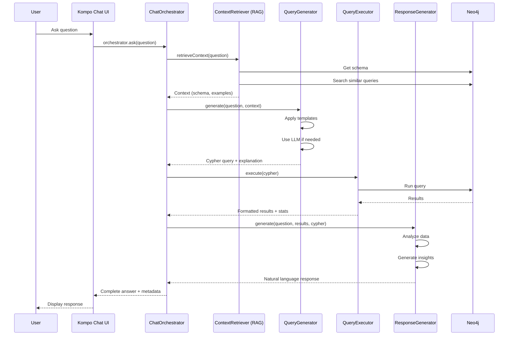

# AI Text-to-Query System - Detailed Module Specifications

This document provides comprehensive specifications for Modules 12-16, completing the AI Text-to-Query system.

---

## Table of Contents

- [Module 12: Query Generation](#module-12-query-generation)
- [Module 13: Query Execution](#module-13-query-execution)
- [Module 14: Response Generation](#module-14-response-generation)
- [Module 15: Chat Orchestrator](#module-15-chat-orchestrator)
- [Module 16: Kompo Chat Interface](#module-16-kompo-chat-interface)
- [Integration Flow](#integration-flow)
- [Configuration](#configuration)
- [Testing Strategy](#testing-strategy)

---

# Module 12: Query Generation

## Purpose

Transform natural language questions into valid, safe Cypher queries using LLM and RAG context.

## Responsibilities

1. Generate Cypher queries from natural language using LLM
2. Incorporate graph schema and examples from RAG context
3. Validate generated queries for syntax and safety
4. Prevent destructive operations (DELETE, DROP, MERGE without conditions)
5. Apply query templates for common patterns
6. Handle edge cases and ambiguous questions

## Interface Definition

### File: `src/Contracts/QueryGeneratorInterface.php`

```php
<?php

declare(strict_types=1);

namespace AiSystem\Contracts;

/**
 * Query Generator Interface
 *
 * Transforms natural language questions into Cypher queries using LLM
 * and context from RAG (graph schema, similar queries, examples).
 */
interface QueryGeneratorInterface
{
    /**
     * Generate a Cypher query from natural language question
     *
     * @param string $question Natural language question
     * @param array $context RAG context with keys:
     *                       - similar_queries: Array of similar past queries
     *                       - graph_schema: Graph structure (labels, relationships, properties)
     *                       - relevant_entities: Example entities for reference
     * @param array $options Optional parameters:
     *                       - temperature: LLM temperature (default: 0.1 for consistency)
     *                       - max_retries: Max retry attempts if validation fails (default: 3)
     *                       - allow_write: Allow write operations (default: false)
     *                       - explain: Include query explanation (default: true)
     * @return array Result with keys:
     *               - cypher: Generated Cypher query
     *               - explanation: Human-readable explanation of what query does
     *               - confidence: Confidence score (0-1)
     *               - warnings: Array of warnings about query safety/performance
     *               - metadata: Additional metadata (template used, retry count, etc.)
     * @throws \RuntimeException If query generation fails after retries
     */
    public function generate(string $question, array $context, array $options = []): array;

    /**
     * Validate a Cypher query for syntax and safety
     *
     * @param string $cypherQuery Query to validate
     * @param array $options Validation options:
     *                       - allow_write: Allow write operations (default: false)
     *                       - max_complexity: Max query complexity score (default: 100)
     * @return array Validation result with keys:
     *               - valid: Boolean indicating if query is valid
     *               - errors: Array of validation errors
     *               - warnings: Array of warnings (performance, security)
     *               - complexity: Query complexity score
     *               - is_read_only: Boolean indicating if query only reads data
     * @throws \InvalidArgumentException If query is empty
     */
    public function validate(string $cypherQuery, array $options = []): array;

    /**
     * Sanitize a Cypher query by removing dangerous operations
     *
     * @param string $cypherQuery Query to sanitize
     * @return string Sanitized query
     */
    public function sanitize(string $cypherQuery): string;

    /**
     * Get available query templates
     *
     * @return array Array of template metadata:
     *               - name: Template identifier
     *               - description: What the template does
     *               - pattern: Natural language pattern it matches
     *               - example_question: Example question
     *               - example_cypher: Example generated query
     */
    public function getTemplates(): array;

    /**
     * Detect which template (if any) matches the question
     *
     * @param string $question Natural language question
     * @return string|null Template name or null if no match
     */
    public function detectTemplate(string $question): ?string;
}
```

## Implementation Details

### File: `src/Services/QueryGenerator.php`

#### Constructor Dependencies

```php
public function __construct(
    private readonly LlmProviderInterface $llm,
    private readonly GraphStoreInterface $graphStore,
    private readonly array $config = []
) {}
```

#### Core Algorithm

1. **Template Detection**
   - Check if question matches a known pattern
   - Use template if confidence > 0.8
   - Fall back to LLM generation

2. **Prompt Construction**
   ```
   System: You are a Neo4j Cypher query expert. Generate valid, safe queries.

   Context:
   - Graph Schema: [labels, relationships, properties]
   - Similar Queries: [past examples with high similarity]
   - Example Entities: [sample data for reference]

   Rules:
   - Use only labels/relationships from schema
   - Return ONLY the Cypher query
   - Use LIMIT to prevent large result sets
   - No DELETE, DROP, or MERGE operations
   - Include comments explaining complex parts

   Question: {user_question}

   Generate Cypher query:
   ```

3. **Query Generation**
   - Send prompt to LLM
   - Extract Cypher from response
   - Clean formatting (remove markdown, extra whitespace)

4. **Validation**
   - Check syntax (basic Cypher validation)
   - Check for dangerous keywords (DELETE, DROP, etc.)
   - Verify referenced labels/relationships exist in schema
   - Calculate complexity score

5. **Retry Logic**
   - If validation fails, include error in prompt
   - Retry up to max_retries times
   - Track retry count in metadata

6. **Post-Processing**
   - Add LIMIT clause if missing (safety)
   - Optimize obvious inefficiencies
   - Generate explanation

#### Query Templates

```php
private array $templates = [
    'list_all' => [
        'pattern' => '/^(show|list|get|display|find)\s+all\s+(\w+)/i',
        'cypher' => 'MATCH (n:{label}) RETURN n LIMIT 100',
        'description' => 'List all entities of a type'
    ],
    'count' => [
        'pattern' => '/^(how many|count|number of)\s+(\w+)/i',
        'cypher' => 'MATCH (n:{label}) RETURN count(n) as count',
        'description' => 'Count entities of a type'
    ],
    'find_by_property' => [
        'pattern' => '/^find\s+(\w+)\s+(with|where|having)\s+(\w+)\s*(=|is|equals)\s*(.+)/i',
        'cypher' => 'MATCH (n:{label} {{{property}: $value}}) RETURN n LIMIT 100',
        'description' => 'Find entities by property value'
    ],
    'relationship_query' => [
        'pattern' => '/^(show|find|get)\s+(\w+)\s+(connected to|related to|linked to)\s+(\w+)/i',
        'cypher' => 'MATCH (a:{label1})-[r]-(b:{label2}) RETURN a, r, b LIMIT 100',
        'description' => 'Find related entities'
    ],
    // More templates...
];
```

#### Validation Rules

```php
private array $dangerousKeywords = [
    'DELETE', 'REMOVE', 'DROP', 'CREATE', 'MERGE', 'SET', 'DETACH'
];

private function validateSafety(string $cypher, bool $allowWrite): array
{
    $errors = [];
    $warnings = [];

    // Check for dangerous operations
    foreach ($this->dangerousKeywords as $keyword) {
        if (stripos($cypher, $keyword) !== false && !$allowWrite) {
            $errors[] = "Query contains forbidden keyword: {$keyword}";
        }
    }

    // Check for LIMIT clause
    if (!stripos($cypher, 'LIMIT')) {
        $warnings[] = "Query missing LIMIT clause - may return large result set";
    }

    // Check complexity
    $complexity = $this->calculateComplexity($cypher);
    if ($complexity > 100) {
        $warnings[] = "Query complexity ({$complexity}) is high - may be slow";
    }

    return ['errors' => $errors, 'warnings' => $warnings, 'complexity' => $complexity];
}
```

## Configuration

### In `config/ai.php`:

```php
'query_generation' => [
    'default_limit' => 100,
    'max_limit' => 1000,
    'allow_write_operations' => false,
    'max_retries' => 3,
    'temperature' => 0.1, // Low temperature for consistency
    'max_complexity' => 100,
    'enable_templates' => true,
    'template_confidence_threshold' => 0.8,
],
```

## Error Handling

```php
// Custom exceptions
class QueryGenerationException extends \RuntimeException {}
class QueryValidationException extends \InvalidArgumentException {}
class UnsafeQueryException extends \RuntimeException {}
```

## Testing Requirements

### Unit Tests (30+ tests)

1. **Query Generation**
   - Generates valid Cypher from simple questions
   - Incorporates schema from context
   - Uses similar queries as examples
   - Respects temperature setting
   - Handles retry logic

2. **Validation**
   - Detects dangerous keywords
   - Validates syntax
   - Checks schema references
   - Calculates complexity

3. **Templates**
   - Detects correct templates
   - Applies templates correctly
   - Falls back to LLM when no match

4. **Sanitization**
   - Removes dangerous operations
   - Preserves safe queries
   - Adds LIMIT when missing

5. **Edge Cases**
   - Empty question
   - Invalid context structure
   - LLM returns non-Cypher
   - All retries fail

### Integration Tests (10+ tests)

- Test with real LLM API
- Test with real Neo4j schema
- End-to-end generation flow

## Example Usage

```php
use AiSystem\Facades\AI;

// Simple usage via facade
$question = "Show me all teams with more than 5 members";
$context = AI::retrieveContext($question);

// Generate query (to be added to AiManager)
$result = $queryGenerator->generate($question, $context);

// Result structure:
[
    'cypher' => 'MATCH (t:Team)<-[:MEMBER_OF]-(p:Person)
                 WITH t, count(p) as member_count
                 WHERE member_count > 5
                 RETURN t, member_count
                 LIMIT 100',
    'explanation' => 'This query finds all teams that have more than 5 members...',
    'confidence' => 0.92,
    'warnings' => [],
    'metadata' => [
        'template_used' => null,
        'retry_count' => 0,
        'generation_time_ms' => 1234
    ]
]
```

---

# Module 13: Query Execution

## Purpose

Execute Cypher queries against Neo4j safely with timeout protection, result limiting, and comprehensive error handling.

## Responsibilities

1. Execute validated Cypher queries against Neo4j
2. Enforce timeouts to prevent long-running queries
3. Limit result set size
4. Format results for consumption
5. Handle errors gracefully with user-friendly messages
6. Support read-only mode
7. Log query performance
8. Support transactions (optional)

## Interface Definition

### File: `src/Contracts/QueryExecutorInterface.php`

```php
<?php

declare(strict_types=1);

namespace AiSystem\Contracts;

/**
 * Query Executor Interface
 *
 * Executes Cypher queries against Neo4j with safety measures,
 * timeout protection, and comprehensive error handling.
 */
interface QueryExecutorInterface
{
    /**
     * Execute a Cypher query
     *
     * @param string $cypherQuery Validated Cypher query to execute
     * @param array $parameters Query parameters (for parameterized queries)
     * @param array $options Execution options:
     *                       - timeout: Max execution time in seconds (default: 30)
     *                       - limit: Max results to return (default: 100)
     *                       - read_only: Enforce read-only mode (default: true)
     *                       - format: Result format: 'graph', 'table', 'json' (default: 'table')
     *                       - include_stats: Include execution statistics (default: true)
     * @return array Execution result with keys:
     *               - success: Boolean indicating if query succeeded
     *               - data: Query results in requested format
     *               - stats: Execution statistics (rows returned, time, etc.)
     *               - metadata: Additional metadata
     *               - errors: Array of errors if any
     * @throws \RuntimeException If query execution fails
     * @throws \TimeoutException If query exceeds timeout
     */
    public function execute(string $cypherQuery, array $parameters = [], array $options = []): array;

    /**
     * Execute query and return count only (optimization)
     *
     * @param string $cypherQuery Query to execute
     * @param array $parameters Query parameters
     * @param array $options Execution options
     * @return int Count of results
     */
    public function executeCount(string $cypherQuery, array $parameters = [], array $options = []): int;

    /**
     * Execute query with pagination
     *
     * @param string $cypherQuery Query to execute
     * @param int $page Page number (1-indexed)
     * @param int $perPage Results per page
     * @param array $parameters Query parameters
     * @param array $options Execution options
     * @return array Paginated results with keys:
     *               - data: Current page results
     *               - pagination: Pagination metadata (current_page, per_page, total, last_page)
     *               - stats: Execution statistics
     */
    public function executePaginated(
        string $cypherQuery,
        int $page = 1,
        int $perPage = 20,
        array $parameters = [],
        array $options = []
    ): array;

    /**
     * Explain a query (show execution plan without running)
     *
     * @param string $cypherQuery Query to explain
     * @param array $parameters Query parameters
     * @return array Execution plan details
     */
    public function explain(string $cypherQuery, array $parameters = []): array;

    /**
     * Test if a query is valid (dry run)
     *
     * @param string $cypherQuery Query to test
     * @return bool True if query is valid
     */
    public function test(string $cypherQuery): bool;

    /**
     * Cancel a running query
     *
     * @param string $queryId Query identifier
     * @return bool True if cancelled successfully
     */
    public function cancel(string $queryId): bool;
}
```

## Implementation Details

### File: `src/Services/QueryExecutor.php`

#### Constructor Dependencies

```php
public function __construct(
    private readonly GraphStoreInterface $graphStore,
    private readonly array $config = []
) {}
```

#### Core Algorithm

1. **Pre-Execution Validation**
   - Verify query is not empty
   - Check read-only mode compliance
   - Validate parameters

2. **Timeout Setup**
   - Set execution timeout
   - Track start time
   - Monitor execution duration

3. **Query Execution**
   - Execute via GraphStore
   - Apply LIMIT if not present
   - Pass parameters safely

4. **Result Processing**
   - Parse Neo4j response
   - Format according to requested format
   - Apply result limiting

5. **Statistics Collection**
   - Execution time
   - Rows returned
   - Rows scanned
   - Database hits

6. **Error Handling**
   - Catch timeout exceptions
   - Parse Neo4j error messages
   - Generate user-friendly errors

#### Result Formatters

```php
/**
 * Format results as table (array of rows)
 */
private function formatAsTable(array $rawResults): array
{
    return array_map(function ($row) {
        return $this->flattenNode($row);
    }, $rawResults);
}

/**
 * Format results as graph (nodes and relationships)
 */
private function formatAsGraph(array $rawResults): array
{
    $nodes = [];
    $relationships = [];

    foreach ($rawResults as $row) {
        $this->extractNodesAndRelationships($row, $nodes, $relationships);
    }

    return [
        'nodes' => array_values($nodes),
        'relationships' => array_values($relationships)
    ];
}

/**
 * Format results as JSON (structured data)
 */
private function formatAsJson(array $rawResults): array
{
    return json_decode(json_encode($rawResults), true);
}
```

#### Performance Monitoring

```php
private function collectStatistics(array $rawResponse, float $startTime): array
{
    return [
        'execution_time_ms' => round((microtime(true) - $startTime) * 1000, 2),
        'rows_returned' => count($rawResponse),
        'database_hits' => $rawResponse['stats']['db_hits'] ?? null,
        'rows_scanned' => $rawResponse['stats']['rows'] ?? null,
    ];
}
```

## Configuration

### In `config/ai.php`:

```php
'query_execution' => [
    'default_timeout' => 30, // seconds
    'max_timeout' => 120,
    'default_limit' => 100,
    'max_limit' => 1000,
    'read_only_mode' => true,
    'default_format' => 'table',
    'enable_explain' => true,
    'log_slow_queries' => true,
    'slow_query_threshold_ms' => 1000,
],
```

## Error Handling

```php
// Custom exceptions
class QueryExecutionException extends \RuntimeException {}
class QueryTimeoutException extends \RuntimeException {}
class ReadOnlyViolationException extends \RuntimeException {}
```

## Testing Requirements

### Unit Tests (25+ tests)

1. **Execution**
   - Executes valid queries
   - Applies timeout
   - Applies result limit
   - Formats results correctly

2. **Read-Only Mode**
   - Blocks write operations
   - Allows read operations
   - Throws appropriate exceptions

3. **Result Formatting**
   - Table format
   - Graph format
   - JSON format

4. **Pagination**
   - Correct page calculation
   - Correct limit/offset
   - Metadata accuracy

5. **Error Handling**
   - Timeout handling
   - Invalid query syntax
   - Connection errors
   - Parameter errors

### Integration Tests (15+ tests)

- Execute real queries against Neo4j
- Test timeout enforcement
- Test result limiting
- Test pagination

## Example Usage

```php
$executor = app(QueryExecutorInterface::class);

$result = $executor->execute(
    'MATCH (t:Team)<-[:MEMBER_OF]-(p:Person) RETURN t, count(p) as members',
    [],
    [
        'timeout' => 30,
        'limit' => 100,
        'read_only' => true,
        'format' => 'table'
    ]
);

// Result structure:
[
    'success' => true,
    'data' => [
        ['t' => ['id' => 1, 'name' => 'Alpha Team'], 'members' => 8],
        ['t' => ['id' => 2, 'name' => 'Beta Team'], 'members' => 6],
    ],
    'stats' => [
        'execution_time_ms' => 45.23,
        'rows_returned' => 2,
        'database_hits' => 120,
    ],
    'metadata' => [
        'format' => 'table',
        'read_only' => true
    ],
    'errors' => []
]
```

---

# Module 14: Response Generation

## Purpose

Transform raw Neo4j query results into natural language explanations using LLM, making data accessible to non-technical users.

## Responsibilities

1. Generate human-readable explanations from query results
2. Incorporate original question for context
3. Support multiple output formats (text, markdown, JSON)
4. Handle empty results gracefully
5. Provide data insights and patterns
6. Suggest visualizations when appropriate
7. Maintain conversation context

## Interface Definition

### File: `src/Contracts/ResponseGeneratorInterface.php`

```php
<?php

declare(strict_types=1);

namespace AiSystem\Contracts;

/**
 * Response Generator Interface
 *
 * Transforms raw query results into natural language explanations
 * using LLM to make data accessible to non-technical users.
 */
interface ResponseGeneratorInterface
{
    /**
     * Generate natural language response from query results
     *
     * @param string $originalQuestion User's original question
     * @param array $queryResult Results from QueryExecutor
     * @param string $cypherQuery The Cypher query that was executed
     * @param array $options Generation options:
     *                       - format: 'text', 'markdown', 'json' (default: 'text')
     *                       - style: 'concise', 'detailed', 'technical' (default: 'detailed')
     *                       - include_insights: Include data insights (default: true)
     *                       - include_visualization: Suggest visualizations (default: true)
     *                       - max_length: Max response length in words (default: 200)
     *                       - temperature: LLM temperature (default: 0.3)
     * @return array Response with keys:
     *               - answer: Natural language answer
     *               - insights: Array of insights discovered in data
     *               - visualizations: Suggested visualization types
     *               - format: Response format used
     *               - metadata: Additional metadata
     * @throws \RuntimeException If response generation fails
     */
    public function generate(
        string $originalQuestion,
        array $queryResult,
        string $cypherQuery,
        array $options = []
    ): array;

    /**
     * Generate response for empty results
     *
     * @param string $originalQuestion User's original question
     * @param string $cypherQuery The query that returned no results
     * @param array $options Generation options
     * @return array Response explaining why no results were found
     */
    public function generateEmptyResponse(
        string $originalQuestion,
        string $cypherQuery,
        array $options = []
    ): array;

    /**
     * Generate response for error cases
     *
     * @param string $originalQuestion User's original question
     * @param \Throwable $error The error that occurred
     * @param array $options Generation options
     * @return array User-friendly error response
     */
    public function generateErrorResponse(
        string $originalQuestion,
        \Throwable $error,
        array $options = []
    ): array;

    /**
     * Summarize large result sets
     *
     * @param array $queryResult Large result set to summarize
     * @param int $maxItems Max items to include in summary
     * @return array Summarized results
     */
    public function summarize(array $queryResult, int $maxItems = 10): array;

    /**
     * Extract insights from data
     *
     * @param array $queryResult Query results to analyze
     * @return array Array of insights (patterns, outliers, trends)
     */
    public function extractInsights(array $queryResult): array;

    /**
     * Suggest appropriate visualizations
     *
     * @param array $queryResult Query results
     * @param string $cypherQuery Original query
     * @return array Suggested visualization types with rationale
     */
    public function suggestVisualizations(array $queryResult, string $cypherQuery): array;
}
```

## Implementation Details

### File: `src/Services/ResponseGenerator.php`

#### Constructor Dependencies

```php
public function __construct(
    private readonly LlmProviderInterface $llm,
    private readonly array $config = []
) {}
```

#### Core Algorithm

1. **Data Preparation**
   - Summarize large result sets
   - Extract key statistics
   - Identify data types
   - Detect patterns

2. **Prompt Construction**
   ```
   System: You are a data analyst who explains query results clearly.

   Original Question: {question}
   Query Executed: {cypher}
   Results: {data}
   Statistics: {stats}

   Task: Explain these results in natural language, making them accessible
   to someone without technical knowledge.

   Guidelines:
   - Start with a direct answer to the question
   - Highlight interesting patterns or insights
   - Use specific numbers from the data
   - Keep it {style} (concise/detailed/technical)
   - Format as {format}

   Generate response:
   ```

3. **Response Generation**
   - Send prompt to LLM
   - Parse response
   - Apply formatting

4. **Insight Extraction**
   - Calculate statistics (avg, min, max, count)
   - Detect outliers
   - Identify trends
   - Find correlations

5. **Visualization Suggestions**
   - Analyze data structure
   - Match to visualization types
   - Provide rationale

#### Response Styles

```php
private array $stylePrompts = [
    'concise' => 'Be brief and to the point. 1-2 sentences maximum.',
    'detailed' => 'Provide comprehensive explanation with context and examples.',
    'technical' => 'Include technical details and reference the Cypher query.'
];
```

#### Insight Detection

```php
private function extractInsights(array $data): array
{
    $insights = [];

    // Calculate basic statistics
    if ($this->isNumericData($data)) {
        $stats = $this->calculateStatistics($data);

        if ($stats['outliers']) {
            $insights[] = [
                'type' => 'outlier',
                'description' => "Found {count} outliers significantly different from average",
                'data' => $stats['outliers']
            ];
        }

        if ($stats['trend']) {
            $insights[] = [
                'type' => 'trend',
                'description' => "Data shows a {direction} trend",
                'data' => $stats['trend']
            ];
        }
    }

    // Detect patterns
    $patterns = $this->detectPatterns($data);
    foreach ($patterns as $pattern) {
        $insights[] = [
            'type' => 'pattern',
            'description' => $pattern['description'],
            'data' => $pattern['data']
        ];
    }

    return $insights;
}
```

#### Visualization Suggestions

```php
private function suggestVisualizations(array $data, string $query): array
{
    $suggestions = [];

    // Check data structure
    if ($this->hasTimeSeriesData($data)) {
        $suggestions[] = [
            'type' => 'line_chart',
            'reason' => 'Data contains time-based information',
            'columns' => ['date', 'value']
        ];
    }

    if ($this->hasCategoricalData($data)) {
        $suggestions[] = [
            'type' => 'bar_chart',
            'reason' => 'Data contains categories with counts',
            'columns' => ['category', 'count']
        ];
    }

    if ($this->hasRelationshipData($query)) {
        $suggestions[] = [
            'type' => 'network_graph',
            'reason' => 'Query involves relationships between entities',
            'columns' => ['source', 'target', 'relationship']
        ];
    }

    return $suggestions;
}
```

## Configuration

### In `config/ai.php`:

```php
'response_generation' => [
    'default_style' => 'detailed',
    'default_format' => 'text',
    'max_response_length' => 200, // words
    'temperature' => 0.3,
    'include_insights' => true,
    'include_visualizations' => true,
    'empty_result_message' => 'No results found for your query.',
    'summarize_threshold' => 10, // items
],
```

## Error Handling

```php
// Custom exceptions
class ResponseGenerationException extends \RuntimeException {}
```

## Testing Requirements

### Unit Tests (20+ tests)

1. **Response Generation**
   - Generates natural language from results
   - Respects style setting
   - Respects format setting
   - Handles different data types

2. **Empty Results**
   - Generates helpful message
   - Suggests alternatives

3. **Error Responses**
   - User-friendly error messages
   - Hides technical details from users

4. **Insights**
   - Detects outliers
   - Identifies trends
   - Finds patterns

5. **Visualizations**
   - Suggests appropriate charts
   - Provides rationale

### Integration Tests (10+ tests)

- Test with real LLM API
- Test with various data structures
- End-to-end response generation

## Example Usage

```php
$generator = app(ResponseGeneratorInterface::class);

$response = $generator->generate(
    "Show me teams with most active members",
    $queryResult,
    $cypherQuery,
    [
        'format' => 'markdown',
        'style' => 'detailed',
        'include_insights' => true
    ]
);

// Result:
[
    'answer' => "I found 3 teams with the highest member activity:\n\n" .
                "1. **Alpha Team** has 8 active members\n" .
                "2. **Beta Team** has 6 active members\n" .
                "3. **Gamma Team** has 5 active members\n\n" .
                "Alpha Team is notably more active, with 33% more members than Beta Team.",
    'insights' => [
        [
            'type' => 'outlier',
            'description' => 'Alpha Team has significantly more members than average',
            'data' => ['team' => 'Alpha Team', 'members' => 8, 'avg' => 5.3]
        ],
        [
            'type' => 'pattern',
            'description' => 'All top teams were created in the last 6 months',
            'data' => ['pattern' => 'recent_creation']
        ]
    ],
    'visualizations' => [
        [
            'type' => 'bar_chart',
            'reason' => 'Best for comparing team member counts',
            'columns' => ['team', 'member_count']
        ]
    ],
    'format' => 'markdown',
    'metadata' => [
        'style' => 'detailed',
        'generation_time_ms' => 892
    ]
]
```

---

# Module 15: Chat Orchestrator

## Purpose

Coordinate the complete question-answering pipeline, managing conversation history and tying all services together into a cohesive chat experience.

## Responsibilities

1. Coordinate full pipeline: RAG → Query Generation → Execution → Response
2. Manage conversation history
3. Handle multi-turn dialogues
4. Implement error recovery strategies
5. Track performance metrics
6. Support streaming responses (optional)
7. Cache frequent queries
8. Provide debugging information

## Interface Definition

### File: `src/Contracts/ChatOrchestratorInterface.php`

```php
<?php

declare(strict_types=1);

namespace AiSystem\Contracts;

/**
 * Chat Orchestrator Interface
 *
 * Coordinates the complete question-answering pipeline and manages
 * conversation history for multi-turn dialogues.
 */
interface ChatOrchestratorInterface
{
    /**
     * Process a question through the complete pipeline
     *
     * @param string $question User's natural language question
     * @param array $options Processing options:
     *                       - conversation_id: ID for multi-turn conversation (default: null)
     *                       - include_context: Include RAG context in response (default: false)
     *                       - include_query: Include generated Cypher (default: false)
     *                       - include_stats: Include performance stats (default: true)
     *                       - cache: Use cached results if available (default: true)
     *                       - response_format: Format for response (default: 'text')
     *                       - debug: Include debug information (default: false)
     * @return array Complete answer with keys:
     *               - answer: Natural language response
     *               - success: Boolean indicating success
     *               - metadata: Processing metadata
     *               - context: RAG context (if included)
     *               - query: Generated Cypher (if included)
     *               - stats: Performance statistics (if included)
     *               - debug: Debug information (if included)
     *               - errors: Array of any errors
     * @throws \RuntimeException If processing fails completely
     */
    public function ask(string $question, array $options = []): array;

    /**
     * Get conversation history
     *
     * @param string $conversationId Conversation identifier
     * @return array Array of turns with question, answer, timestamp
     */
    public function getHistory(string $conversationId): array;

    /**
     * Clear conversation history
     *
     * @param string $conversationId Conversation identifier
     * @return void
     */
    public function clearHistory(string $conversationId): void;

    /**
     * Get suggested follow-up questions
     *
     * @param string $conversationId Conversation identifier
     * @param int $count Number of suggestions (default: 3)
     * @return array Array of suggested questions
     */
    public function getSuggestedQuestions(string $conversationId, int $count = 3): array;

    /**
     * Get performance statistics for a conversation
     *
     * @param string $conversationId Conversation identifier
     * @return array Performance metrics
     */
    public function getConversationStats(string $conversationId): array;

    /**
     * Explain how a question was processed (debugging)
     *
     * @param string $question Question to explain
     * @return array Detailed breakdown of processing steps
     */
    public function explain(string $question): array;
}
```

## Implementation Details

### File: `src/Services/ChatOrchestrator.php`

#### Constructor Dependencies

```php
public function __construct(
    private readonly ContextRetrieverInterface $contextRetriever,
    private readonly QueryGeneratorInterface $queryGenerator,
    private readonly QueryExecutorInterface $queryExecutor,
    private readonly ResponseGeneratorInterface $responseGenerator,
    private readonly CacheInterface $cache,
    private readonly array $config = []
) {}
```

#### Core Algorithm: `ask()` Method

```php
public function ask(string $question, array $options = []): array
{
    $conversationId = $options['conversation_id'] ?? null;
    $startTime = microtime(true);
    $result = [
        'answer' => null,
        'success' => false,
        'metadata' => [],
        'errors' => []
    ];

    try {
        // Step 1: Check cache
        if ($options['cache'] ?? true) {
            $cached = $this->checkCache($question);
            if ($cached) {
                return $this->formatCachedResponse($cached, $options);
            }
        }

        // Step 2: Retrieve context (RAG)
        $context = $this->contextRetriever->retrieveContext($question, [
            'collection' => 'questions',
            'limit' => 5,
            'includeSchema' => true,
            'includeExamples' => true
        ]);

        // Step 3: Generate Cypher query
        $queryResult = $this->queryGenerator->generate($question, $context, [
            'temperature' => 0.1,
            'max_retries' => 3,
            'explain' => true
        ]);

        // Step 4: Execute query
        $executionResult = $this->queryExecutor->execute(
            $queryResult['cypher'],
            [],
            [
                'timeout' => 30,
                'limit' => 100,
                'read_only' => true,
                'format' => 'table'
            ]
        );

        // Step 5: Generate response
        $response = $this->responseGenerator->generate(
            $question,
            $executionResult,
            $queryResult['cypher'],
            [
                'format' => $options['response_format'] ?? 'text',
                'style' => 'detailed',
                'include_insights' => true
            ]
        );

        // Step 6: Save to history
        if ($conversationId) {
            $this->saveToHistory($conversationId, $question, $response);
        }

        // Step 7: Cache result
        $this->cacheResult($question, $response);

        // Step 8: Format final response
        $result['answer'] = $response['answer'];
        $result['success'] = true;
        $result['metadata'] = $this->collectMetadata($queryResult, $executionResult, $response);

        // Optional inclusions
        if ($options['include_context'] ?? false) {
            $result['context'] = $context;
        }
        if ($options['include_query'] ?? false) {
            $result['query'] = $queryResult['cypher'];
        }
        if ($options['include_stats'] ?? true) {
            $result['stats'] = $this->collectStats($startTime, $executionResult);
        }
        if ($options['debug'] ?? false) {
            $result['debug'] = $this->collectDebugInfo($context, $queryResult, $executionResult);
        }

    } catch (\Throwable $e) {
        // Error recovery
        $result['errors'][] = $e->getMessage();
        $result['answer'] = $this->responseGenerator->generateErrorResponse(
            $question,
            $e
        );
    }

    return $result;
}
```

#### Conversation History Management

```php
private array $conversations = []; // In-memory storage (use Redis/DB in production)

private function saveToHistory(string $conversationId, string $question, array $response): void
{
    if (!isset($this->conversations[$conversationId])) {
        $this->conversations[$conversationId] = [];
    }

    $this->conversations[$conversationId][] = [
        'question' => $question,
        'answer' => $response['answer'],
        'timestamp' => time(),
        'metadata' => $response['metadata'] ?? []
    ];
}

public function getHistory(string $conversationId): array
{
    return $this->conversations[$conversationId] ?? [];
}

public function getSuggestedQuestions(string $conversationId, int $count = 3): array
{
    $history = $this->getHistory($conversationId);
    if (empty($history)) {
        return $this->getDefaultSuggestions();
    }

    // Generate suggestions based on conversation context
    $lastQuestion = end($history)['question'];

    // Use LLM to generate follow-up questions
    // Or use rule-based system based on entities in last answer

    return $this->generateFollowUpQuestions($lastQuestion, $count);
}
```

#### Performance Tracking

```php
private function collectStats(float $startTime, array $executionResult): array
{
    return [
        'total_time_ms' => round((microtime(true) - $startTime) * 1000, 2),
        'context_retrieval_ms' => $this->timers['context'] ?? 0,
        'query_generation_ms' => $this->timers['generation'] ?? 0,
        'query_execution_ms' => $executionResult['stats']['execution_time_ms'] ?? 0,
        'response_generation_ms' => $this->timers['response'] ?? 0,
        'cache_hit' => false,
    ];
}
```

#### Caching Strategy

```php
private function checkCache(string $question): ?array
{
    $key = 'chat:' . md5(strtolower(trim($question)));
    return $this->cache->get($key);
}

private function cacheResult(string $question, array $response): void
{
    $key = 'chat:' . md5(strtolower(trim($question)));
    $ttl = $this->config['cache_ttl'] ?? 3600; // 1 hour
    $this->cache->set($key, $response, $ttl);
}
```

## Configuration

### In `config/ai.php`:

```php
'chat_orchestrator' => [
    'enable_caching' => true,
    'cache_ttl' => 3600, // seconds
    'max_history_length' => 50, // turns per conversation
    'default_timeout' => 60, // seconds for entire pipeline
    'retry_on_failure' => true,
    'max_retries' => 2,
    'enable_suggested_questions' => true,
    'store_conversation_history' => true,
    'conversation_storage' => 'database', // 'memory', 'redis', 'database'
],
```

## Error Handling

```php
// Custom exceptions
class ChatOrchestrationException extends \RuntimeException {}
class ConversationNotFoundException extends \RuntimeException {}
```

## Testing Requirements

### Unit Tests (35+ tests)

1. **Pipeline Coordination**
   - Calls all services in correct order
   - Passes data correctly between services
   - Handles each service's response format

2. **Error Recovery**
   - Recovers from context retrieval failure
   - Recovers from query generation failure
   - Recovers from execution failure
   - Generates user-friendly error responses

3. **Conversation History**
   - Saves turns correctly
   - Retrieves history correctly
   - Clears history
   - Limits history length

4. **Caching**
   - Caches successful responses
   - Returns cached responses
   - Respects TTL
   - Cache key generation

5. **Performance Tracking**
   - Collects accurate timing
   - Tracks all stages
   - Provides meaningful metrics

### Integration Tests (20+ tests)

- Full end-to-end pipeline
- Multi-turn conversations
- Error scenarios
- Performance benchmarks

## Example Usage

```php
use AiSystem\Facades\AI;

// Simple usage (to be added to AiManager)
$response = $orchestrator->ask(
    "Show me teams with most active members",
    [
        'conversation_id' => 'user-123',
        'include_stats' => true,
        'include_query' => true
    ]
);

// Result:
[
    'answer' => "I found 3 teams with the highest member activity:\n\n" .
                "1. Alpha Team has 8 active members\n" .
                "2. Beta Team has 6 active members\n" .
                "3. Gamma Team has 5 active members",
    'success' => true,
    'metadata' => [
        'confidence' => 0.92,
        'results_count' => 3
    ],
    'query' => 'MATCH (t:Team)<-[:MEMBER_OF]-(p:Person) ...',
    'stats' => [
        'total_time_ms' => 1847.23,
        'context_retrieval_ms' => 234.56,
        'query_generation_ms' => 891.12,
        'query_execution_ms' => 45.23,
        'response_generation_ms' => 676.32,
        'cache_hit' => false
    ],
    'errors' => []
]

// Follow-up question
$response2 = $orchestrator->ask(
    "Which team has the most senior members?",
    ['conversation_id' => 'user-123']
);

// Get suggested questions
$suggestions = $orchestrator->getSuggestedQuestions('user-123');
// ['How many teams are there in total?', 'Show me the newest teams', ...]
```

---

# Module 16: Kompo Chat Interface

## Purpose

Provide beautiful, interactive UI components for the chat experience using Kompo framework.

## Responsibilities

1. Display chat interface with message history
2. Handle user input and submission
3. Show loading states during processing
4. Display query visualizations (optional)
5. Show generated Cypher queries (developer mode)
6. Provide export functionality
7. Support real-time updates
8. Mobile responsive design

## Components to Build

### 1. **ChatForm.php** - Main Chat Interface

```php
<?php

namespace AiSystem\Kompo;

use Kompo\Form;

class ChatForm extends Form
{
    public $conversationId;

    public function created()
    {
        $this->conversationId = request('conversation_id') ?? uniqid('chat-');
    }

    public function render()
    {
        return [
            // Header
            _Rows(
                _Html('AI Chat Assistant')->class('text-2xl font-bold'),
                _Html('Ask questions about your data')->class('text-gray-600')
            )->class('p-4 border-b'),

            // Message history
            _Rows()->id('message-history')->class('flex-1 overflow-y-auto p-4'),

            // Input area
            _Rows(
                _Textarea('question')
                    ->placeholder('Ask a question...')
                    ->rows(3),
                _FlexEnd(
                    _SubmitButton('Send')
                        ->submit('ask')
                        ->onSuccess(fn($e) => $e->run('appendMessage'))
                )->class('mt-2')
            )->class('p-4 border-t')
        ];
    }

    public function ask()
    {
        $question = request('question');

        // Call orchestrator
        $response = app(ChatOrchestratorInterface::class)->ask($question, [
            'conversation_id' => $this->conversationId,
            'include_stats' => true,
            'include_query' => auth()->user()->isDeveloper()
        ]);

        return $response;
    }
}
```

### 2. **MessageList.php** - Display Conversation

```php
class MessageList extends Query
{
    public function query()
    {
        // Get conversation history
        $conversationId = request('conversation_id');
        $history = app(ChatOrchestratorInterface::class)->getHistory($conversationId);

        return collect($history);
    }

    public function render($turn)
    {
        return _Rows(
            // User question
            _Rows(
                _Html($turn['question'])->class('font-medium')
            )->class('bg-blue-100 rounded p-3 mb-2'),

            // AI answer
            _Rows(
                _Html($turn['answer'])->class('prose')
            )->class('bg-gray-100 rounded p-3 mb-4')
        );
    }
}
```

### 3. **QueryVisualization.php** - Show Generated Query

```php
class QueryVisualization extends Form
{
    public function render()
    {
        return [
            _Html('Generated Cypher Query')->class('font-bold mb-2'),
            _Html('<pre><code>' . htmlspecialchars($this->cypherQuery) . '</code></pre>')
                ->class('bg-gray-900 text-green-400 p-4 rounded font-mono text-sm'),
            _Html('Execution Time: ' . $this->executionTime . 'ms')
                ->class('text-sm text-gray-600 mt-2')
        ];
    }
}
```

### 4. **ResultsTable.php** - Display Query Results

```php
class ResultsTable extends Table
{
    public function query()
    {
        return collect($this->results);
    }

    public function top()
    {
        return _Rows(
            _Html(count($this->results) . ' results found')->class('font-bold'),
            _FlexEnd(
                _Link('Export CSV')->href(route('ai.export', ['format' => 'csv']))
            )
        );
    }

    public function headers()
    {
        // Dynamic headers based on result structure
        if (empty($this->results)) {
            return [];
        }

        $firstRow = $this->results[0];
        return array_keys($firstRow);
    }

    public function render($row)
    {
        return array_values($row);
    }
}
```

### 5. **SuggestedQuestions.php** - Follow-up Suggestions

```php
class SuggestedQuestions extends Query
{
    public function query()
    {
        $conversationId = request('conversation_id');
        $suggestions = app(ChatOrchestratorInterface::class)
            ->getSuggestedQuestions($conversationId, 5);

        return collect($suggestions);
    }

    public function render($question)
    {
        return _Link($question)
            ->onClick(fn($e) => $e->fillInput('question', $question))
            ->class('inline-block bg-blue-50 hover:bg-blue-100 rounded px-3 py-1 text-sm mr-2 mb-2 cursor-pointer');
    }
}
```

## Routes

### File: `routes/web.php`

```php
// AI Chat Routes (protected by auth middleware)
Route::middleware(['web', 'auth'])->prefix('ai-chat')->group(function () {
    Route::get('/', [AiChatController::class, 'index'])->name('ai.chat.index');
    Route::get('/history/{conversationId}', [AiChatController::class, 'history'])->name('ai.chat.history');
    Route::post('/ask', [AiChatController::class, 'ask'])->name('ai.chat.ask');
    Route::delete('/history/{conversationId}', [AiChatController::class, 'clearHistory'])->name('ai.chat.clear');
    Route::get('/export', [AiChatController::class, 'export'])->name('ai.export');
});
```

## Controller

### File: `src/Http/Controllers/AiChatController.php`

```php
<?php

namespace AiSystem\Http\Controllers;

use Illuminate\Http\Request;
use AiSystem\Contracts\ChatOrchestratorInterface;
use AiSystem\Kompo\ChatForm;

class AiChatController extends Controller
{
    public function __construct(
        private readonly ChatOrchestratorInterface $orchestrator
    ) {}

    public function index()
    {
        return ChatForm::class;
    }

    public function ask(Request $request)
    {
        $validated = $request->validate([
            'question' => 'required|string|max:1000',
            'conversation_id' => 'required|string'
        ]);

        $response = $this->orchestrator->ask(
            $validated['question'],
            [
                'conversation_id' => $validated['conversation_id'],
                'include_stats' => true
            ]
        );

        return response()->json($response);
    }

    public function history(string $conversationId)
    {
        $history = $this->orchestrator->getHistory($conversationId);
        return response()->json($history);
    }

    public function clearHistory(string $conversationId)
    {
        $this->orchestrator->clearHistory($conversationId);
        return response()->json(['success' => true]);
    }

    public function export(Request $request)
    {
        // Export conversation or results to CSV/JSON
        $format = $request->input('format', 'json');
        // Implementation...
    }
}
```

## JavaScript (Real-time Updates)

```javascript
// resources/js/ai-chat.js

class ChatInterface {
    constructor(conversationId) {
        this.conversationId = conversationId;
        this.isLoading = false;
    }

    async sendMessage(question) {
        if (this.isLoading) return;

        this.isLoading = true;
        this.showLoading();

        try {
            const response = await fetch('/ai-chat/ask', {
                method: 'POST',
                headers: {
                    'Content-Type': 'application/json',
                    'X-CSRF-TOKEN': document.querySelector('meta[name="csrf-token"]').content
                },
                body: JSON.stringify({
                    question: question,
                    conversation_id: this.conversationId
                })
            });

            const data = await response.json();
            this.appendMessage('user', question);
            this.appendMessage('ai', data.answer);

            if (data.query) {
                this.showQuery(data.query);
            }

        } catch (error) {
            this.showError(error.message);
        } finally {
            this.isLoading = false;
            this.hideLoading();
        }
    }

    appendMessage(sender, message) {
        const messageHtml = `
            <div class="message message-${sender}">
                <div class="message-content">${message}</div>
            </div>
        `;
        document.getElementById('message-history').insertAdjacentHTML('beforeend', messageHtml);
        this.scrollToBottom();
    }

    showLoading() {
        // Show loading spinner
    }

    hideLoading() {
        // Hide loading spinner
    }

    scrollToBottom() {
        const history = document.getElementById('message-history');
        history.scrollTop = history.scrollHeight;
    }
}
```

## Styling

```css
/* resources/css/ai-chat.css */

.message {
    margin-bottom: 1rem;
    padding: 1rem;
    border-radius: 0.5rem;
}

.message-user {
    background-color: #e3f2fd;
    margin-left: 2rem;
}

.message-ai {
    background-color: #f5f5f5;
    margin-right: 2rem;
}

.message-content {
    line-height: 1.6;
}

.query-visualization {
    background-color: #1e1e1e;
    color: #d4d4d4;
    padding: 1rem;
    border-radius: 0.5rem;
    font-family: 'Courier New', monospace;
    font-size: 0.875rem;
    overflow-x: auto;
}

.loading-spinner {
    display: inline-block;
    width: 20px;
    height: 20px;
    border: 3px solid rgba(0, 0, 0, 0.1);
    border-radius: 50%;
    border-top-color: #3490dc;
    animation: spin 1s ease-in-out infinite;
}

@keyframes spin {
    to { transform: rotate(360deg); }
}
```

## Configuration

### In `config/ai.php`:

```php
'chat_interface' => [
    'enabled' => env('AI_CHAT_ENABLED', true),
    'route_prefix' => 'ai-chat',
    'middleware' => ['web', 'auth'],
    'max_message_length' => 1000,
    'show_developer_mode' => true,
    'enable_export' => true,
    'export_formats' => ['json', 'csv', 'pdf'],
    'real_time_updates' => false, // WebSocket support
],
```

## Testing Requirements

### Feature Tests (15+ tests)

1. **Chat Interface**
   - Displays chat form
   - Submits questions
   - Shows responses
   - Handles errors

2. **Message History**
   - Saves messages
   - Retrieves history
   - Clears history

3. **Query Visualization**
   - Shows query in developer mode
   - Hides query for regular users

4. **Export**
   - Exports to JSON
   - Exports to CSV

5. **Suggested Questions**
   - Displays suggestions
   - Fills input on click

## Example UI Flow

```
1. User lands on /ai-chat
   ↓
2. ChatForm component loads with empty history
   ↓
3. User types: "Show me all teams"
   ↓
4. Loading spinner appears
   ↓
5. Backend processes through orchestrator
   ↓
6. Response appears with:
   - Natural language answer
   - (Optional) Generated Cypher query
   - (Optional) Results table
   - Execution statistics
   ↓
7. Suggested follow-up questions appear
   ↓
8. User can continue conversation or export results
```

---

# Integration Flow

## Complete Pipeline Diagram



## Data Flow

```
1. User Question
   ↓
2. Context Retrieval (RAG)
   - Vector search for similar questions
   - Graph schema retrieval
   - Example entities
   ↓
3. Query Generation
   - Template detection
   - LLM generation with context
   - Validation
   ↓
4. Query Execution
   - Safety checks
   - Timeout enforcement
   - Result formatting
   ↓
5. Response Generation
   - Data analysis
   - Insight extraction
   - Natural language explanation
   ↓
6. Conversation Management
   - Save to history
   - Cache result
   - Generate suggestions
   ↓
7. UI Display
   - Show answer
   - Show query (optional)
   - Show stats (optional)
```

---

# Configuration

## Complete `config/ai.php` with All Modules

```php
<?php

return [
    // ... existing configuration ...

    /*
    |--------------------------------------------------------------------------
    | Query Generation Settings
    |--------------------------------------------------------------------------
    */
    'query_generation' => [
        'default_limit' => 100,
        'max_limit' => 1000,
        'allow_write_operations' => false,
        'max_retries' => 3,
        'temperature' => 0.1,
        'max_complexity' => 100,
        'enable_templates' => true,
        'template_confidence_threshold' => 0.8,
    ],

    /*
    |--------------------------------------------------------------------------
    | Query Execution Settings
    |--------------------------------------------------------------------------
    */
    'query_execution' => [
        'default_timeout' => 30,
        'max_timeout' => 120,
        'default_limit' => 100,
        'max_limit' => 1000,
        'read_only_mode' => true,
        'default_format' => 'table',
        'enable_explain' => true,
        'log_slow_queries' => true,
        'slow_query_threshold_ms' => 1000,
    ],

    /*
    |--------------------------------------------------------------------------
    | Response Generation Settings
    |--------------------------------------------------------------------------
    */
    'response_generation' => [
        'default_style' => 'detailed',
        'default_format' => 'text',
        'max_response_length' => 200,
        'temperature' => 0.3,
        'include_insights' => true,
        'include_visualizations' => true,
        'empty_result_message' => 'No results found for your query.',
        'summarize_threshold' => 10,
    ],

    /*
    |--------------------------------------------------------------------------
    | Chat Orchestrator Settings
    |--------------------------------------------------------------------------
    */
    'chat_orchestrator' => [
        'enable_caching' => true,
        'cache_ttl' => 3600,
        'max_history_length' => 50,
        'default_timeout' => 60,
        'retry_on_failure' => true,
        'max_retries' => 2,
        'enable_suggested_questions' => true,
        'store_conversation_history' => true,
        'conversation_storage' => 'database',
    ],

    /*
    |--------------------------------------------------------------------------
    | Chat Interface Settings
    |--------------------------------------------------------------------------
    */
    'chat_interface' => [
        'enabled' => env('AI_CHAT_ENABLED', true),
        'route_prefix' => 'ai-chat',
        'middleware' => ['web', 'auth'],
        'max_message_length' => 1000,
        'show_developer_mode' => true,
        'enable_export' => true,
        'export_formats' => ['json', 'csv', 'pdf'],
        'real_time_updates' => false,
    ],
];
```

---

# Testing Strategy

## Overall Testing Approach

### Unit Tests (150+ total)

- Module 12: 30 tests
- Module 13: 25 tests
- Module 14: 20 tests
- Module 15: 35 tests
- Module 16: 15 tests
- Integration: 25 tests

### Integration Tests

1. **End-to-End Pipeline**
   - Complete question-to-answer flow
   - Error handling at each stage
   - Performance benchmarks

2. **Module Integration**
   - Query Generator → Executor
   - Executor → Response Generator
   - Orchestrator coordinating all

3. **Real Service Tests**
   - With actual LLM API
   - With real Neo4j database
   - With real embeddings

### Performance Tests

- Pipeline latency targets
- Concurrent user handling
- Cache effectiveness
- Database query performance

---

# Implementation Timeline

## Estimated Effort

| Module | Complexity | Estimated Time |
|--------|-----------|----------------|
| Module 12: Query Generation | Medium | 3-4 hours |
| Module 13: Query Execution | Medium | 2-3 hours |
| Module 14: Response Generation | Medium | 2-3 hours |
| Module 15: Chat Orchestrator | Medium-High | 4-5 hours |
| Module 16: Kompo Interface | High | 5-6 hours |
| **Total** | | **16-21 hours** |

## Recommended Order

1. **Phase 1**: Modules 12-14 (Backend Pipeline) - 7-10 hours
2. **Phase 2**: Module 15 (Integration) - 4-5 hours
3. **Phase 3**: Module 16 (UI) - 5-6 hours

---

# Success Criteria

## Module 12: Query Generation
- ✅ Generates valid Cypher from natural language
- ✅ Uses RAG context effectively
- ✅ Validates queries for safety
- ✅ 90%+ success rate on common questions
- ✅ All 30 unit tests passing

## Module 13: Query Execution
- ✅ Executes queries safely
- ✅ Enforces timeouts
- ✅ Formats results correctly
- ✅ All 25 unit tests passing

## Module 14: Response Generation
- ✅ Generates natural language explanations
- ✅ Extracts meaningful insights
- ✅ Suggests appropriate visualizations
- ✅ All 20 unit tests passing

## Module 15: Chat Orchestrator
- ✅ Coordinates full pipeline
- ✅ Manages conversation history
- ✅ Handles errors gracefully
- ✅ Average response time < 3 seconds
- ✅ All 35 unit tests passing

## Module 16: Kompo Interface
- ✅ Beautiful, responsive UI
- ✅ Real-time updates
- ✅ Export functionality
- ✅ Mobile friendly
- ✅ All 15 feature tests passing

---

# Next Steps

After completing this specification, we can:

1. **Start building Module 12** - Query Generation is the foundation
2. **Build in sequence** - Each module depends on the previous
3. **Test thoroughly** - Maintain 100% test pass rate throughout
4. **Document as we go** - Keep docs updated with each module

Ready to start implementation? Let me know which module you'd like to begin with!
