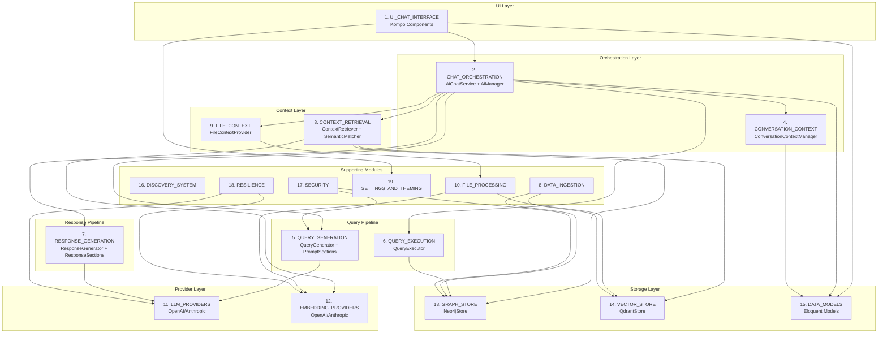

# MODULE INDEX - Kompo AI Chat System

> **Status:** REFINED - Based on actual code analysis (Phase 2)
> **Last Updated:** Phase 2
> **Anchor:** CHAT-CENTRIC - All modules understood relative to chat interface flow

---

## Verified Architecture Flow

```
User Input (Browser)
       │
       ▼
┌─────────────────────────────────────────────────────────────────┐
│  MODULE 1: UI_CHAT_INTERFACE (Kompo Components)                 │
│  ChatMessageForm → SendMessageService                           │
└─────────────────────────────────────────────────────────────────┘
       │
       ▼
┌─────────────────────────────────────────────────────────────────┐
│  MODULE 2: CHAT_ORCHESTRATION                                   │
│  AiChatService → AI Facade → AiManager                          │
│  ConversationContextManager (entity extraction, ref resolution) │
└─────────────────────────────────────────────────────────────────┘
       │
       ├──────────────────────────────────────┐
       ▼                                      ▼
┌──────────────────────┐           ┌─────────────────────────────┐
│  MODULE 3: CONTEXT   │           │  MODULE 9: FILE_CONTEXT     │
│  ContextRetriever    │           │  FileContextProvider        │
│  SemanticMatcher     │           │  FileAccessResolver         │
│  ScopeSemanticMatcher│           │  PhysicalFileIndexer        │
└──────────────────────┘           └─────────────────────────────┘
       │
       ▼
┌─────────────────────────────────────────────────────────────────┐
│  MODULE 4: QUERY_GENERATION (Extensible Pipeline)               │
│  QueryGenerator + SemanticPromptBuilder + PromptSections[]      │
│  Config-driven: config('ai.query_generator_sections')           │
└─────────────────────────────────────────────────────────────────┘
       │
       ├─────────────────┐
       ▼                 ▼
┌─────────────────┐  ┌───────────────────────────────┐
│  MODULE 11:     │  │  MODULE 12: GRAPH_STORE       │
│  LLM_PROVIDERS  │  │  Neo4jStore + CypherSanitizer │
└─────────────────┘  └───────────────────────────────┘
       │                        │
       ▼                        ▼
┌─────────────────────────────────────────────────────────────────┐
│  MODULE 5: QUERY_EXECUTION                                      │
│  QueryExecutor (with rate limiting, timeout, validation)        │
└─────────────────────────────────────────────────────────────────┘
       │
       ▼
┌─────────────────────────────────────────────────────────────────┐
│  MODULE 6: RESPONSE_GENERATION (Extensible Pipeline)            │
│  ResponseGenerator + ResponseSections[] + HasInternalModules    │
│  Config-driven: config('ai.response_generator_sections')        │
└─────────────────────────────────────────────────────────────────┘
       │
       ▼
┌─────────────────────────────────────────────────────────────────┐
│  MODULE 1: UI_CHAT_INTERFACE (Response Rendering)               │
│  MessagesQuery → AiMessage display with markdown/code highlight │
└─────────────────────────────────────────────────────────────────┘
```

---

## Module Map (Refined - Phase 2)

### 1. UI_CHAT_INTERFACE
**Responsibility:** Render chat UI, handle user input, display messages, manage visual state
**Non-Responsibility:** Business logic, AI calls, data persistence (delegates to services)

**Verified Entry Points:**
- `src/Kompo/AiChatPanel.php` - Main chat panel component
- `src/Kompo/AiChatFloating.php` - Floating chat button/panel
- `src/Kompo/ChatMessageForm.php` - Message input form (sends to SendMessageService)
- `src/Kompo/MessagesQuery.php` - Message display component

**Actual Dependencies:**
- SendMessageService (via `app(SendMessageService::class)`)
- AiConversation model (via Eloquent query)
- Settings/Theme services (via traits)

**Key Files (14 total):**
```
src/Kompo/AiChatFloating.php
src/Kompo/AiChatPanel.php
src/Kompo/ChatMessageForm.php
src/Kompo/ConversationListQuery.php
src/Kompo/MessagesQuery.php
src/Kompo/Components/TypingIndicator.php
src/Kompo/Modals/ChatHelpModal.php
src/Kompo/Modals/ChatSettingsModal.php
src/Kompo/Modals/EditMessageModal.php
src/Kompo/Modals/FilePreviewModal.php
src/Kompo/Traits/HasAvatars.php
src/Kompo/Traits/HasChatSettings.php
src/Kompo/Traits/HasChatTheme.php
src/Kompo/Traits/HasMethodsAsProperties.php
resources/css/ai-chat.css
resources/js/chat-message-injector.js
resources/js/chat-scroll.js
```

**Boundary Observations:**
- Clean separation from business logic
- Uses trait composition for settings/theming
- Client-side optimistic UI via chat-message-injector.js

---

### 2. CHAT_ORCHESTRATION
**Responsibility:** Orchestrate complete chat flow from user message to AI response
**Non-Responsibility:** Direct LLM calls (delegates to AiManager), UI rendering

**Verified Entry Points:**
- `src/Services/Chat/SendMessageService.php` - Thin validation layer
- `src/Services/Chat/AiChatService.php` - Chat flow orchestrator
- `src/Services/AiManager.php` - Central facade for all AI operations

**Data Flow (Verified from code):**
```
ChatMessageForm.sendMessage()
    → SendMessageService.sendMessage(conversation, message, options)
        → AiChatService.askWithConversation(question, conversation, options)
            → ConversationContextManager.processQuestion() [entity extraction]
            → ConversationContextManager.buildPromptContext() [history context]
            → conversation.addMessage('user', ...)
            → AI::answerQuestion(enrichedQuestion, options) [AiManager facade]
                → AiManager.retrieveContext()
                → AiManager.retrieveFileContext()
                → AiManager.generateQuery()
                → AiManager.executeQuery()
                → AiManager.generateResponse()
            → ConversationContextManager.recordResponse()
            → conversation.addMessage('assistant', ...)
```

**Key Files (4 total):**
```
src/Services/AiManager.php              (Central facade - 796 lines)
src/Services/Chat/AiChatService.php     (Chat orchestrator - 233 lines)
src/Services/Chat/AiChatServiceInterface.php
src/Services/Chat/SendMessageService.php (Thin layer - 55 lines)
```

**Key Contracts:**
- `AiChatServiceInterface` - Chat service contract
- `AI` facade → `AiManager` singleton

**Boundary Observations:**
- AiManager is the true orchestrator; AiChatService adds chat-specific context
- Clean interface with ConversationContextManager for multi-turn context
- File context integrated at AiManager.answerQuestion() level

---

### 3. CONTEXT_RETRIEVAL
**Responsibility:** Retrieve and merge context from multiple sources for query generation
**Non-Responsibility:** Query generation, response generation, conversation state management

**Verified Entry Points:**
- `src/Services/ContextRetriever.php` - RAG context retrieval
- `src/Services/SemanticContextSelector.php` - Intelligent context selection
- `src/Services/ScopeSemanticMatcher.php` - Scope detection via embeddings

**Actual Dependencies:**
- VectorStoreInterface (Qdrant)
- GraphStoreInterface (Neo4j)
- EmbeddingProviderInterface

**Key Files (5 total):**
```
src/Services/ContextRetriever.php
src/Services/SemanticContextSelector.php
src/Services/ScopeSemanticMatcher.php
src/Services/SemanticMatcher.php
src/Services/SemanticIndexer.php
```

**Key Contracts:**
- `ContextRetrieverInterface`

---

### 4. CONVERSATION_CONTEXT
**Responsibility:** Manage multi-turn conversation context, entity extraction, reference resolution
**Non-Responsibility:** RAG retrieval, query generation, storage operations

**Verified Entry Points:**
- `src/Services/Context/ConversationContextManager.php` - Main context manager
- `src/Services/Context/EntityExtractor.php` - Extract entities from questions
- `src/Services/Context/ReferenceResolver.php` - Resolve "it", "that", etc.

**Actual Dependencies:**
- EntityExtractor
- ReferenceResolver
- AiConversation model

**Key Files (3 total):**
```
src/Services/Context/ConversationContextManager.php
src/Services/Context/EntityExtractor.php
src/Services/Context/ReferenceResolver.php
```

**Boundary Observations:**
- Tightly coupled trio (Manager + Extractor + Resolver)
- Manager is lazy-loaded in AiChatService
- Stores context in AiConversation.context_snapshot

---

### 5. QUERY_GENERATION (Extensible Pipeline)
**Responsibility:** Generate Cypher queries from natural language using LLM with rich context
**Non-Responsibility:** Query execution, response generation

**Verified Entry Points:**
- `src/Services/QueryGenerator.php` - Main generator
- `src/Services/SemanticPromptBuilder.php` - Builds prompts via module pipeline

**Key Pattern: HasInternalModules**
Both `SemanticPromptBuilder` and `ResponseGenerator` use `HasInternalModules` trait for extensible section pipelines.

**Config-Driven Sections:**
```php
// config/ai.php
'query_generator_sections' => [
    ProjectContextSection::class,
    GenericContextSection::class,
    CurrentUserContextSection::class,
    SchemaSection::class,
    RelationshipsSection::class,
    ExampleEntitiesSection::class,
    FileContextSection::class,
    SimilarQueriesSection::class,
    ConversationContextSection::class,
    DetectedEntitiesSection::class,
    DetectedScopesSection::class,
    PatternLibrarySection::class,  // Note: uses closure for dependency injection
    QueryRulesSection::class,
    QuestionSection::class,
    TaskInstructionsSection::class,
]
```

**Key Files (19 total):**
```
src/Services/QueryGenerator.php
src/Services/SemanticPromptBuilder.php
src/Services/PatternLibrary.php
src/Services/HasInternalModules.php    (Shared trait!)
src/Services/PromptSections/BasePromptSection.php
src/Services/PromptSections/ConversationContextSection.php
src/Services/PromptSections/CurrentUserContextSection.php
src/Services/PromptSections/DetectedEntitiesSection.php
src/Services/PromptSections/DetectedScopesSection.php
src/Services/PromptSections/ExampleEntitiesSection.php
src/Services/PromptSections/FileContextSection.php
src/Services/PromptSections/GenericContextSection.php
src/Services/PromptSections/PatternLibrarySection.php
src/Services/PromptSections/ProjectContextSection.php
src/Services/PromptSections/QueryRulesSection.php
src/Services/PromptSections/QuestionSection.php
src/Services/PromptSections/RelationshipsSection.php
src/Services/PromptSections/SchemaSection.php
src/Services/PromptSections/SimilarQueriesSection.php
src/Services/PromptSections/TaskInstructionsSection.php
```

**Key Contracts:**
- `QueryGeneratorInterface`
- `PromptSectionInterface` (for sections)
- `SectionModuleInterface` (base for extensible modules)

---

### 6. QUERY_EXECUTION
**Responsibility:** Execute Cypher queries against Neo4j with safety, rate limiting, timeouts
**Non-Responsibility:** Query generation, response generation

**Verified Entry Points:**
- `src/Services/QueryExecutor.php`

**Key Files (1 total):**
```
src/Services/QueryExecutor.php
```

**Key Contracts:**
- `QueryExecutorInterface`

**Features:**
- Rate limiting
- Timeout handling
- Read-only mode enforcement
- Pagination support
- Query explanation (EXPLAIN)

---

### 7. RESPONSE_GENERATION (Extensible Pipeline)
**Responsibility:** Generate natural language responses from query results using LLM
**Non-Responsibility:** Query execution, context retrieval

**Verified Entry Points:**
- `src/Services/ResponseGenerator.php` - Main generator with section pipeline

**Config-Driven Sections:**
```php
// config/ai.php
'response_generator_sections' => [
    SystemPromptSection::class,
    PrivacyAndSecurityGuidelinesSection::class,
    ResponseProjectContextSection::class,
    OriginalQuestionSection::class,
    QueryInfoSection::class,
    FileContextSection::class,
    ResultsDataSection::class,
    StatisticsSection::class,
    GuidelinesSection::class,
    ResponseTaskSection::class,
]
```

**Key Files (13 total):**
```
src/Services/ResponseGenerator.php
src/Services/Response/ResponseFileEnricher.php
src/Services/ResponseSections/BaseResponseSection.php
src/Services/ResponseSections/FileContextSection.php
src/Services/ResponseSections/GuidelinesSection.php
src/Services/ResponseSections/OriginalQuestionSection.php
src/Services/ResponseSections/PrivacyAndSecurityGuidelinesSection.php
src/Services/ResponseSections/QueryInfoSection.php
src/Services/ResponseSections/ResponseProjectContextSection.php
src/Services/ResponseSections/ResponseTaskSection.php
src/Services/ResponseSections/ResultsDataSection.php
src/Services/ResponseSections/StatisticsSection.php
src/Services/ResponseSections/SystemPromptSection.php
```

**Key Contracts:**
- `ResponseGeneratorInterface`
- `ResponseSectionInterface` (for sections)

---

### 8. DATA_INGESTION
**Responsibility:** Ingest entities into dual storage (Neo4j + Qdrant)
**Non-Responsibility:** Query generation, response generation

**Verified Entry Points:**
- `src/Services/DataIngestionService.php`

**Key Files (1 total):**
```
src/Services/DataIngestionService.php
```

**Key Contracts:**
- `DataIngestionServiceInterface`

---

### 9. FILE_CONTEXT
**Responsibility:** Provide file content as context for AI queries with access control
**Non-Responsibility:** File storage, UI rendering

**Verified Entry Points:**
- `src/Services/Context/FileContextProvider.php` - Main provider
- `src/Services/Context/FileAccessResolver.php` - Security resolver

**Actual Dependencies:**
- FileSearchService
- FileAccessResolverInterface

**Key Files (3 total):**
```
src/Services/Context/FileContextProvider.php
src/Services/Context/FileAccessResolver.php
src/Services/Files/PhysicalFileIndexer.php
```

**Key Contracts:**
- `FileAccessResolverInterface`

---

### 10. FILE_PROCESSING
**Responsibility:** Extract content from files, chunk, and index for semantic search
**Non-Responsibility:** File storage, access control

**Verified Entry Points:**
- `src/Services/FileProcessor.php`
- `src/Services/FileExtractorRegistry.php`

**Key Files (10 total):**
```
src/Services/FileProcessor.php
src/Services/FileExtractorRegistry.php
src/Services/SemanticChunker.php
src/Services/FileSearchService.php
src/Services/QdrantChunkStore.php
src/Services/Extractors/DocxExtractor.php
src/Services/Extractors/MarkdownExtractor.php
src/Services/Extractors/PdfExtractor.php
src/Services/Extractors/TextExtractor.php
```

**Key Contracts:**
- `FileProcessorInterface`
- `FileExtractorInterface`
- `FileChunkerInterface`
- `ChunkStoreInterface`

---

### 11. LLM_PROVIDERS
**Responsibility:** Abstract LLM API calls (OpenAI, Anthropic)
**Non-Responsibility:** Prompt construction, response parsing

**Verified Entry Points:**
- `src/LlmProviders/OpenAiLlmProvider.php`
- `src/LlmProviders/AnthropicLlmProvider.php`

**Key Files (2 total):**
```
src/LlmProviders/AnthropicLlmProvider.php
src/LlmProviders/OpenAiLlmProvider.php
```

**Key Contracts:**
- `LlmProviderInterface`

---

### 12. EMBEDDING_PROVIDERS
**Responsibility:** Generate vector embeddings for semantic search
**Non-Responsibility:** Storage, retrieval

**Key Files (2 total):**
```
src/EmbeddingProviders/AnthropicEmbeddingProvider.php
src/EmbeddingProviders/OpenAiEmbeddingProvider.php
```

**Key Contracts:**
- `EmbeddingProviderInterface`

---

### 13. GRAPH_STORE
**Responsibility:** Store and query graph data in Neo4j
**Non-Responsibility:** Query generation (receives Cypher, executes it)

**Key Files (2 total):**
```
src/GraphStore/Neo4jStore.php
src/GraphStore/CypherSanitizer.php
```

**Key Contracts:**
- `GraphStoreInterface`

---

### 14. VECTOR_STORE
**Responsibility:** Store and query vector embeddings in Qdrant
**Non-Responsibility:** Embedding generation

**Key Files (1 total):**
```
src/VectorStore/QdrantStore.php
```

**Key Contracts:**
- `VectorStoreInterface`

---

### 15. DATA_MODELS
**Responsibility:** Define data structures and persistence (thin models)
**Non-Responsibility:** Business logic

**Key Files (6 total):**
```
src/Models/AiConversation.php
src/Models/AiMessage.php
src/Models/AiQueryLog.php
src/Models/AiUserSetting.php
src/Models/Plugins/FileAccessScopePlugin.php
src/Models/Plugins/FileProcessingPlugin.php
```

---

### 16. DISCOVERY_SYSTEM
**Responsibility:** Auto-discover entities, schemas, scopes from Laravel models
**Non-Responsibility:** Runtime query handling

**Key Files (11 total):**
```
src/Services/Discovery/AliasGenerator.php
src/Services/Discovery/CypherPatternGenerator.php
src/Services/Discovery/CypherQueryBuilderSpy.php
src/Services/Discovery/CypherScopeAdapter.php
src/Services/Discovery/EmbedFieldDetector.php
src/Services/Discovery/EntityAutoDiscovery.php
src/Services/Discovery/InheritanceResolver.php
src/Services/Discovery/PropertyDiscoverer.php
src/Services/Discovery/RelationshipDiscoverer.php
src/Services/Discovery/SchemaInspector.php
src/Services/Discovery/TraversalScopeGenerator.php
```

---

### 17. SECURITY
**Responsibility:** Sanitize queries, enforce access control, prevent injection
**Non-Responsibility:** Authentication (Laravel handles)

**Key Files (5 total):**
```
src/Services/Security/AccessLevelResolver.php
src/Services/Security/CypherSanitizer.php
src/Services/Security/PromptContextBuilder.php
src/Services/Security/SensitiveDataSanitizer.php
src/Services/Security/TeamFilteredQuery.php
```

**Note:** `src/GraphStore/CypherSanitizer.php` is DUPLICATE of `src/Services/Security/CypherSanitizer.php` - potential cleanup target

---

### 18. RESILIENCE
**Responsibility:** Handle failures gracefully (retry, circuit breaker, rate limiting)
**Non-Responsibility:** Business logic

**Key Files (3 total):**
```
src/Services/Resilience/CircuitBreaker.php
src/Services/Resilience/RateLimiter.php
src/Services/Resilience/RetryPolicy.php
```

---

### 19. SETTINGS_AND_THEMING
**Responsibility:** User-configurable settings and visual theming
**Non-Responsibility:** Core chat logic

**Key Files (12 total):**
```
src/Services/Settings/AbstractChatSettings.php
src/Services/Settings/ChatSettingsInterface.php
src/Services/Settings/UserChatSettings.php
src/Services/UI/AbstractChatTheme.php
src/Services/UI/ChatThemeFactoryInterface.php
src/Services/UI/ChatThemeInterface.php
src/Services/UI/ConfigChatThemeFactory.php
src/Services/UI/SafeMarkdownRenderer.php
src/Services/UI/UserChatThemeFactory.php
src/Services/UI/Themes/ConfigTheme.php
src/Services/UI/Themes/GreenTheme.php
src/Services/UI/Themes/IndigoTheme.php
```

**Key Contracts:**
- `ChatSettingsInterface`
- `ChatThemeInterface`
- `ChatThemeFactoryInterface`

---

### 20. CONSOLE_COMMANDS
**Responsibility:** CLI tools for indexing, processing, diagnostics
**Non-Responsibility:** Runtime chat handling

**Key Files (9 total):**
```
src/Console/Commands/DiagnoseCommand.php
src/Console/Commands/DiscoverEntitiesCommand.php
src/Console/Commands/IndexContextCommand.php
src/Console/Commands/IndexScopesCommand.php
src/Console/Commands/IndexSemanticCommand.php
src/Console/Commands/IngestEntitiesCommand.php
src/Console/Commands/ProcessFilesCommand.php
src/Console/Commands/SyncRelationshipsCommand.php
src/Console/Commands/ValidateConfigCommand.php
```

---

### 21. DOMAIN_CONTRACTS
**Responsibility:** Define core interfaces, value objects, DTOs
**Non-Responsibility:** Implementation

**Key Files (24 total):**
```
src/Contracts/ChunkStoreInterface.php
src/Contracts/ContextRetrieverInterface.php
src/Contracts/DataIngestionServiceInterface.php
src/Contracts/EmbeddingProviderInterface.php
src/Contracts/FileAccessResolverInterface.php
src/Contracts/FileChunkerInterface.php
src/Contracts/FileExtractorInterface.php
src/Contracts/FileProcessorInterface.php
src/Contracts/GraphStoreInterface.php
src/Contracts/LlmProviderInterface.php
src/Contracts/PromptSectionInterface.php
src/Contracts/QueryExecutorInterface.php
src/Contracts/QueryGeneratorInterface.php
src/Contracts/ResponseGeneratorInterface.php
src/Contracts/ResponseSectionInterface.php
src/Contracts/SectionModuleInterface.php
src/Contracts/VectorStoreInterface.php
src/Domain/Contracts/Nodeable.php
src/Domain/Traits/HasNodeableConfig.php
src/Domain/ValueObjects/GraphConfig.php
src/Domain/ValueObjects/NodeableConfig.php
src/Domain/ValueObjects/RelationshipConfig.php
src/Domain/ValueObjects/VectorConfig.php
src/DTOs/FileChunk.php
src/DTOs/ProcessingResult.php
```

---

### 22. INFRASTRUCTURE
**Responsibility:** Laravel integration (service provider, facades, observers, jobs, HTTP)
**Non-Responsibility:** Business logic

**Key Files (11 total):**
```
src/AiServiceProvider.php           (770 lines - large, wires everything)
src/Facades/AI.php
src/Facades/FileSearch.php
src/Observers/RelatedModelSyncObserver.php
src/Jobs/IngestEntityJob.php
src/Jobs/ProcessFileJob.php
src/Jobs/RemoveEntityJob.php
src/Jobs/SyncEntityJob.php
src/Http/Controllers/ConversationController.php
src/Http/Controllers/HealthController.php
```

---

### 23. EXCEPTIONS
**Responsibility:** Define domain-specific exceptions
**Non-Responsibility:** Exception handling

**Key Files (9 total):**
```
src/Exceptions/CircuitBreakerOpenException.php
src/Exceptions/CypherInjectionException.php
src/Exceptions/DataConsistencyException.php
src/Exceptions/QueryExecutionException.php
src/Exceptions/QueryGenerationException.php
src/Exceptions/QueryTimeoutException.php
src/Exceptions/QueryValidationException.php
src/Exceptions/ReadOnlyViolationException.php
src/Exceptions/UnsafeQueryException.php
```

---

## Cross-Module Dependencies (Verified)



---

## Identified Issues for Phase 4 Deep Analysis

### Potential Boundary Violations
1. **Duplicate CypherSanitizer** - exists in both `GraphStore/` and `Services/Security/`
2. **AiServiceProvider size** - 770 lines, may need decomposition
3. **HasInternalModules coupling** - shared trait creates implicit coupling

### Areas Requiring Reference Tracing
1. **FileContextSection** - exists in BOTH PromptSections AND ResponseSections (different classes, same name)
2. **PatternLibrary** - loaded via closure in config, verify actual usage
3. **Model Plugins** - verify FileProcessingPlugin and FileAccessScopePlugin are actually invoked

### Config-Driven Behavior
1. **query_generator_sections** - 16 sections, verify all are used
2. **response_generator_sections** - 10 sections, verify all are used
3. **file_context** - extensive config, verify all options consumed

---

## Raw Inventory (Phase 1 Complete)

> **Note:** Vendor and .git directories excluded - focusing on project source files only.

### Root Directory Files
```
.claude/settings.local.json
.env.example
.gitignore
.phpunit.result.cache
composer.json
composer.lock
docker-compose.yml
phpunit.xml
README.md
testbench.yaml
nul
```

### /config (4 files)
```
config/ai.php
config/ai-patterns.php
config/entities.php
config/larecipe.php
```

### /database/migrations (5 files)
```
database/migrations/2025_01_01_000001_create_ai_conversations_table.php
database/migrations/2025_01_01_000002_create_ai_query_logs_table.php
database/migrations/2025_01_02_000001_add_context_snapshot_to_ai_conversations.php
database/migrations/2025_01_03_000001_create_ai_user_settings_table.php
database/migrations/2026_01_03_000001_add_settings_columns_to_ai_user_settings_table.php
```

### /routes (2 files)
```
routes/api.php
routes/web.php
```

### /resources/css (1 file)
```
resources/css/ai-chat.css
```

### /resources/js (2 files)
```
resources/js/chat-message-injector.js
resources/js/chat-scroll.js
```

### /resources/lang (2 files)
```
resources/lang/en.json
resources/lang/fr.json
```

### /resources/docs/1.0 (Documentation - 35 files)
```
resources/docs/1.0/index.md
resources/docs/1.0/advanced/auto-discovery.md
resources/docs/1.0/advanced/context-selection.md
resources/docs/1.0/advanced/patterns.md
resources/docs/1.0/advanced/scopes.md
resources/docs/1.0/advanced/semantic-matching.md
resources/docs/1.0/chat/chat-ui.md
resources/docs/1.0/chat/conversation-context-management.md
resources/docs/1.0/chat/file-context-system.md
resources/docs/1.0/chat/module-pipeline.md
resources/docs/1.0/configuration/entities.md
resources/docs/1.0/configuration/environment.md
resources/docs/1.0/configuration/response-styles.md
resources/docs/1.0/extending/embedding-providers.md
resources/docs/1.0/extending/file-extractors.md
resources/docs/1.0/extending/llm-providers.md
resources/docs/1.0/extending/prompt-sections.md
resources/docs/1.0/foundations/configuration.md
resources/docs/1.0/foundations/index.md
resources/docs/1.0/foundations/infrastructure.md
resources/docs/1.0/foundations/installing.md
resources/docs/1.0/foundations/requirements.md
resources/docs/1.0/foundations/troubleshooting.md
resources/docs/1.0/internals/architecture.md
resources/docs/1.0/internals/components.md
resources/docs/1.0/internals/data-flows.md
resources/docs/1.0/internals/index.md
resources/docs/1.0/internals/resilience.md
resources/docs/1.0/internals/storage-guide.md
resources/docs/1.0/reference/commands.md
resources/docs/1.0/reference/facades.md
resources/docs/1.0/reference/interfaces.md
resources/docs/1.0/usage/advanced-usage.md
resources/docs/1.0/usage/context-retrieval.md
resources/docs/1.0/usage/data-ingestion.md
resources/docs/1.0/usage/embeddings.md
resources/docs/1.0/usage/examples.md
resources/docs/1.0/usage/extending.md
resources/docs/1.0/usage/file-search.md
resources/docs/1.0/usage/index.md
resources/docs/1.0/usage/laravel-integration.md
resources/docs/1.0/usage/llm.md
resources/docs/1.0/usage/quick-start.md
resources/docs/1.0/usage/simple-usage.md
resources/docs/1.0/usage/testing.md
```

### /docs (4 files)
```
docs/architecture.md
docs/diagrams.md
docs/quick-start.md
docs/plans/2026-01-03-chat-ux-animations-scroll.md
```

### /src - Main Source (167 files)

#### src/ Root (1 file)
```
src/AiServiceProvider.php
```

#### src/Console/Commands (10 files)
```
src/Console/Commands/DiagnoseCommand.php
src/Console/Commands/DiscoverEntitiesCommand.php
src/Console/Commands/IndexContextCommand.php
src/Console/Commands/IndexScopesCommand.php
src/Console/Commands/IndexSemanticCommand.php
src/Console/Commands/IngestEntitiesCommand.php
src/Console/Commands/ProcessFilesCommand.php
src/Console/Commands/SyncRelationshipsCommand.php
src/Console/Commands/ValidateConfigCommand.php
```

#### src/Contracts (17 files)
```
src/Contracts/ChunkStoreInterface.php
src/Contracts/ContextRetrieverInterface.php
src/Contracts/DataIngestionServiceInterface.php
src/Contracts/EmbeddingProviderInterface.php
src/Contracts/FileAccessResolverInterface.php
src/Contracts/FileChunkerInterface.php
src/Contracts/FileExtractorInterface.php
src/Contracts/FileProcessorInterface.php
src/Contracts/GraphStoreInterface.php
src/Contracts/LlmProviderInterface.php
src/Contracts/PromptSectionInterface.php
src/Contracts/QueryExecutorInterface.php
src/Contracts/QueryGeneratorInterface.php
src/Contracts/ResponseGeneratorInterface.php
src/Contracts/ResponseSectionInterface.php
src/Contracts/SectionModuleInterface.php
src/Contracts/VectorStoreInterface.php
```

#### src/Domain (5 files)
```
src/Domain/Contracts/Nodeable.php
src/Domain/Traits/HasNodeableConfig.php
src/Domain/ValueObjects/GraphConfig.php
src/Domain/ValueObjects/NodeableConfig.php
src/Domain/ValueObjects/RelationshipConfig.php
src/Domain/ValueObjects/VectorConfig.php
```

#### src/DTOs (2 files)
```
src/DTOs/FileChunk.php
src/DTOs/ProcessingResult.php
```

#### src/EmbeddingProviders (2 files)
```
src/EmbeddingProviders/AnthropicEmbeddingProvider.php
src/EmbeddingProviders/OpenAiEmbeddingProvider.php
```

#### src/Exceptions (9 files)
```
src/Exceptions/CircuitBreakerOpenException.php
src/Exceptions/CypherInjectionException.php
src/Exceptions/DataConsistencyException.php
src/Exceptions/QueryExecutionException.php
src/Exceptions/QueryGenerationException.php
src/Exceptions/QueryTimeoutException.php
src/Exceptions/QueryValidationException.php
src/Exceptions/ReadOnlyViolationException.php
src/Exceptions/UnsafeQueryException.php
```

#### src/Facades (2 files)
```
src/Facades/AI.php
src/Facades/FileSearch.php
```

#### src/GraphStore (2 files)
```
src/GraphStore/CypherSanitizer.php
src/GraphStore/Neo4jStore.php
```

#### src/Http/Controllers (2 files)
```
src/Http/Controllers/ConversationController.php
src/Http/Controllers/HealthController.php
```

#### src/Jobs (4 files)
```
src/Jobs/IngestEntityJob.php
src/Jobs/ProcessFileJob.php
src/Jobs/RemoveEntityJob.php
src/Jobs/SyncEntityJob.php
```

#### src/Kompo (14 files)
```
src/Kompo/AiChatFloating.php
src/Kompo/AiChatPanel.php
src/Kompo/ChatMessageForm.php
src/Kompo/ConversationListQuery.php
src/Kompo/MessagesQuery.php
src/Kompo/Components/TypingIndicator.php
src/Kompo/Modals/ChatHelpModal.php
src/Kompo/Modals/ChatSettingsModal.php
src/Kompo/Modals/EditMessageModal.php
src/Kompo/Modals/FilePreviewModal.php
src/Kompo/Traits/HasAvatars.php
src/Kompo/Traits/HasChatSettings.php
src/Kompo/Traits/HasChatTheme.php
src/Kompo/Traits/HasMethodsAsProperties.php
```

#### src/LlmProviders (2 files)
```
src/LlmProviders/AnthropicLlmProvider.php
src/LlmProviders/OpenAiLlmProvider.php
```

#### src/Models (6 files)
```
src/Models/AiConversation.php
src/Models/AiMessage.php
src/Models/AiQueryLog.php
src/Models/AiUserSetting.php
src/Models/Plugins/FileAccessScopePlugin.php
src/Models/Plugins/FileProcessingPlugin.php
```

#### src/Observers (1 file)
```
src/Observers/RelatedModelSyncObserver.php
```

#### src/Services (88 files)
```
src/Services/AiManager.php
src/Services/ContextRetriever.php
src/Services/DataIngestionService.php
src/Services/FileExtractorRegistry.php
src/Services/FileProcessor.php
src/Services/FileSearchService.php
src/Services/HasInternalModules.php
src/Services/PatternLibrary.php
src/Services/QdrantChunkStore.php
src/Services/QueryExecutor.php
src/Services/QueryGenerator.php
src/Services/ResponseGenerator.php
src/Services/ScopeSemanticMatcher.php
src/Services/SemanticChunker.php
src/Services/SemanticContextSelector.php
src/Services/SemanticIndexer.php
src/Services/SemanticMatcher.php
src/Services/SemanticPromptBuilder.php

src/Services/Chat/AiChatService.php
src/Services/Chat/AiChatServiceInterface.php
src/Services/Chat/SendMessageService.php

src/Services/Context/ConversationContextManager.php
src/Services/Context/EntityExtractor.php
src/Services/Context/FileAccessResolver.php
src/Services/Context/FileContextProvider.php
src/Services/Context/ReferenceResolver.php

src/Services/Discovery/AliasGenerator.php
src/Services/Discovery/CypherPatternGenerator.php
src/Services/Discovery/CypherQueryBuilderSpy.php
src/Services/Discovery/CypherScopeAdapter.php
src/Services/Discovery/EmbedFieldDetector.php
src/Services/Discovery/EntityAutoDiscovery.php
src/Services/Discovery/InheritanceResolver.php
src/Services/Discovery/PropertyDiscoverer.php
src/Services/Discovery/RelationshipDiscoverer.php
src/Services/Discovery/SchemaInspector.php
src/Services/Discovery/TraversalScopeGenerator.php

src/Services/Extractors/DocxExtractor.php
src/Services/Extractors/MarkdownExtractor.php
src/Services/Extractors/PdfExtractor.php
src/Services/Extractors/TextExtractor.php

src/Services/Files/PhysicalFileIndexer.php

src/Services/PromptSections/BasePromptSection.php
src/Services/PromptSections/ConversationContextSection.php
src/Services/PromptSections/CurrentUserContextSection.php
src/Services/PromptSections/DetectedEntitiesSection.php
src/Services/PromptSections/DetectedScopesSection.php
src/Services/PromptSections/ExampleEntitiesSection.php
src/Services/PromptSections/FileContextSection.php
src/Services/PromptSections/GenericContextSection.php
src/Services/PromptSections/PatternLibrarySection.php
src/Services/PromptSections/ProjectContextSection.php
src/Services/PromptSections/QueryRulesSection.php
src/Services/PromptSections/QuestionSection.php
src/Services/PromptSections/RelationshipsSection.php
src/Services/PromptSections/SchemaSection.php
src/Services/PromptSections/SimilarQueriesSection.php
src/Services/PromptSections/TaskInstructionsSection.php

src/Services/Resilience/CircuitBreaker.php
src/Services/Resilience/RateLimiter.php
src/Services/Resilience/RetryPolicy.php

src/Services/Response/ResponseFileEnricher.php

src/Services/ResponseSections/BaseResponseSection.php
src/Services/ResponseSections/FileContextSection.php
src/Services/ResponseSections/GuidelinesSection.php
src/Services/ResponseSections/OriginalQuestionSection.php
src/Services/ResponseSections/PrivacyAndSecurityGuidelinesSection.php
src/Services/ResponseSections/QueryInfoSection.php
src/Services/ResponseSections/ResponseProjectContextSection.php
src/Services/ResponseSections/ResponseTaskSection.php
src/Services/ResponseSections/ResultsDataSection.php
src/Services/ResponseSections/StatisticsSection.php
src/Services/ResponseSections/SystemPromptSection.php

src/Services/Security/AccessLevelResolver.php
src/Services/Security/CypherSanitizer.php
src/Services/Security/PromptContextBuilder.php
src/Services/Security/SensitiveDataSanitizer.php
src/Services/Security/TeamFilteredQuery.php

src/Services/Settings/AbstractChatSettings.php
src/Services/Settings/ChatSettingsInterface.php
src/Services/Settings/UserChatSettings.php

src/Services/UI/AbstractChatTheme.php
src/Services/UI/ChatThemeFactoryInterface.php
src/Services/UI/ChatThemeInterface.php
src/Services/UI/ConfigChatThemeFactory.php
src/Services/UI/SafeMarkdownRenderer.php
src/Services/UI/UserChatThemeFactory.php
src/Services/UI/Themes/ConfigTheme.php
src/Services/UI/Themes/GreenTheme.php
src/Services/UI/Themes/IndigoTheme.php
```

#### src/VectorStore (1 file)
```
src/VectorStore/QdrantStore.php
```

### /tests (96 files)

#### tests/ Root & Fixtures
```
tests/TestCase.php
tests/Fixtures/TestCustomer.php
tests/Fixtures/TestOrder.php
tests/database/factories/TestCustomerFactory.php
tests/database/factories/TestOrderFactory.php
tests/database/migrations/2024_01_01_000001_create_test_customers_table.php
tests/database/migrations/2024_01_01_000002_create_test_orders_table.php
```

#### tests/Feature (4 files)
```
tests/Feature/AiSystemFeatureTest.php
tests/Feature/HealthEndpointTest.php
tests/Feature/FileContextIntegrationTest.php
tests/Feature/Commands/IngestPhysicalFilesTest.php
```

#### tests/Integration (11 files)
```
tests/Integration/ConversationContextIntegrationTest.php
tests/Integration/DualStorageCoordinationTest.php
tests/Integration/EntityAutoDiscoveryTest.php
tests/Integration/FileContextFlowTest.php
tests/Integration/FileProcessingPipelineTest.php
tests/Integration/RealBusinessScenarioTest.php
tests/Integration/EmbeddingProviders/OpenAiEmbeddingProviderTest.php
tests/Integration/GraphStore/Neo4jStoreTest.php
tests/Integration/LlmProviders/AnthropicLlmProviderTest.php
tests/Integration/LlmProviders/OpenAiLlmProviderTest.php
tests/Integration/VectorStore/QdrantStoreTest.php
```

#### tests/Unit (74 files)
```
tests/Unit/ServiceProviderFileContextTest.php
tests/Unit/ServiceProviderRegistrationTest.php
tests/Unit/Config/FileContextConfigTest.php
tests/Unit/Console/DiagnoseCommandTest.php
tests/Unit/Console/ValidateConfigCommandTest.php
tests/Unit/Domain/Traits/HasNodeableConfigPropertiesTest.php
tests/Unit/Domain/Traits/HasNodeableConfigTest.php
tests/Unit/Domain/ValueObjects/GraphConfigTest.php
tests/Unit/Domain/ValueObjects/NodeableConfigTest.php
tests/Unit/Domain/ValueObjects/RelationshipConfigTest.php
tests/Unit/Domain/ValueObjects/VectorConfigTest.php
tests/Unit/DTOs/FileChunkTest.php
tests/Unit/DTOs/ProcessingResultTest.php
tests/Unit/EmbeddingProviders/AnthropicEmbeddingProviderTest.php
tests/Unit/EmbeddingProviders/OpenAiEmbeddingProviderTest.php
tests/Unit/GraphStore/Neo4jStoreSecurityTest.php
tests/Unit/Kompo/ChatComponentsBootTest.php
tests/Unit/LlmProviders/AnthropicLlmProviderTest.php
tests/Unit/LlmProviders/OpenAiLlmProviderTest.php
tests/Unit/Models/AiConversationContextTest.php
tests/Unit/Models/AiConversationTest.php
tests/Unit/Models/Plugins/FileProcessingPluginTest.php
tests/Unit/Observers/RelatedModelSyncObserverTest.php
tests/Unit/Resilience/CircuitBreakerTest.php
tests/Unit/Resilience/RetryPolicyTest.php
tests/Unit/Security/CypherInjectionTest.php
tests/Unit/Services/AiManagerContextTest.php
tests/Unit/Services/AiManagerFileContextTest.php
tests/Unit/Services/ContextRetrieverTest.php
tests/Unit/Services/DataConsistencyTest.php
tests/Unit/Services/DataIngestionServiceSecurityTest.php
tests/Unit/Services/DataIngestionServiceTest.php
tests/Unit/Services/EntityMetadataTest.php
tests/Unit/Services/FileExtractorRegistryTest.php
tests/Unit/Services/PatternLibraryMinimalTest.php
tests/Unit/Services/PatternLibraryTest.php
tests/Unit/Services/QueryExecutorRateLimitTest.php
tests/Unit/Services/QueryExecutorTest.php
tests/Unit/Services/QueryGeneratorSecurityTest.php
tests/Unit/Services/QueryGeneratorTest.php
tests/Unit/Services/RelationshipWeightsTest.php
tests/Unit/Services/ResponseGeneratorTest.php
tests/Unit/Services/SemanticChunkerTest.php
tests/Unit/Services/Chat/AiChatServiceContextTest.php
tests/Unit/Services/Chat/SendMessageServiceTest.php
tests/Unit/Services/Context/ConversationContextManagerTest.php
tests/Unit/Services/Context/ConversationFileTrackingTest.php
tests/Unit/Services/Context/EntityExtractorTest.php
tests/Unit/Services/Context/FileAccessResolverTest.php
tests/Unit/Services/Context/FileContextProviderSecurityTest.php
tests/Unit/Services/Context/FileContextProviderTest.php
tests/Unit/Services/Context/ReferenceResolverTest.php
tests/Unit/Services/Discovery/CypherPatternGeneratorTest.php
tests/Unit/Services/Discovery/CypherQueryBuilderSpyTest.php
tests/Unit/Services/Discovery/CypherScopeAdapterTest.php
tests/Unit/Services/Discovery/InheritanceResolverTest.php
tests/Unit/Services/Discovery/NestedScopeDiscoveryTest.php
tests/Unit/Services/Discovery/SchemaInspectorTest.php
tests/Unit/Services/Discovery/SensibleColumnsDiscoveryTest.php
tests/Unit/Services/Discovery/TeamResolutionDiscoveryTest.php
tests/Unit/Services/Files/PhysicalFileIndexerTest.php
tests/Unit/Services/PromptSections/ConversationContextSectionTest.php
tests/Unit/Services/PromptSections/FileContextSectionTest.php
tests/Unit/Services/Response/ResponseFileEnricherTest.php
tests/Unit/Services/ResponseSections/FileContextSectionTest.php
tests/Unit/Services/Security/AccessLevelResolverTest.php
tests/Unit/Services/Security/PromptContextBuilderTest.php
tests/Unit/Services/Security/TeamFilteredQueryTest.php
tests/Unit/StressTests/AdversarialSecurityTest.php
tests/Unit/StressTests/DualStorageFailureTest.php
tests/Unit/StressTests/RealBusinessScenarioStressTest.php
```

---

### Directory Structure Summary

| Directory | Subdirectories | PHP Files | Other Files |
|-----------|---------------|-----------|-------------|
| /config | 0 | 4 | 0 |
| /database | 1 | 5 | 0 |
| /docs | 1 | 0 | 4 |
| /resources | 5 | 0 | 69 |
| /routes | 0 | 2 | 0 |
| /src | 17 | 167 | 0 |
| /tests | 20 | 96 | 0 |
| **TOTAL** | **44** | **274** | **73** |

---

## Revision History

| Phase | Date | Changes |
|-------|------|---------|
| 0 | 2026-01-03 | Initial hypothesized module structure |
| 1 | 2026-01-03 | Added raw inventory: 167 src files, 96 test files, 73 other files |
| 2 | 2026-01-03 | Refined to 23 modules with verified boundaries, data flows, and file counts |
