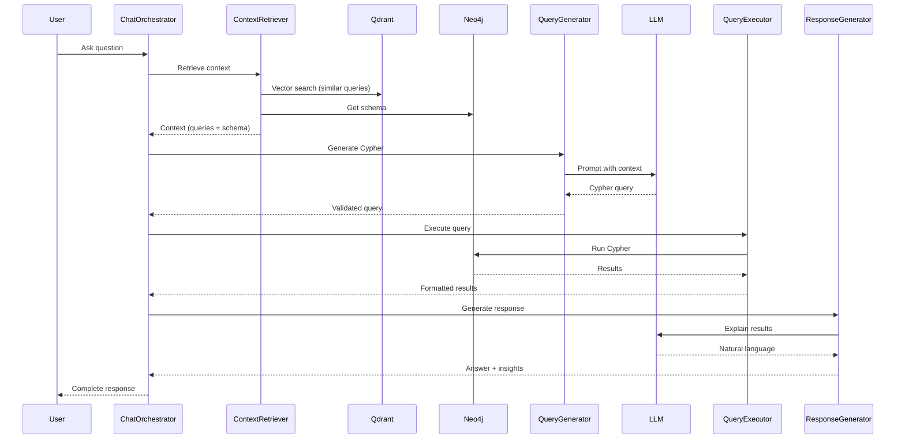

# AI Package Architecture

## Overview

The AI package is a Laravel-based system that provides **Text-to-Cypher query generation with RAG (Retrieval-Augmented Generation)** capabilities, using dual-storage with Neo4j for graph relationships and Qdrant for vector embeddings.

**Core Capabilities:**
- Auto-discovery of entity configuration from Eloquent models
- Automatic conversion of Eloquent scopes to Cypher patterns
- Dual-storage coordination (Neo4j + Qdrant)
- RAG-powered natural language to Cypher query generation
- Auto-sync of model changes to graph and vector stores

## Architecture Components

### 1. Auto-Discovery System

Eliminates manual configuration by introspecting Eloquent models to extract entity metadata.

#### EntityAutoDiscovery Service

**Purpose:** Discovers entity configuration from Eloquent models using PHP Reflection.

**What it discovers:**
- **Label**: Class name → Neo4j node label
- **Properties**: From `$fillable`, `$casts`, `$dates` → Neo4j properties
- **Relationships**: From `belongsTo()` methods → Neo4j relationships
- **Embed Fields**: Text-like fields (`name`, `description`, etc.) → Qdrant embedding
- **Aliases**: From table names → Semantic matching
- **Scopes**: From `scopeX()` methods → Query patterns

**Example:**
```php
class Customer extends Model implements Nodeable
{
    use HasNodeableConfig;

    protected $fillable = ['name', 'email', 'status'];

    public function team() {
        return $this->belongsTo(Team::class);
    }

    public function scopeActive($query) {
        return $query->where('status', 'active');
    }
}

// Auto-discovered configuration:
// Label: "Customer"
// Properties: ['id', 'name', 'email', 'status', 'created_at', 'updated_at']
// Relationships: [BELONGS_TO_TEAM → Team]
// Collection: "customers"
// Embed Fields: ['name', 'email']
// Aliases: ['customer', 'customers', 'client', 'clients']
// Scopes: ['active']
```

#### Discovery Strategy

**Three-Tier Fallback Chain** (priority order):
1. **Explicit Config**: `nodeableConfig()` method in model
2. **Legacy Config**: `config/entities.php` file
3. **Auto-Discovery**: Introspection from model definition (default)

**Property Discovery Algorithm:**
1. Start with `id` (always included)
2. Add `$fillable` attributes
3. Add `$casts` keys
4. Add date fields from `$dates`
5. Add timestamps if enabled
6. Remove `$hidden` attributes
7. Remove sensitive fields (password, tokens)

**Relationship Discovery:**
- Only `belongsTo` relationships are auto-discovered
- Generates relationship type from method name: `customer()` → `BELONGS_TO_CUSTOMER`
- Extracts foreign key automatically
- `hasMany` is ignored (inverse, discovered from target entity)

**Embed Field Detection:**
- Common patterns: `name`, `title`, `description`, `notes`, `content`, `body`, `bio`
- Cast types: `string`, `text`
- Excludes: IDs, foreign keys, dates, numeric fields

#### SchemaInspector

**Purpose:** Extracts database schema hints for better discovery.

**Capabilities:**
- Column type analysis
- Index detection
- Foreign key relationships
- Nullable/required field detection

#### Caching Strategy

**ConfigCache Service:**
- Caches introspection results (expensive operation)
- Default TTL: 1 hour
- Key pattern: `ai:discovery:{EntityClass}`
- Disabled in development for hot-reload
- Warmed during deployment via `php artisan ai:discover:cache`

### 2. Scope to Cypher Conversion

Automatically converts Eloquent query scopes into Neo4j Cypher patterns.

#### CypherScopeAdapter

**Purpose:** Main orchestrator that discovers scopes and converts them to Cypher.

**Flow:**
```
Eloquent Scope → CypherQueryBuilderSpy → Recorded Calls → CypherPatternGenerator → Cypher Pattern
```

#### CypherQueryBuilderSpy

**Purpose:** Spy pattern that records Eloquent query builder method calls.

**How it works:**
1. Implements same interface as Eloquent query builder
2. Records each method call (where, whereIn, whereHas, etc.) with parameters
3. Returns `$this` for method chaining
4. Provides `getCalls()` to retrieve recorded sequence

**Example:**
```php
$spy = new CypherQueryBuilderSpy();
$model->scopeActiveVolunteers($spy);

$calls = $spy->getCalls();
// [
//   ['method' => 'where', 'args' => ['status', '=', 'active']],
//   ['method' => 'whereHas', 'args' => ['personTeams', <closure>]],
// ]
```

#### CypherPatternGenerator

**Purpose:** Converts recorded query builder calls into Cypher syntax.

**Supported Eloquent Methods:**
- `where()`, `orWhere()` → `n.field = value`, `OR n.field = value`
- `whereIn()`, `whereNotIn()` → `n.field IN [...]`
- `whereNull()`, `whereNotNull()` → `n.field IS NULL`
- `whereBetween()` → `n.field >= x AND n.field <= y`
- `whereColumn()` → `n.field1 < n.field2`
- `whereHas()` → `MATCH (n)-[r]->(related) WHERE ...`
- `whereDoesntHave()` → `NOT EXISTS {MATCH (n)-[r]->(related)}`

**Operator Conversion:**
- `=` → `=`
- `>`, `<`, `>=`, `<=` → Same
- `!=`, `<>` → `<>`
- `LIKE` → `CONTAINS`

**Example:**
```php
// Eloquent
public function scopeActiveVolunteers($query) {
    return $query->where('status', 'active')
                 ->whereHas('personTeams', function($q) {
                     $q->where('role_type', 'volunteer');
                 });
}

// Generated Cypher
MATCH (n:Person)-[:HAS_ROLE]->(pt:PersonTeam)
WHERE n.status = 'active'
  AND pt.role_type = 'volunteer'
RETURN DISTINCT n
```

### 3. Dual-Storage Coordination

Manages synchronized data storage across Neo4j (graph) and Qdrant (vector).

#### DataIngestionService

**Purpose:** Coordinates ingestion to both stores simultaneously.

**Responsibilities:**
- Extract entity data from Nodeable models
- Generate embeddings for text fields
- Store node + relationships in Neo4j
- Store vector + metadata in Qdrant
- Handle errors gracefully per store
- Return comprehensive status

**Process:**
```
Entity → Extract Config → Generate Embedding → [Neo4j Store | Qdrant Store] → Status
```

**Methods:**
- `ingest(Nodeable $entity)`: Single entity ingestion
- `ingestBatch(array $entities)`: Batch ingestion (more efficient)
- `sync(Nodeable $entity)`: Update if exists, create if not
- `remove(Nodeable $entity)`: Remove from both stores

#### Storage Responsibilities

**Neo4j (GraphStore):**
- Node storage with properties
- Relationship creation
- Schema/metadata storage
- Query execution
- Pattern matching

**Qdrant (VectorStore):**
- Vector embeddings storage
- Semantic similarity search
- Metadata filtering
- Collection management
- Scoring/ranking

#### Auto-Sync System

**Purpose:** Automatically sync model changes to stores via Laravel events.

**Implementation:**
```php
// In HasNodeableConfig trait
protected static function bootHasNodeableConfig(): void
{
    static::created(function ($entity) {
        if ($entity->shouldAutoSync('create')) {
            $entity->autoSyncToAi('create');
        }
    });

    static::updated(function ($entity) {
        if ($entity->shouldAutoSync('update')) {
            $entity->autoSyncToAi('update');
        }
    });

    static::deleted(function ($entity) {
        if ($entity->shouldAutoSync('delete')) {
            $entity->autoSyncToAi('delete');
        }
    });
}
```

**Configuration:**
- Global: `config('ai.auto_sync.enabled')`
- Per-entity: `config('entities.Customer.auto_sync')`
- Per-model: `protected $aiAutoSync = true;`

**Queueing:**
- Supports async processing via Laravel queues
- Jobs: `IngestEntityJob`, `SyncEntityJob`, `RemoveEntityJob`
- Configurable queue connection and name
- Retry logic: 3 attempts, 120s timeout

**Error Handling:**
- Silent failure by default (doesn't crash application)
- Errors logged to Laravel log
- Optional exception throwing: `config('ai.auto_sync.fail_silently')`

### 4. RAG System

Combines vector search and graph context for intelligent query generation.

#### ContextRetriever

**Purpose:** Retrieves relevant context for answering questions using RAG.

**Context Components:**
1. **Similar Queries**: Vector search in Qdrant for past similar questions
2. **Graph Schema**: Neo4j labels, relationships, properties
3. **Example Entities**: Sample data for reference
4. **Scope Metadata**: Available semantic scopes

**Process:**
```
Question → Embed → Vector Search (Qdrant) → Similar Queries
                 → Schema Fetch (Neo4j) → Graph Structure
                 → Example Fetch (Neo4j) → Sample Data
                 → Combine → Context Array
```

**Options:**
- `collection`: Target Qdrant collection
- `limit`: Max similar queries to retrieve
- `scoreThreshold`: Minimum similarity score
- `includeSchema`: Include graph schema
- `includeExamples`: Include sample entities
- `examplesPerLabel`: Sample size per entity type

#### Pattern Library

**Purpose:** Pre-defined query patterns for common question types.

**Available Patterns:**
- `property_filter`: Simple WHERE clauses
- `property_range`: Numeric/date ranges
- `relationship_traversal`: Graph navigation
- `entity_with_relationship`: Existence checks
- `entity_without_relationship`: Absence checks
- `entity_with_aggregated_relationship`: Aggregations (SUM, COUNT, AVG)
- `temporal_filter`: Date/time queries
- `multi_hop_traversal`: Deep relationship navigation (3+ hops)
- `multiple_property_filter`: Complex AND/OR conditions
- `relationship_with_property_filter`: Combined filters

**Pattern Structure:**
```php
[
    'name' => 'property_filter',
    'description' => 'Filter entities by property value',
    'cypher_template' => 'MATCH (n:{label}) WHERE n.{property} = $value RETURN n',
    'parameters' => ['label', 'property', 'value'],
    'examples' => ['Show active customers', 'Find completed orders'],
]
```

#### QueryGenerator

**Purpose:** Generate Cypher queries from natural language using LLM + RAG context.

**Algorithm:**
1. **Template Detection**: Check if question matches known pattern (confidence > 0.8)
2. **Prompt Construction**: Build LLM prompt with context:
   - System: "You are a Neo4j Cypher query expert"
   - Graph Schema from context
   - Similar past queries
   - Example entities
   - Rules: safe queries, use LIMIT, no destructive operations
3. **Query Generation**: Send to LLM (temperature: 0.1 for consistency)
4. **Validation**:
   - Syntax check
   - Dangerous keywords (DELETE, DROP, MERGE)
   - Schema reference verification
   - Complexity scoring
5. **Retry Logic**: Up to 3 retries if validation fails
6. **Post-Processing**: Add LIMIT if missing, optimize

**Safety Features:**
- Forbidden keywords: DELETE, REMOVE, DROP, CREATE, MERGE (unless write enabled)
- Auto-add LIMIT clause (default: 100)
- Read-only mode enforcement
- Complexity scoring and limits

#### QueryExecutor

**Purpose:** Execute validated Cypher queries against Neo4j with safety measures.

**Features:**
- Timeout enforcement (default: 30s)
- Result limiting
- Read-only mode
- Multiple output formats (table, graph, JSON)
- Performance statistics
- Error handling

#### ResponseGenerator

**Purpose:** Transform raw query results into natural language using LLM.

**Capabilities:**
- Natural language explanation of results
- Data insights extraction (outliers, trends, patterns)
- Visualization suggestions (charts, graphs)
- Empty result handling
- Error response generation

**Insight Detection:**
- Statistical analysis (avg, min, max, outliers)
- Trend identification
- Pattern recognition
- Correlation detection

**Visualization Suggestions:**
- Time series → Line chart
- Categories → Bar chart
- Relationships → Network graph
- Distributions → Histogram

### 5. Entity Configuration

#### Nodeable Interface

**Contract for entities** that can be indexed in the AI system.

```php
interface Nodeable
{
    public function getGraphConfig(): GraphConfig;
    public function getVectorConfig(): VectorConfig;
}
```

#### HasNodeableConfig Trait

**Provides implementation** of Nodeable interface with auto-discovery.

**Key Methods:**
- `getGraphConfig()`: Returns Neo4j configuration (auto-discovered or explicit)
- `getVectorConfig()`: Returns Qdrant configuration (auto-discovered or explicit)
- `nodeableConfig()`: Optional method to override auto-discovery
- `bootHasNodeableConfig()`: Registers auto-sync event listeners

#### NodeableConfig Fluent Builder

**Purpose:** Type-safe, chainable API for configuring entities.

**Usage:**
```php
public function nodeableConfig(): NodeableConfig
{
    return NodeableConfig::discover($this)
        ->embedFields(['name', 'bio'])         // Override embed fields
        ->addAlias('member')                   // Add custom alias
        ->addRelationship('HAS_ROLE', 'Role', 'role_id')
        ->addScope('premium', [...])
        ->disableVectorStore();                // Graph-only entity
}
```

**Factory Methods:**
- `NodeableConfig::for(Model::class)`: Start blank
- `NodeableConfig::discover($model)`: Start with auto-discovery
- `NodeableConfig::fromArray($config)`: From existing array

**Output Methods:**
- `toArray()`: Array format (for config files)
- `toGraphConfig()`: GraphConfig object
- `toVectorConfig()`: VectorConfig object

#### Config Priority

**Resolution Order:**
1. **Method**: `nodeableConfig()` in model (highest priority)
2. **Config File**: `config/entities.php` (legacy)
3. **Auto-Discovery**: Introspection (default)

## Key Design Patterns

### Interface-Based Service Architecture

**All services defined as interfaces:**
- `LlmProviderInterface`: Chat, completion, embeddings
- `EmbeddingProviderInterface`: Generate embeddings
- `GraphStoreInterface`: Neo4j operations
- `VectorStoreInterface`: Qdrant operations
- `DataIngestionServiceInterface`: Ingest/sync
- `ContextRetrieverInterface`: RAG context

**Benefits:**
- Easy to mock in tests
- Swappable implementations
- Dependency injection friendly

### Strategy Pattern for Providers

**LLM Providers:**
- `OpenAiLlmProvider`
- `AnthropicLlmProvider`
- Configured via `config('ai.llm.provider')`

**Embedding Providers:**
- `OpenAiEmbeddingProvider`
- `AnthropicEmbeddingProvider`
- Configured via `config('ai.embedding.provider')`

**Switching providers:**
```php
// .env
AI_LLM_PROVIDER=anthropic
AI_EMBEDDING_PROVIDER=openai
```

### Spy Pattern for Query Recording

**CypherQueryBuilderSpy** records method calls without execution.

**Benefits:**
- No database connection needed
- Inspectable call sequence
- Testable in isolation

### Builder Pattern for Configuration

**NodeableConfig** provides fluent API for building configurations.

**Benefits:**
- Type-safe
- Chainable
- IDE autocomplete
- Interchangeable with array configs

### Event-Driven Auto-Sync

**Laravel model events** trigger automatic syncing.

**Benefits:**
- Zero boilerplate
- Automatic consistency
- Optional async via queues
- Granular control per operation

## Data Flow

### Question → Answer Pipeline



### Entity Ingestion Flow

```
Model Created/Updated
    ↓
Auto-Sync Event Triggered
    ↓
DataIngestionService.ingest()
    ↓
├─→ Extract GraphConfig (auto-discovered)
├─→ Extract VectorConfig (auto-discovered)
├─→ Generate Embedding (via EmbeddingProvider)
    ↓
Parallel Storage:
├─→ Neo4j: Create node + relationships
└─→ Qdrant: Store vector + metadata
    ↓
Return Status (success/errors per store)
```

## Critical Implementation Details

### Type Safety Considerations

**Nodeable Type Compatibility:**
- Models must implement `Nodeable` interface
- Use `Model & Nodeable` type hint for full type safety
- PHP 8.1+ intersection types supported
- Fallback: `Model` with `@var` hints for PHP 7.4

**Example:**
```php
public function ingest(Model&Nodeable $entity): array
{
    $graphConfig = $entity->getGraphConfig();
    $vectorConfig = $entity->getVectorConfig();
    // ...
}
```

### Caching Strategies

**Multi-Level Caching:**

1. **Discovery Cache** (EntityAutoDiscovery)
   - Key: `ai:discovery:{EntityClass}`
   - TTL: 1 hour (configurable)
   - Cleared: On model changes (optional), deployment

2. **Query Cache** (ChatOrchestrator)
   - Key: `chat:{md5(question)}`
   - TTL: 1 hour
   - Cleared: TTL expiration

3. **Schema Cache** (GraphStore)
   - Key: `graph:schema`
   - TTL: Long (schema changes infrequent)
   - Cleared: Manual or on schema changes

### Error Handling Patterns

**Graceful Degradation:**
```php
try {
    $status = $this->storeInNeo4j($entity);
} catch (\Throwable $e) {
    Log::error('Neo4j storage failed', ['error' => $e->getMessage()]);
    $status['graph_stored'] = false;
    $status['errors'][] = $e->getMessage();
}
// Continue with Qdrant even if Neo4j failed
```

**Auto-Sync Error Handling:**
- Default: Silent failure + logging
- Optional: Exception throwing (`config('ai.auto_sync.fail_silently')`)
- Queued jobs: Retry 3 times with exponential backoff

### Performance Optimizations

**Batch Operations:**
- `ingestBatch()` for multiple entities (reduces overhead)
- Single embedding API call for multiple texts
- Bulk Neo4j operations via transactions
- Bulk Qdrant upserts

**Relationship Loading:**
- Eager load relationships before sync: `$aiSyncRelationships = ['orders', 'profile']`
- Configurable: `$aiEagerLoadRelationships = false` to disable

**Query Optimization:**
- LIMIT clause enforced (prevent large result sets)
- Complexity scoring and limits
- Timeout enforcement
- Index hints in generated Cypher

**Caching:**
- Discovery results cached (expensive reflection)
- Query results cached (identical questions)
- Schema cached (infrequent changes)

## Extension Points

### Adding New LLM Providers

**Steps:**
1. Implement `LlmProviderInterface`
2. Add to `config/ai.php` providers list
3. Set `AI_LLM_PROVIDER` in `.env`

**Example:**
```php
class CustomLlmProvider implements LlmProviderInterface
{
    public function chat(array $messages, array $options = []): string
    {
        // Implementation
    }

    public function chatJson(array $messages, array $options = []): object|array
    {
        // Implementation
    }

    // ... other methods
}

// config/ai.php
'llm' => [
    'providers' => [
        'custom' => [
            'class' => CustomLlmProvider::class,
            'config' => [...],
        ],
    ],
],
```

### Custom Scope Converters

**Extend CypherScopeAdapter** to handle custom scope patterns:

```php
class CustomCypherScopeAdapter extends CypherScopeAdapter
{
    protected function parseScope(...): ?array
    {
        // Custom parsing logic

        return parent::parseScope(...);
    }
}
```

### Additional Pattern Types

**Add to config/ai-patterns.php:**
```php
'custom_pattern' => [
    'name' => 'custom_pattern',
    'description' => 'Custom query pattern',
    'cypher_template' => 'MATCH ...',
    'parameters' => [...],
    'examples' => [...],
],
```

### Custom Discovery Logic

**Extend EntityAutoDiscovery:**
```php
class CustomEntityAutoDiscovery extends EntityAutoDiscovery
{
    protected function discoverEmbedFields(Model $entity, array $properties): array
    {
        // Custom logic

        return parent::discoverEmbedFields($entity, $properties);
    }
}

// Bind in service provider
$this->app->singleton(EntityAutoDiscovery::class, CustomEntityAutoDiscovery::class);
```

## Security Architecture

The package implements defense-in-depth security with multiple layers of protection against common vulnerabilities.

### 1. Injection Protection

**Cypher Injection Prevention** (`CypherSanitizer`):
- Validates all labels, relationship types, and property keys
- Strict regex pattern: `[a-zA-Z_][a-zA-Z0-9_]*`
- Blocks reserved Cypher keywords (MATCH, DELETE, DROP, etc.)
- Maximum length validation (255 characters)
- Backtick escaping as defense-in-depth

**SQL Injection Prevention** (`SchemaInspector`):
- SQLite PRAGMA query sanitization
- Table/index name validation
- Prevents malicious identifiers in schema introspection

**Protection Applied To:**
- Neo4j node labels
- Relationship types
- Property keys
- Database table names (auto-discovery)

```php
// Example: Automatic injection protection
CypherSanitizer::validateLabel("User}); DELETE (n) //"); // Throws CypherInjectionException
CypherSanitizer::validateLabel("User_Profile"); // ✓ Valid
```

### 2. Data Consistency & Resilience

**Compensating Transactions** (`DataIngestionService`):
- Two-phase commit pattern for dual-store operations
- Automatic rollback on vector store failure
- Automatic restoration on deletion failure
- Critical error logging when compensation fails

**Circuit Breaker Pattern** (`CircuitBreaker`):
- Prevents cascading failures
- States: CLOSED → OPEN → HALF_OPEN → CLOSED
- Configurable failure threshold (default: 5)
- Configurable recovery timeout (default: 30s)
- Fail-fast when circuit open

**Retry Logic** (`RetryPolicy`):
- Exponential backoff with jitter
- Prevents thundering herd problem
- Configurable max attempts (default: 3-5)
- Separate policies for API, database, network operations

```php
// Example: Automatic retry and circuit breaking
$neo4j = new Neo4jStore(); // Automatically includes retry + circuit breaker
$result = $neo4j->createNode('User', $properties); // Retries on transient failures
```

### 3. Sensitive Data Protection

**Log Sanitization** (`SensitiveDataSanitizer`):
- Automatic redaction of API keys
- Pattern detection for multiple key formats:
  - OpenAI: `sk-...`
  - Anthropic: `sk-ant-...`
  - AWS credentials
  - Bearer tokens
- Password and secret redaction
- Stack trace sanitization
- Absolute path removal

**Protected Patterns:**
- API keys and tokens
- Passwords and credentials
- Database connection strings
- AWS access keys
- Basic Auth headers
- URLs with embedded credentials

```php
// Example: Automatic log sanitization
Log::error('API failed', SensitiveDataSanitizer::forLogging([
    'api_key' => 'sk-abc123...', // Automatically redacted
    'error' => $exception->getMessage(),
]));
// Logged as: ['api_key' => '***REDACTED***', 'error' => '...']
```

### 4. Recursion Protection

**Auto-Discovery Guards** (`RelationshipDiscoverer`):
- Maximum stack depth (5 levels)
- Circular reference detection
- Automatic cycle breaking
- Clean stack management with `try`/`finally`

**Deep Merge Protection** (`EntityAutoDiscovery`):
- Maximum recursion depth (10 levels)
- Prevents stack overflow in configuration merging
- Exception thrown on depth exceeded

### 5. Security Best Practices

**Defense-in-Depth Layers:**
1. **Input Validation**: Strict pattern matching on all identifiers
2. **Parameterized Queries**: MySQL/PostgreSQL use parameter binding
3. **Sanitization**: Additional validation for SQLite PRAGMA queries
4. **Output Encoding**: Backtick escaping for Cypher identifiers
5. **Error Handling**: Sensitive data removed from all error messages
6. **Resource Limits**: Maximum depth, length, and count protections

**Secure by Default:**
- All user input validated automatically
- No configuration required for basic security
- Opt-in for advanced features
- Production-ready out of the box
- Comprehensive test coverage validates all security mechanisms

## Summary

The AI package provides a **zero-configuration, Laravel-style approach** to integrating RAG-powered text-to-Cypher query generation. By leveraging auto-discovery from Eloquent models, automatic scope conversion, and dual-storage coordination, it eliminates manual configuration while maintaining flexibility through explicit overrides when needed.

**Key architectural strengths:**
- Convention over configuration (Laravel philosophy)
- Auto-discovery eliminates duplication
- Type-safe, interface-based design
- Dual-storage with automatic consistency
- RAG-powered intelligent query generation
- Production-ready with caching, queueing, and error handling
- **Defense-in-depth security architecture**
- **Automatic injection protection**
- **Resilient failure handling**
- **Sensitive data protection**
