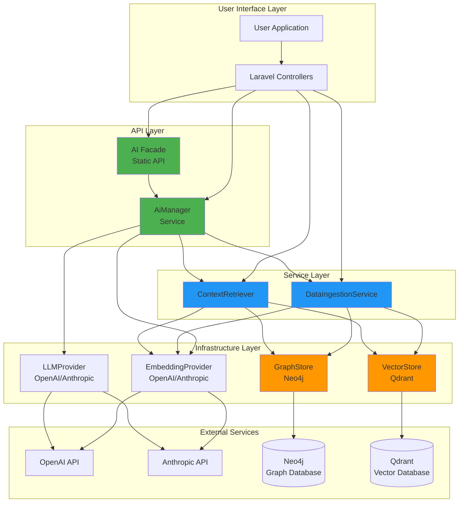
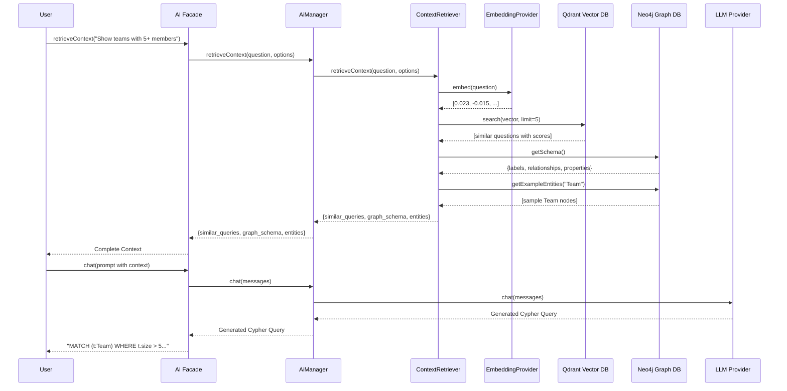
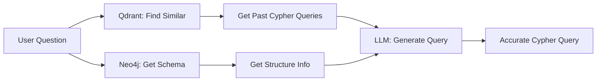

# Architecture Overview

This document explains the design principles, components, and data flow of the AI Text-to-Query System.

---

## System Architecture



---

## Data Flow: User Question to Answer



---

## Core Components

### 1. Domain Layer

**Purpose:** Business logic and contracts independent of infrastructure.

#### Contracts (Interfaces)

**`Nodeable`** - Contract for entities storable in graph/vector databases
```php
interface Nodeable
{
    public function getGraphConfig(): GraphConfig;
    public function getVectorConfig(): VectorConfig;
    public function getId(): string|int;
    public function toArray(): array;
}
```

**`Searchable`** - Marker interface for vector-searchable entities

#### Value Objects

**`GraphConfig`** - Immutable Neo4j configuration
- Node label
- Properties to store
- Relationships to create

**`VectorConfig`** - Immutable Qdrant configuration
- Collection name
- Fields to embed
- Metadata to store

**`RelationshipConfig`** - Graph relationship definition
- Relationship type (e.g., "MEMBER_OF")
- Target label
- Foreign key mapping

#### Traits

**`HasNodeableConfig`** - Auto-loads config from `config/entities.php`

---

### 2. Infrastructure Contracts Layer

**Purpose:** Abstraction over external services for testability and flexibility.

#### VectorStoreInterface

```php
interface VectorStoreInterface
{
    public function upsert(string $collection, array $points): bool;
    public function search(string $collection, array $vector, int $limit): array;
    public function deletePoints(string $collection, array $ids): bool;
    public function createCollection(string $name, int $vectorSize): bool;
}
```

**Implementations:**
- `QdrantStore` - Qdrant REST API client

---

#### GraphStoreInterface

```php
interface GraphStoreInterface
{
    public function createNode(string $label, array $properties): string;
    public function updateNode(string $label, string|int $id, array $properties): bool;
    public function createRelationship(...): bool;
    public function query(string $cypher, array $params = []): array;
    public function getSchema(): array;
}
```

**Implementations:**
- `Neo4jStore` - Neo4j HTTP API client

---

#### EmbeddingProviderInterface

```php
interface EmbeddingProviderInterface
{
    public function embed(string $text): array;
    public function embedBatch(array $texts): array;
}
```

**Implementations:**
- `OpenAiEmbeddingProvider` - text-embedding-3-small (1536 dimensions)
- `AnthropicEmbeddingProvider` - Placeholder for future support

---

#### LlmProviderInterface

```php
interface LlmProviderInterface
{
    public function chat(array $messages, array $options = []): string;
    public function chatJson(array $messages, array $options = []): object|array;
    public function complete(string $prompt, ?string $systemPrompt = null): string;
    public function streamChat(array $messages, callable $callback): void;
}
```

**Implementations:**
- `OpenAiLlmProvider` - GPT-4o (128K context)
- `AnthropicLlmProvider` - Claude 3.5 Sonnet (200K context)

---

### 3. Service Layer

**Purpose:** Business logic orchestration and coordination.

#### DataIngestionService

**Responsibility:** Ingest entities into both graph and vector stores.

**Key Methods:**
```php
ingest(Nodeable $entity): array
ingestBatch(array $entities): array
sync(Nodeable $entity): array
remove(Nodeable $entity): bool
```

**Features:**
- Dual-store ingestion (Neo4j + Qdrant)
- Automatic embedding generation
- Relationship creation from config
- Batch optimization
- Graceful error handling

---

#### ContextRetriever

**Responsibility:** Implement RAG (Retrieval-Augmented Generation).

**Key Methods:**
```php
retrieveContext(string $question, array $options = []): array
searchSimilar(string $question, string $collection, int $limit): array
getGraphSchema(): array
getExampleEntities(string $label, int $limit): array
```

**Features:**
- Vector similarity search for past questions
- Graph schema discovery
- Example entity retrieval
- Combined context assembly
- Graceful degradation on partial failures

---

### 4. API Layer (AiManager + Facade)

#### AiManager Service

**Purpose:** Convenient wrapper around AI services with proper dependency injection.

**Architecture:**
```php
class AiManager
{
    public function __construct(
        private readonly DataIngestionServiceInterface $ingestion,
        private readonly ContextRetrieverInterface $context,
        private readonly EmbeddingProviderInterface $embedding,
        private readonly LlmProviderInterface $llm
    ) {}
}
```

**Features:**
- Constructor dependency injection
- Fully testable with Laravel's container
- Follows SOLID principles
- All dependencies explicit and visible

#### AI Facade

**Purpose:** Developer-friendly static API.

**Architecture:**
```php
class AI extends Facade
{
    protected static function getFacadeAccessor(): string
    {
        return 'ai'; // Resolves AiManager from container
    }
}
```

**Features:**
- Static method access: `AI::ingest($entity)`
- Leverages Laravel's service container
- Testable with facade mocking
- No singleton anti-pattern

**Usage Examples:**
```php
// Via Facade (simple)
use Condoedge\Ai\Facades\AI;
AI::ingest($customer);
AI::retrieveContext("Show all teams");
AI::chat("What is 2+2?");

// Via Dependency Injection (testable)
use Condoedge\Ai\Services\AiManager;
class CustomerController extends Controller
{
    public function __construct(private AiManager $ai) {}

    public function store(Request $request)
    {
        $this->ai->ingest($customer);
    }
}
```

**Benefits of Refactored Architecture:**
- Proper dependency injection throughout
- Testable with Laravel's facade mocking
- Follows Laravel best practices
- No service locator anti-pattern
- Single source of truth (service provider)

---

## Design Principles

### 1. Interface-Based Design

**All dependencies are interfaces**, not concrete classes:

```php
class DataIngestionService
{
    public function __construct(
        private readonly VectorStoreInterface $vectorStore,
        private readonly GraphStoreInterface $graphStore,
        private readonly EmbeddingProviderInterface $embeddingProvider
    ) {}
}
```

**Benefits:**
- Easy testing with mocks
- Swap implementations without changing code
- Add new providers (Pinecone, ArangoDB, etc.)

---

### 2. Dependency Injection

Services receive dependencies via constructor:

```php
// Laravel container auto-wires this
class CustomerController
{
    public function __construct(
        private DataIngestionServiceInterface $ingestion
    ) {}
}
```

**Benefits:**
- Testability
- Flexibility
- No hidden dependencies

---

### 3. Separation of Concerns

Each component has a single responsibility:

- **Domain Layer:** Business rules
- **Infrastructure:** External service communication
- **Services:** Orchestration
- **Wrappers:** Developer convenience

---

### 4. Graceful Degradation

Services handle partial failures elegantly:

```php
$status = AI::ingest($entity);
// [
//     'graph_stored' => true,
//     'vector_stored' => false,  // Vector failed but graph succeeded
//     'errors' => ['Vector: Connection timeout']
// ]
```

One store failing doesn't crash the entire operation.

---

### 5. Configuration Over Code

Entity mappings defined in config, not code:

```php
// config/entities.php
'Customer' => [
    'graph' => ['label' => 'Customer', ...],
    'vector' => ['collection' => 'customers', ...]
]
```

**Benefits:**
- No code changes for new entities
- Easy to maintain
- Clear separation

---

## Why Two Storage Systems?

### Neo4j (Graph Database)

**Strengths:**
- Complex relationship queries
- Pattern matching
- Graph algorithms
- Structured data

**Use Cases:**
- "Find teams with most active members"
- "Show customer purchase history"
- "Recommend products based on friend purchases"

**Query Language:** Cypher
```cypher
MATCH (t:Team)<-[:MEMBER_OF]-(p:Person)
WHERE p.status = 'active'
RETURN t.name, count(p) as members
ORDER BY members DESC
```

---

### Qdrant (Vector Database)

**Strengths:**
- Semantic similarity search
- Fast nearest neighbor search
- Fuzzy matching
- RAG support

**Use Cases:**
- Find similar past questions
- Search by meaning, not keywords
- Few-shot learning context
- Semantic product search

**Query:** Vector similarity
```php
$embedding = embed("software development teams");
$similar = search($embedding, limit: 5);
// Returns: ["Engineering Team", "Dev Squad", "Tech Builders"]
```

---

### Together: Intelligent Query Generation



**The Synergy:**
1. **Qdrant** provides examples (few-shot learning)
2. **Neo4j** provides structure (schema understanding)
3. **LLM** combines both for accurate query generation

---

## Data Flow Examples

### Example 1: Ingesting an Entity

```
Customer Entity (Laravel Model)
  ↓
AI::ingest($customer)
  ↓
DataIngestionService
  ├─→ Generate embedding from name+description
  ├─→ Create node in Neo4j {id, name, email}
  ├─→ Store vector in Qdrant with metadata
  └─→ Create relationships (PURCHASED → Order)
  ↓
Status Report: {graph_stored: true, vector_stored: true}
```

---

### Example 2: RAG Context Retrieval

```
Question: "Show teams with 5+ members"
  ↓
AI::retrieveContext($question)
  ↓
ContextRetriever
  ├─→ EmbeddingProvider: Generate question embedding
  ├─→ Qdrant: Search for similar questions
  │     Returns: ["List all teams", "Show team members"]
  ├─→ Neo4j: Get schema
  │     Returns: {labels: [Team, Person], relationships: [MEMBER_OF]}
  ├─→ Neo4j: Get example entities
  │     Returns: [{id: 1, name: "Alpha", size: 10}]
  └─→ Combine into context
  ↓
Context: {similar_queries, graph_schema, relevant_entities}
```

---

### Example 3: Complete Q&A Pipeline

```
1. User Question
   "Which teams have more than 5 members?"

2. RAG Context Retrieval
   AI::retrieveContext($question)
   → Similar queries, schema, examples

3. LLM Prompt Construction
   System: "You are a Cypher expert"
   User: "Question + Context"

4. Query Generation
   AI::chat($prompt)
   → "MATCH (t:Team) WHERE t.size > 5 RETURN t"

5. Query Execution
   Neo4jStore::query($cypherQuery)
   → [{id: 1, name: "Alpha", size: 10}, ...]

6. Response Generation
   AI::chat("Explain these results to the user")
   → "I found 3 teams with more than 5 members: Alpha, Beta, Gamma"

7. Return to User
```

---

## Testing Architecture

### Unit Tests
- Mock all interfaces
- Test business logic in isolation
- Fast, no external dependencies

```php
$mockVector = Mockery::mock(VectorStoreInterface::class);
$service = new DataIngestionService($mockVector, $mockGraph, $mockEmbed);
```

---

### Integration Tests
- Test with real Neo4j/Qdrant
- Verify API integrations
- Slower, requires infrastructure

```php
$neo4j = new Neo4jStore(config('ai.graph.neo4j'));
$result = $neo4j->createNode('Test', ['name' => 'test']);
```

---

## Scalability Considerations

### Batch Operations
- Use `ingestBatch()` for bulk ingestion
- Reduces API calls and network overhead
- Batch embedding generation

### Caching
- Configure `AI_CACHE_TTL` for query result caching
- Cache schema information
- Cache frequently accessed embeddings

### Async Processing
- Queue ingestion operations
- Process updates asynchronously
- Use Laravel queues for background processing

---

## Security Considerations

### Cypher Injection Prevention
- All labels validated with regex: `/^[a-zA-Z_][a-zA-Z0-9_-]*$/`
- Parameterized queries for user input
- Never concatenate user input into Cypher

### API Key Protection
- Store in environment variables
- Never commit to version control
- Use Laravel's encrypted environment

### Access Control
- Protect documentation routes with middleware
- Restrict database access by IP
- Use Neo4j RBAC for multi-tenant scenarios

---

## Extension Points

### Add New Vector Store
1. Implement `VectorStoreInterface`
2. Register in service provider
3. Configure in `config/ai.php`

### Add New Graph Store
1. Implement `GraphStoreInterface`
2. Register in service provider
3. Configure in `config/ai.php`

### Add New LLM Provider
1. Implement `LlmProviderInterface`
2. Register in service provider
3. Add configuration section

---

## Next Steps

- **[Simple Usage](/docs/{{version}}/simple-usage)** - Learn the AI wrapper API
- **[Advanced Usage](/docs/{{version}}/advanced-usage)** - Direct service usage
- **[Configuration](/docs/{{version}}/configuration)** - All settings explained
- **[Real-World Examples](/docs/{{version}}/examples)** - Complete implementations
