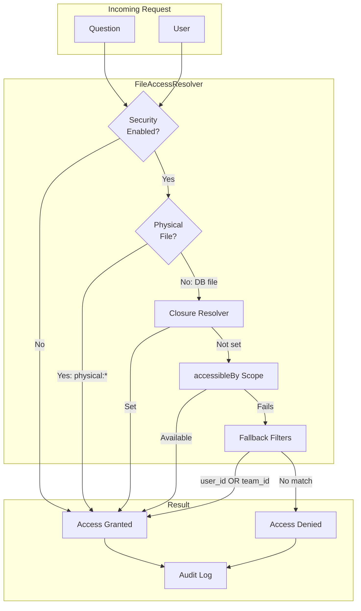

# File Context System

Enhance AI responses with relevant file content from physical documentation and database-backed files.

---

## Overview

The File Context System provides AI assistants with relevant file content to answer user questions more accurately. It supports two distinct modes:

1. **Physical Files (Documentation)** - Static documentation files like `.md`, `.mdx`, `.txt`, and `.rst` files stored in your project
2. **Database Files** - Dynamic files stored in your database, typically uploaded by users

Both modes use semantic search via Qdrant to find the most relevant file chunks for a given question, then inject that content into the AI prompt with citation instructions.

### Key Features

- **Semantic Search** - Finds relevant content using vector embeddings, not just keyword matching
- **Automatic Citations** - AI responses include [1], [2] markers referencing source files
- **Access Control** - Database files are filtered based on user permissions
- **Configurable Relevance** - Set minimum scores and maximum references
- **Unified API** - Same interface for both physical and database files

### Example Flow

```
1. User asks: "How do I configure authentication?"

2. FileContextProvider searches Qdrant for relevant file chunks

3. Returns matches:
   - [1] auth.md (relevance: 92%) - "Configure auth using middleware..."
   - [2] guards.md (relevance: 85%) - "Guards handle session management..."

4. FileContextSection adds to prompt:
   "Use these files for reference. Cite with [1], [2] markers..."

5. AI responds: "Configure auth using middleware [1]. Guards handle sessions [2]."

6. ResponseFileEnricher extracts citations and builds referenced_files array
```

---

## Configuration

Configure the file context system in `config/ai.php` under the `file_context` key:

```php
'file_context' => [
    // Enable file context in AI responses
    'enabled' => env('AI_FILE_CONTEXT_ENABLED', true),

    // Security mode for database files
    'security_enabled' => env('AI_FILE_SECURITY_ENABLED', true),

    // Physical file paths (glob patterns)
    'physical_paths' => [
        'docs/**/*.mdx',
        'resources/docs/**/*.md',
    ],

    // Supported extensions for physical files
    'supported_extensions' => ['md', 'mdx', 'txt', 'rst'],

    // Base path for physical files (relative to project root)
    'base_path' => env('AI_DOCS_BASE_PATH', base_path()),

    // Collection name for physical file chunks in Qdrant
    'physical_collection' => 'documentation_chunks',

    // Maximum file references to include in response
    'max_references' => 5,

    // Minimum relevance score for file inclusion (0.0 - 1.0)
    'min_relevance_score' => 0.4,

    // Include file snippets in response metadata
    'include_snippets' => true,

    // Maximum snippet length (characters)
    'snippet_length' => 200,

    // The Eloquent File model class (your app's File model)
    'file_model' => env('AI_FILE_MODEL', 'App\\Models\\File'),

    // The scope method to call for user-accessible files
    'access_scope' => 'accessibleBy',

    // Fallback filtering when accessibleBy scope is not available
    'fallback_filters' => [
        'use_user_filter' => env('AI_FILE_USE_USER_FILTER', true),
        'use_team_filter' => env('AI_FILE_USE_TEAM_FILTER', true),
    ],

    // Alternative: closure-based resolver (takes precedence over scope)
    'access_resolver' => null,

    // Log file access attempts for security auditing
    'log_access' => env('AI_FILE_ACCESS_LOG', true),
],
```

### Configuration Options Reference

| Option | Type | Default | Description |
|--------|------|---------|-------------|
| `enabled` | bool | `true` | Enable/disable the entire file context system |
| `security_enabled` | bool | `true` | Enforce access control for database files |
| `physical_paths` | array | `[]` | Glob patterns for physical documentation files |
| `supported_extensions` | array | `['md', 'mdx', 'txt', 'rst']` | File extensions to process |
| `base_path` | string | `base_path()` | Root directory for physical file paths |
| `physical_collection` | string | `'documentation_chunks'` | Qdrant collection for physical files |
| `max_references` | int | `5` | Maximum files to include in context |
| `min_relevance_score` | float | `0.4` | Minimum similarity score (0.0-1.0) |
| `include_snippets` | bool | `true` | Include content snippets in metadata |
| `snippet_length` | int | `200` | Maximum characters per snippet |
| `file_model` | string | `'App\\Models\\File'` | Eloquent model for database files |
| `access_scope` | string | `'accessibleBy'` | Scope method name on file model |
| `access_resolver` | Closure | `null` | Custom access resolver function |
| `fallback_filters.use_user_filter` | bool | `true` | Filter by user_id when scope fails |
| `fallback_filters.use_team_filter` | bool | `true` | Filter by team_id when scope fails |
| `log_access` | bool | `true` | Log file access attempts for auditing |

---

## Usage Examples

### Setting Up for a Documentation Project (Physical Files)

For projects with static documentation files:

```php
// config/ai.php
'file_context' => [
    'enabled' => true,
    'security_enabled' => false, // Physical files don't need security

    'physical_paths' => [
        'docs/**/*.md',           // All markdown in docs/
        'resources/docs/**/*.mdx', // MDX files in resources/docs/
        'guides/*.txt',           // Text files in guides/
    ],

    'supported_extensions' => ['md', 'mdx', 'txt'],
    'base_path' => base_path(),

    'max_references' => 5,
    'min_relevance_score' => 0.7,
    'snippet_length' => 200,
],
```

Then index the files:

```bash
php artisan ai:ingest --docs
```

### Setting Up for Database Files with Security

For applications with user-uploaded files:

```php
// config/ai.php
'file_context' => [
    'enabled' => true,
    'security_enabled' => true,

    // No physical_paths needed - using database files only
    'physical_paths' => [],

    // Your File model with accessibleBy scope
    'file_model' => App\Models\File::class,
    'access_scope' => 'accessibleBy',

    'max_references' => 10,
    'min_relevance_score' => 0.65,
],
```

Your File model needs the scope:

```php
// app/Models/File.php
class File extends Model
{
    /**
     * Scope to filter files accessible by the given user
     */
    public function scopeAccessibleBy(Builder $query, $user): Builder
    {
        return $query->where(function ($q) use ($user) {
            // User's own files
            $q->where('user_id', $user->id)
              // Or files in user's teams
              ->orWhereIn('team_id', $user->teams->pluck('id'))
              // Or public files
              ->orWhere('is_public', true);
        });
    }
}
```

### Custom Access Resolver

For complex access logic, use a closure-based resolver:

```php
// app/Providers/AppServiceProvider.php
public function boot()
{
    config(['ai.file_context.access_resolver' => function ($user) {
        // Custom logic to determine accessible file IDs
        $ownFiles = File::where('user_id', $user->id)->pluck('id');
        $sharedFiles = $user->sharedFiles()->pluck('id');
        $publicFiles = File::where('is_public', true)->pluck('id');

        return $ownFiles
            ->merge($sharedFiles)
            ->merge($publicFiles)
            ->unique()
            ->toArray();
    }]);
}
```

The closure receives the user object and must return an array of accessible file IDs.

### Fallback Filters

When the `accessibleBy` scope is not available or fails, the system uses fallback filters based on `user_id` and `team_id`:

```php
// config/ai.php
'file_context' => [
    'fallback_filters' => [
        // Filter files by user_id when security is enabled
        'use_user_filter' => env('AI_FILE_USE_USER_FILTER', true),

        // Also filter by team_id using safeCurrentTeamId()
        'use_team_filter' => env('AI_FILE_USE_TEAM_FILTER', true),
    ],
],
```

The fallback uses OR logic: files where `user_id` matches OR `team_id` matches the current team are accessible.

**Important:** If both filters are disabled (`false`), the fallback returns an empty array for security - no database files would be accessible.

---

## Indexing Files

### Physical Documentation Files

Index physical files from configured paths:

```bash
# Index all physical documentation files
php artisan ai:ingest --docs

# Preview what would be indexed (dry run)
php artisan ai:ingest --docs --dry-run

# Force re-index existing files
php artisan ai:ingest --docs --fresh
```

The dry run outputs a table showing each file that would be indexed:

```
Found 15 files to index.

+------------------------+--------------+---------------------------+
| ID                     | Name         | Path                      |
+------------------------+--------------+---------------------------+
| physical:docs/auth.md  | auth.md      | docs/auth.md              |
| physical:docs/api.md   | api.md       | docs/api.md               |
| ...                    | ...          | ...                       |
+------------------------+--------------+---------------------------+
```

### Database Files

Database files are typically processed when uploaded using the FileProcessor:

```php
use Condoedge\Ai\Contracts\FileProcessorInterface;

$processor = app(FileProcessorInterface::class);
$result = $processor->processFile($fileModel);
```

Or use the batch file processing command:

```bash
php artisan ai:process-files --path=storage/documents
```

---

## How It Works

The system consists of several components working together to provide file-aware AI responses:

```mermaid
flowchart LR
    subgraph Input
        Q[User Question]
        U[User]
    end

    subgraph Search["File Search"]
        FCP[FileContextProvider]
        FAR[FileAccessResolver]
        FS[FileSearchService]
    end

    subgraph Sources["File Sources"]
        PF[(Physical Files<br/>docs/*.md)]
        DB[(Database Files<br/>user uploads)]
        QD[(Qdrant<br/>Vector Store)]
    end

    subgraph Prompt["Prompt Building"]
        PCS[PromptSections/<br/>FileContextSection]
        RCS[ResponseSections/<br/>FileContextSection]
    end

    subgraph Response["Response Processing"]
        LLM[LLM Response]
        RFE[ResponseFileEnricher]
        FCH[FileCitationHandler]
    end

    Q --> FCP
    U --> FAR
    FCP --> FS
    FAR --> FCP
    FS --> QD
    PF --> QD
    DB --> QD
    FCP --> PCS
    FCP --> RCS
    PCS --> LLM
    RCS --> LLM
    LLM --> RFE
    RFE --> FCH
    FCH --> |Clickable [1] [2]| UI[Chat UI]
```

### Component Overview

| Component | Location | Purpose |
|-----------|----------|---------|
| FileContextProvider | `src/Services/Context/FileContextProvider.php` | Searches files, applies access control |
| FileAccessResolver | `src/Services/Context/FileAccessResolver.php` | Determines which files user can access |
| FileContextSection (Prompt) | `src/Services/PromptSections/FileContextSection.php` | Injects files into query prompt |
| FileContextSection (Response) | `src/Services/ResponseSections/FileContextSection.php` | Injects files into response prompt |
| ResponseFileEnricher | `src/Services/Response/ResponseFileEnricher.php` | Extracts citations, builds metadata |
| FileCitationHandler | `src/Services/Response/FileCitationHandler.php` | Creates clickable citation links |

### FileContextProvider

Searches Qdrant for relevant file chunks and filters by access control.

**Location:** `src/Services/Context/FileContextProvider.php`

```php
use Condoedge\Ai\Services\Context\FileContextProvider;

$provider = app(FileContextProvider::class);

// Search for relevant files
$files = $provider->searchRelevantFiles(
    question: 'How do I configure authentication?',
    user: auth()->user(),
    options: [
        'limit' => 5,
        'min_score' => 0.7,
    ]
);

// Get full context including metadata
$context = $provider->getFileContext($question, $user);
// Returns:
// [
//     'relevant_files' => [...],
//     'file_count' => 3,
//     'has_physical' => true,
//     'has_database' => true,
// ]
```

### FileContextSection

Adds file context to the AI prompt with citation instructions.

**Location:** `src/Services/PromptSections/FileContextSection.php`

**Priority:** 45 (before similar_queries at 50)

The section formats context like:

```
=== FILE CONTEXT ===

**Citation Instructions:**
When using information from the files below, cite your sources using inline
markers like [1], [2], etc. Place the citation marker at the end of the
relevant sentence or phrase.

**Example:**
"Authentication can be configured using middleware [1]. The guard system
handles sessions [2]."

**Relevant Files:**

**[1] auth.md** (relevance: 92%)
  Configure authentication by registering middleware in your kernel...

**[2] guards.md** (relevance: 85%)
  Guards are responsible for authenticating users on each request...
```

### ResponseFileEnricher

Extracts citation markers from the response and builds actionable file references.

**Location:** `src/Services/Response/ResponseFileEnricher.php`

```php
use Condoedge\Ai\Services\Response\ResponseFileEnricher;

$enricher = new ResponseFileEnricher();

// Extract citations from response text
$markers = $enricher->extractCitationMarkers(
    'Configure auth using middleware [1]. Guards handle sessions [2].'
);
// Returns: [1, 2]

// Build full referenced files array
$referencedFiles = $enricher->buildReferencedFiles(
    $responseText,
    $fileContext,
    [
        'user' => auth()->user(),
        'download_url_resolver' => fn($id) => route('files.download', $id),
        'preview_url_resolver' => fn($id) => route('files.preview', $id),
    ]
);

// Enrich entire response array
$enrichedResponse = $enricher->enrichResponse($response, $fileContext, $options);
```

---

## Search Strategies

### Filename Search

When users explicitly reference a file by name, the system detects and prioritizes that file:

```
User: "What's in the budget_2024.xlsx file?"
→ Detects "budget_2024.xlsx" as explicit reference
→ Searches by filename (exact/partial match)
→ Returns file with match_type: "filename"
```

**Detected patterns:**
- `filename.ext` - Direct filename reference
- `"my document.pdf"` - Quoted filename (supports spaces)
- `path/to/file.txt` - Path reference (extracts filename)

**Supported extensions:** txt, pdf, doc, docx, xls, xlsx, csv, md, json, xml, html, rtf, ppt, pptx, png, jpg, gif, svg

### Content Search

Semantic similarity search using embeddings:

```
User: "What are the Q3 sales figures?"
→ No explicit filename detected
→ Searches by content similarity
→ Returns files with relevant content
```

### Combined Search

When a filename is mentioned along with a question, both strategies are used:

```
User: "Summarize the key points from report.pdf"
→ Filename search finds "report.pdf" (score: 1.0)
→ Content search may find additional relevant files
→ Results deduplicated, filename match prioritized
```

### Scoring Strategy

| Match Type | Score | Threshold |
|------------|-------|-----------|
| Exact filename match | 1.0 | None (always included) |
| Partial filename match | 0.85 | 0.3 (low) |
| Content/semantic match | 0.0-1.0 | 0.7 (standard) |

---

## Response Format

The AI response includes a `referenced_files` array with metadata for cited files:

```json
{
    "answer": "Configure authentication using middleware [1]. The guard system handles session management and token validation [2].",
    "referenced_files": [
        {
            "ref": 1,
            "id": "physical:docs/auth.md",
            "name": "auth.md",
            "snippet": "Configure authentication by registering middleware...",
            "relevance_score": 0.92,
            "source": "physical",
            "chunk_index": 0,
            "download_url": null,
            "preview_url": null,
            "can_download": false
        },
        {
            "ref": 2,
            "id": 42,
            "name": "guards.md",
            "snippet": "Guards are responsible for authenticating users...",
            "relevance_score": 0.85,
            "source": "database",
            "chunk_index": 1,
            "download_url": "https://example.com/files/42/download",
            "preview_url": "https://example.com/files/42/preview",
            "can_download": true
        }
    ],
    "has_file_references": true
}
```

### Response Fields

| Field | Type | Description |
|-------|------|-------------|
| `ref` | int | Citation number used in response text ([1], [2], etc.) |
| `id` | int\|string | File ID (string with `physical:` prefix for physical files) |
| `name` | string | File name |
| `snippet` | string | Content snippet from the matched chunk |
| `relevance_score` | float | Similarity score (0.0 - 1.0) |
| `source` | string | Either `'physical'` or `'database'` |
| `chunk_index` | int | Which chunk within the file matched |
| `download_url` | string\|null | URL to download the file (database files only) |
| `preview_url` | string\|null | URL to preview the file (database files only) |
| `can_download` | bool | Whether the user can download this file |

---

## Security

The file context system uses a layered security model to protect sensitive files:



### Physical Files

Physical files have **no runtime security checks**. Security is enforced at configuration time by explicitly listing which paths to include:

```php
'physical_paths' => [
    'docs/public/**/*.md',  // Only index public docs
    // 'docs/internal/**/*.md', // Not included = not accessible
],
```

Physical files are always accessible once indexed because you control what gets indexed.

### Database Files

Database files are filtered based on user permissions using one of two methods:

**Method 1: Eloquent Scope (Default)**

```php
// config/ai.php
'file_model' => App\Models\File::class,
'access_scope' => 'accessibleBy',

// app/Models/File.php
public function scopeAccessibleBy(Builder $query, $user): Builder
{
    return $query->where('user_id', $user->id)
                 ->orWhere('is_public', true);
}
```

The system calls `File::accessibleBy($user)->pluck('id')` to get accessible file IDs.

**Method 2: Closure Resolver**

```php
// Takes precedence over scope when set
config(['ai.file_context.access_resolver' => function ($user) {
    return File::where('user_id', $user->id)->pluck('id')->toArray();
}]);
```

### Global Security Bypass

Disable security checks entirely (use with caution):

```php
'security_enabled' => false,
```

When disabled, all database files are accessible to all users.

### Access Audit Logging

File access attempts are logged to the `ai_file_access_logs` table for security auditing:

```php
// config/ai.php
'file_context' => [
    // Enable/disable access logging
    'log_access' => env('AI_FILE_ACCESS_LOG', true),
],
```

Each log entry records:
- **user_id** - The user attempting access
- **file_id** - The file being accessed (physical or database)
- **granted** - Whether access was allowed
- **access_method** - How access was determined (`physical`, `security_disabled`, `no_user`, `access_list`)

Query the logs for security analysis:

```php
use Condoedge\Ai\Models\AiFileAccessLog;

// Get denied access attempts in the last 24 hours
$deniedAttempts = AiFileAccessLog::where('granted', false)
    ->where('created_at', '>', now()->subDay())
    ->get();
```

### How Security is Enforced

The `FileAccessResolver` class handles all security logic:

1. **Physical files** - Always pass through (identified by `physical:` prefix)
2. **Database files** - Filtered against `getAccessibleFileIds()` results
3. **No user** - Database files return empty (physical files still work)

```php
use Condoedge\Ai\Services\Context\FileAccessResolver;

$resolver = app(FileAccessResolver::class);

// Check if security is enabled
$resolver->shouldEnforceSecurity(); // true

// Get accessible file IDs for a user
$ids = $resolver->getAccessibleFileIds($user);

// Filter a list of file IDs
$accessible = $resolver->filterAccessibleFileIds($allFileIds, $user);

// Check single file access
$canAccess = $resolver->canAccessFile($fileId, $user);

// Check if ID is physical file
$resolver->isPhysicalFile('physical:docs/auth.md'); // true
$resolver->isPhysicalFile(42); // false
```

---

## API Reference

### FileContextProvider

```php
class FileContextProvider
{
    /**
     * Search for relevant files based on a question
     *
     * @param string $question The search query
     * @param mixed $user The user for access control
     * @param array $options Search options (limit, min_score)
     * @return array Array of file references
     */
    public function searchRelevantFiles(
        string $question,
        mixed $user,
        array $options = []
    ): array;

    /**
     * Get full file context for prompt building
     *
     * @param string $question The search query
     * @param mixed $user The user for access control
     * @return array Context with relevant_files, file_count, has_physical, has_database
     */
    public function getFileContext(string $question, mixed $user): array;

    /**
     * Build a single file reference for response metadata
     */
    public function buildFileReference(
        int $refNumber,
        int|string $fileId,
        string $fileName,
        string $snippet,
        float $relevanceScore,
        int $chunkIndex,
        string $source
    ): array;
}
```

### FileAccessResolver

```php
class FileAccessResolver implements FileAccessResolverInterface
{
    public const PHYSICAL_PREFIX = 'physical:';

    /**
     * Check if security enforcement is enabled
     */
    public function shouldEnforceSecurity(): bool;

    /**
     * Get all file IDs accessible by the given user
     */
    public function getAccessibleFileIds(mixed $user): array;

    /**
     * Filter a list of file IDs to only include accessible ones
     */
    public function filterAccessibleFileIds(array $fileIds, mixed $user): array;

    /**
     * Check if a specific file is accessible by the user
     */
    public function canAccessFile(int|string $fileId, mixed $user): bool;

    /**
     * Check if a file ID represents a physical file
     */
    public function isPhysicalFile(int|string $fileId): bool;

    /**
     * Create a physical file ID from a path
     */
    public function makePhysicalFileId(string $path): string;

    /**
     * Extract the file path from a physical file ID
     */
    public function getPhysicalFilePath(int|string $fileId): ?string;
}
```

### ResponseFileEnricher

```php
class ResponseFileEnricher
{
    /**
     * Extract citation markers [1], [2], etc. from response text
     *
     * @param string $response The response text
     * @return array<int> Unique citation numbers
     */
    public function extractCitationMarkers(string $response): array;

    /**
     * Build referenced files array for cited files only
     *
     * @param string $response The response text
     * @param array $fileContext File context from FileContextProvider
     * @param array $options URL resolvers and user for permissions
     * @return array Referenced file metadata
     */
    public function buildReferencedFiles(
        string $response,
        array $fileContext,
        array $options = []
    ): array;

    /**
     * Enrich a response array with file reference metadata
     *
     * @param array $response Original response (must contain 'content' key)
     * @param array $fileContext File context from FileContextProvider
     * @param array $options URL resolvers
     * @return array Enriched response with referenced_files
     */
    public function enrichResponse(
        array $response,
        array $fileContext,
        array $options = []
    ): array;
}
```

### FileContextSection (Prompt)

Adds file context to the AI prompt with citation instructions.

**Location:** `src/Services/PromptSections/FileContextSection.php`

```php
class FileContextSection extends BasePromptSection
{
    protected string $name = 'file_context';
    protected int $priority = 45;

    /**
     * Check if this section should be included
     */
    public function shouldInclude(
        string $question,
        array $context,
        array $options = []
    ): bool;

    /**
     * Format the section content for the prompt
     */
    public function format(
        string $question,
        array $context,
        array $options = []
    ): string;
}
```

### FileContextSection (Response)

Adds file content to response generation prompts.

**Location:** `src/Services/ResponseSections/FileContextSection.php`

```php
class FileContextSection extends BaseResponseSection
{
    protected string $name = 'file_context';
    protected int $priority = 45;

    /**
     * Check if this section should be included
     */
    public function shouldInclude(array $context, array $options = []): bool;

    /**
     * Format the section content
     */
    public function format(array $context, array $options = []): string;
}
```

### FileCitationHandler

Processes citation markers `[1]`, `[2]`, etc. in AI responses and creates clickable elements that open file preview modals.

**Location:** `src/Services/Response/FileCitationHandler.php`

```php
use Condoedge\Ai\Services\Response\FileCitationHandler;

$handler = new FileCitationHandler();

// Get the regex pattern for matching citations
$pattern = $handler->getPatterns(); // '/\[(\d+)\]/'

// Create clickable citation elements from response content
// Context must include 'files' array from message->getReferencedFiles()
$elements = $handler->createElements($content, [
    'files' => $message->getReferencedFiles(),
]);

// Get metadata for processed citations
$metadata = $handler->getCitationMetadata();
// Returns: [['slot' => 'file-citation-1', 'id' => 42, 'type' => 'file', 'mime' => 'application/pdf'], ...]

// Reset metadata before processing new content
$handler->resetMetadata();
```

The handler creates `_Link` elements with `data-action-slot` attributes for JavaScript wiring. The actual file preview is handled by proxy elements with matching `data-action-proxy` attributes.

---

## Testing

### Running Tests

```bash
# Run all file context tests
./vendor/bin/phpunit --filter FileContext

# Run specific test files
./vendor/bin/phpunit tests/Unit/Services/Context/FileContextProviderTest.php
./vendor/bin/phpunit tests/Unit/Services/Context/FileAccessResolverTest.php
./vendor/bin/phpunit tests/Unit/Services/Response/ResponseFileEnricherTest.php
./vendor/bin/phpunit tests/Unit/Services/PromptSections/FileContextSectionTest.php
./vendor/bin/phpunit tests/Unit/Config/FileContextConfigTest.php

# Run ingestion command tests
./vendor/bin/phpunit tests/Feature/Commands/IngestPhysicalFilesTest.php
```

### Test Coverage

| Component | Test File |
|-----------|-----------|
| FileContextProvider | `tests/Unit/Services/Context/FileContextProviderTest.php` |
| FileAccessResolver | `tests/Unit/Services/Context/FileAccessResolverTest.php` |
| ResponseFileEnricher | `tests/Unit/Services/Response/ResponseFileEnricherTest.php` |
| FileContextSection (Prompt) | `tests/Unit/Services/PromptSections/FileContextSectionTest.php` |
| FileContextSection (Response) | `tests/Unit/Services/ResponseSections/FileContextSectionTest.php` |
| FileCitationHandler | `tests/Unit/Services/Response/FileCitationHandlerTest.php` |
| Configuration | `tests/Unit/Config/FileContextConfigTest.php` |
| Physical File Indexing | `tests/Feature/Commands/IngestPhysicalFilesTest.php` |

---

## Troubleshooting

### Files Not Being Found

**Symptom:** Questions return no file references even when relevant files exist.

**Solutions:**

1. Verify files are indexed:
   ```bash
   php artisan ai:ingest --docs --dry-run
   ```

2. Check minimum relevance score:
   ```php
   // Lower the threshold
   config(['ai.file_context.min_relevance_score' => 0.5]);
   ```

3. Verify Qdrant collection exists:
   ```bash
   php artisan ai:status
   ```

### Access Denied for Database Files

**Symptom:** User cannot see files they should have access to.

**Solutions:**

1. Verify scope is returning correct IDs:
   ```php
   $ids = File::accessibleBy($user)->pluck('id');
   dd($ids);
   ```

2. Check security is not bypassed incorrectly:
   ```php
   dd(config('ai.file_context.security_enabled'));
   ```

3. Verify user is passed to the provider:
   ```php
   $context = $provider->getFileContext($question, auth()->user());
   ```

### Citations Not Appearing in Response

**Symptom:** AI response does not include [1], [2] markers.

**Solutions:**

1. Verify FileContextSection is registered:
   ```php
   $sections = config('ai.query_generator_sections');
   // Should include FileContextSection::class
   ```

2. Check file context is being passed:
   ```php
   $context['file_context'] = $provider->getFileContext($question, $user);
   ```

3. Verify files meet minimum score threshold

### Physical Files Not Indexing

**Symptom:** `ai:ingest --docs` finds no files.

**Solutions:**

1. Check physical_paths configuration:
   ```php
   dd(config('ai.file_context.physical_paths'));
   ```

2. Verify base_path is correct:
   ```php
   dd(config('ai.file_context.base_path'));
   ```

3. Check supported_extensions:
   ```php
   dd(config('ai.file_context.supported_extensions'));
   ```

---

## Related Documentation

- [Chat Components](/docs/{{version}}/chat/chat-ui) - Chat UI components
- [Chat Pipeline](/docs/{{version}}/chat/module-pipeline) - Module pipeline system
- [Conversation Context](/docs/{{version}}/chat/conversation-context-management) - Multi-turn conversations
- [Custom Prompt Sections](/docs/{{version}}/extending/prompt-sections) - Creating custom sections
- [Data Ingestion](/docs/{{version}}/usage/data-ingestion) - Ingesting data
- [File Search](/docs/{{version}}/usage/file-search) - File search capabilities
