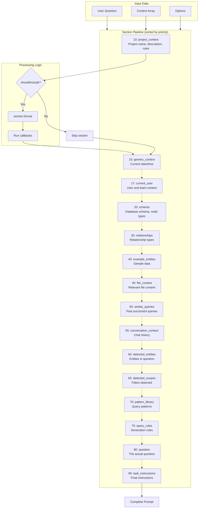
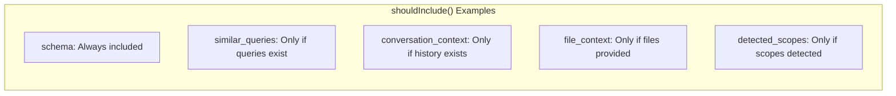
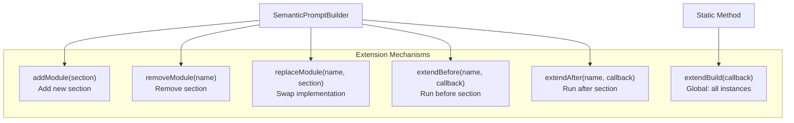
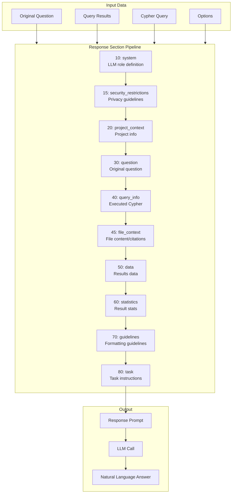
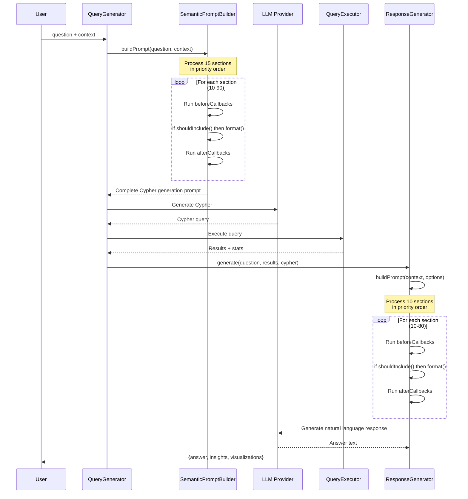

# Module Pipeline System

The AI package uses a flexible, priority-based module pipeline for building LLM prompts and generating responses. This architecture allows for easy customization and extension without modifying core code.

## Overview

Both `SemanticPromptBuilder` and `ResponseGenerator` use the `HasInternalModules` trait, which provides:

- **Modular Architecture**: Compose outputs from reusable, configurable sections
- **Priority-based Processing**: Modules execute in priority order (lower = first)
- **Extension Points**: Add callbacks before/after any module
- **Global Extensions**: Apply modifications to all instances
- **Configuration-driven**: Load default modules from config files

## Core Components

### HasInternalModules Trait

The trait provides the following capabilities:

```php
// Module Management
$builder->addModule(new CustomSection());      // Add a module
$builder->removeModule('section_name');        // Remove by name
$builder->replaceModule('name', new NewSection()); // Replace a module
$builder->getModule('name');                   // Get a module
$builder->hasModule('name');                   // Check existence
$builder->getModules();                        // Get all modules

// Callback Extensions
$builder->extendBefore('section', $callback);  // Run before a section
$builder->extendAfter('section', $callback);   // Run after a section

// Global Extensions (static)
MyBuilder::extendBuild($callback);             // Apply to all new instances
MyBuilder::clearGlobalExtensions();            // Clear global extensions
```

### SectionModuleInterface

All modules must implement:

```php
interface SectionModuleInterface
{
    public function getName(): string;           // Unique identifier
    public function getPriority(): int;          // Processing order
    public function shouldInclude(...): bool;    // Conditional inclusion
    public function format(...): string;         // Generate content
}
```

## SemanticPromptBuilder

Builds LLM prompts for Neo4j Cypher query generation.

### Default Sections (in priority order)

| Priority | Name | Description |
|----------|------|-------------|
| 10 | project_context | Project name, description, business rules |
| 15 | generic_context | Current date/time |
| 17 | current_user | Current user and team context |
| 20 | schema | Database schema and node types |
| 30 | relationships | Relationship types between nodes |
| 40 | example_entities | Sample data for reference |
| 45 | file_context | Relevant file content |
| 50 | similar_queries | Previously successful similar queries |
| 55 | conversation_context | Conversation history |
| 60 | detected_entities | Entities detected in the question |
| 65 | detected_scopes | Scopes/filters detected in the question |
| 70 | pattern_library | Query patterns from the pattern library |
| 75 | query_rules | Rules for query generation |
| 80 | question | The user's actual question |
| 90 | task_instructions | Final instructions for the LLM |

### Configuration

```php
// config/ai.php
return [
    'query_generator_sections' => [
        \Condoedge\Ai\Services\PromptSections\ProjectContextSection::class,
        \Condoedge\Ai\Services\PromptSections\SchemaSection::class,
        \Condoedge\Ai\Services\PromptSections\RelationshipsSection::class,
        // ... add or remove sections as needed
    ],
];
```

### Usage Example

```php
$builder = new SemanticPromptBuilder($patternLibrary);

// Customize project context
$builder->setProjectContext([
    'name' => 'My CRM',
    'description' => 'Customer relationship management system',
    'business_rules' => [
        'All dates are stored in UTC',
        'Customer IDs are UUIDs',
    ],
]);

// Add custom rules
$builder->addQueryRule('PERFORMANCE', 'Always use indexed properties');
$builder->addBusinessRule('Soft deletes are used for all entities');

// Customize task instructions
$builder->setTaskInstructions('Generate a read-only Cypher query...');

// Build the prompt
$prompt = $builder->buildPrompt(
    question: "How many active customers do we have?",
    context: [
        'schema' => $schema,
        'metadata' => $metadata,
        'detected_scopes' => ['status' => 'active'],
    ],
    allowWrite: false
);
```

### Factory Methods

```php
// Minimal builder (only essential sections)
$builder = SemanticPromptBuilder::minimal($patternLibrary);

// Simple builder (no advanced features like similar queries)
$builder = SemanticPromptBuilder::simple($patternLibrary);
```

## ResponseGenerator

Transforms query results into natural language explanations.

### Default Sections (in priority order)

| Priority | Name | Description |
|----------|------|-------------|
| 10 | system | System prompt setting the LLM's role |
| 20 | project_context | Project name and description |
| 30 | question | The user's original question |
| 40 | query_info | The Cypher query that was executed |
| 45 | file_context | Relevant file content with citations |
| 50 | data | The actual results data |
| 60 | statistics | Statistics about the results |
| 70 | guidelines | Guidelines for response formatting |
| 80 | task | Final task instructions for the LLM |
| 1000 | privacy_security | Privacy and security guidelines |

### Configuration

```php
// config/ai.php
return [
    'response_generator_sections' => [
        \Condoedge\Ai\Services\ResponseSections\SystemPromptSection::class,
        \Condoedge\Ai\Services\ResponseSections\ResponseProjectContextSection::class,
        \Condoedge\Ai\Services\ResponseSections\OriginalQuestionSection::class,
        // ... add or remove sections as needed
    ],
];
```

### Usage Example

```php
$generator = new ResponseGenerator($llmProvider, $config);

// Customize
$generator->setProjectContext([
    'name' => 'My CRM',
    'description' => 'Customer management system',
]);
$generator->setSystemPrompt('You are a helpful data analyst...');
$generator->addGuideline('Always include percentage changes when relevant');
$generator->setMaxDataItems(20);

// Generate response
$response = $generator->generate(
    originalQuestion: "How many customers do we have?",
    queryResult: [
        'data' => [['count' => 1500]],
        'stats' => ['execution_time' => 23],
    ],
    cypherQuery: "MATCH (c:Customer) RETURN count(c) as count",
    options: [
        'format' => 'text',
        'style' => 'detailed',
        'include_insights' => true,
        'include_visualization' => true,
    ]
);

// Response structure
// $response = [
//     'answer' => 'You have 1,500 customers in your database.',
//     'insights' => ['Found 1 result', 'Results contain 1 properties: count'],
//     'visualizations' => [['type' => 'number', 'rationale' => '...']],
//     'format' => 'text',
//     'metadata' => ['style' => 'detailed', 'result_count' => 1, ...],
// ];
```

## Extending the Pipeline

### Creating Custom Sections

```php
use Condoedge\Ai\Contracts\PromptSectionInterface;

class CustomAnalyticsSection implements PromptSectionInterface
{
    public function getName(): string
    {
        return 'custom_analytics';
    }

    public function getPriority(): int
    {
        return 52; // After similar_queries (50), before conversation_context (55)
    }

    public function shouldInclude(string $question, array $context, array $options): bool
    {
        // Only include for analytics-related questions
        return str_contains(strtolower($question), 'analytics')
            || str_contains(strtolower($question), 'statistics');
    }

    public function format(string $question, array $context, array $options): string
    {
        return <<<SECTION

=== ANALYTICS CONTEXT ===

When generating analytics queries, consider:
- Use aggregation functions (COUNT, SUM, AVG, etc.)
- Group by relevant dimensions
- Consider time-based filtering

SECTION;
    }
}
```

### Adding Callbacks

```php
// Add content after the schema section
$builder->extendAfter('schema', function($question, $context, $options) {
    $customInfo = getCustomSchemaInfo();
    return "\n=== CUSTOM SCHEMA INFO ===\n\n{$customInfo}\n\n";
});

// Add content before the question section
$builder->extendBefore('question', function($question, $context, $options) {
    return "\n=== HINTS ===\n\nConsider recent user activity patterns.\n\n";
});
```

### Global Extensions

Apply modifications to all instances (useful in service providers):

```php
// In AppServiceProvider::boot()
SemanticPromptBuilder::extendBuild(function($builder) {
    // Add company-specific section
    $builder->addModule(new CompanyContextSection());

    // Remove unused section
    $builder->removeModule('pattern_library');

    // Add custom rules
    $builder->addBusinessRule('Our fiscal year starts in April');
});

ResponseGenerator::extendBuild(function($generator) {
    $generator->addGuideline('Format currency in USD');
    $generator->setMaxDataItems(50);
});
```

### Testing Considerations

```php
// In test setUp() or tearDown()
protected function tearDown(): void
{
    // Clear global extensions to prevent test pollution
    SemanticPromptBuilder::clearGlobalExtensions();
    ResponseGenerator::clearGlobalExtensions();

    parent::tearDown();
}
```

## Architecture Diagram

```
┌─────────────────────────────────────────────────────────────────┐
│                    HasInternalModules Trait                     │
├─────────────────────────────────────────────────────────────────┤
│                                                                 │
│  ┌─────────────┐   ┌─────────────┐   ┌─────────────────────┐   │
│  │  Sections   │   │  Callbacks  │   │  Global Extensions  │   │
│  │  (modules)  │   │  (before/   │   │  (static, shared)   │   │
│  │             │   │   after)    │   │                     │   │
│  └─────────────┘   └─────────────┘   └─────────────────────┘   │
│                                                                 │
│  Pipeline Processing:                                           │
│  ┌──────────────────────────────────────────────────────────┐  │
│  │ for each section (sorted by priority):                   │  │
│  │   1. Run beforeCallbacks[section]                        │  │
│  │   2. if section.shouldInclude(): section.format()        │  │
│  │   3. Run afterCallbacks[section]                         │  │
│  └──────────────────────────────────────────────────────────┘  │
│                                                                 │
└─────────────────────────────────────────────────────────────────┘
                              │
           ┌──────────────────┼──────────────────┐
           │                  │                  │
           ▼                  ▼                  ▼
┌─────────────────┐  ┌─────────────────┐  ┌─────────────────┐
│ SemanticPrompt  │  │ ResponseGen-    │  │ Your Custom     │
│ Builder         │  │ erator          │  │ Builder         │
│                 │  │                 │  │                 │
│ - buildPrompt() │  │ - generate()    │  │ - yourMethod()  │
│ - setProject-   │  │ - buildPrompt() │  │                 │
│   Context()     │  │ - setProject-   │  │                 │
│ - addQuery-     │  │   Context()     │  │                 │
│   Rule()        │  │ - addGuideline()│  │                 │
└─────────────────┘  └─────────────────┘  └─────────────────┘
```

---

## Prompt Building Pipeline

The `SemanticPromptBuilder` assembles LLM prompts by processing sections in priority order. Lower priority numbers execute first.



### Section Inclusion Logic

Each section implements `shouldInclude()` to conditionally participate in the prompt:



### Extension Points

The pipeline supports multiple extension mechanisms:



---

## ResponseGenerator Pipeline

The `ResponseGenerator` uses the same pipeline architecture to build prompts for transforming query results into natural language.



---

## Complete Query-to-Response Flow

This diagram shows how both pipelines work together in the full AI query flow:



## Best Practices

1. **Use configuration for default sections**: Define your section list in config files for easy deployment-specific customization.

2. **Keep sections focused**: Each section should have a single responsibility.

3. **Use appropriate priorities**: Leave gaps between priorities (10, 20, 30...) to allow insertion of custom sections.

4. **Clear global extensions in tests**: Always clean up global state between tests.

5. **Use `shouldInclude` wisely**: Conditional inclusion keeps prompts concise and relevant.

6. **Document custom sections**: Include clear PHPDoc explaining what the section adds and when it's included.
