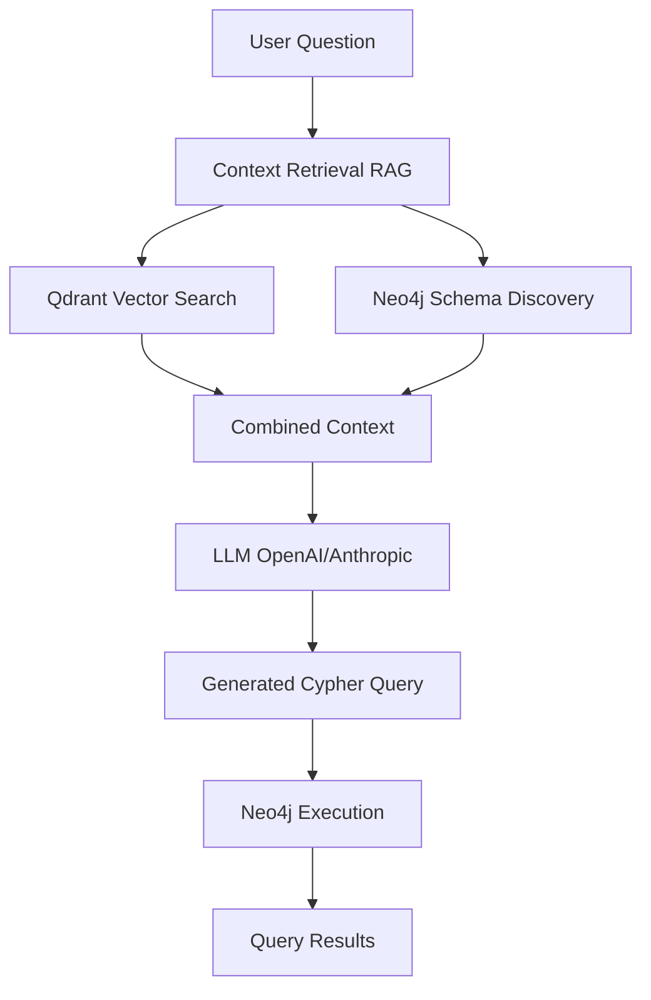

# AI Text-to-Query System

Welcome to the **AI Text-to-Query System** documentation! This powerful Laravel package enables natural language querying of graph databases using advanced AI techniques including Retrieval-Augmented Generation (RAG), vector embeddings, and Large Language Models (LLMs).

---

## What Is This System?

The AI Text-to-Query System transforms natural language questions into database queries by combining:

- **Neo4j Graph Database** - Complex relationship storage and querying
- **Qdrant Vector Database** - Semantic similarity search
- **OpenAI / Anthropic** - Embeddings and LLM query generation
- **RAG (Retrieval-Augmented Generation)** - Context-aware query generation

**Example Flow:**
```
User: "Show me teams with more than 5 active members"
  ↓ (RAG retrieves context)
  ↓ (LLM generates Cypher query)
  ↓ (Execute query on Neo4j)
Result: [Team Alpha, Team Beta, ...]
```

---

## Key Features

### Dual Storage Architecture
- **Neo4j** for structured graph queries with relationships
- **Qdrant** for semantic similarity search
- Automatic synchronization between both stores

### Smart Context Retrieval (RAG)
- Find similar past questions using vector search
- Discover graph schema automatically
- Retrieve example entities for concrete context
- Combine all sources for rich LLM prompts

### Flexible AI Providers
- **OpenAI** - GPT-4o for chat, text-embedding-3-small for vectors
- **Anthropic** - Claude 3.5 Sonnet for chat
- Easy provider switching via configuration

### Developer-Friendly APIs
- **Simple Wrapper** - One-line usage: `AI::ingest($entity)`
- **Advanced Services** - Full control with direct service instantiation
- **Laravel Integration** - Service provider with dependency injection
- **Type-Safe** - Full PHPDoc and interface contracts

### Comprehensive Data Ingestion
- Single and batch entity ingestion
- Automatic embedding generation
- Relationship creation from configuration
- Sync and remove operations
- Detailed status reporting

---

## Quick Links

### Getting Started
- [Installation & Setup](/docs/{{version}}/getting-started) - Install via Composer and configure
- [Quick Start Guide](/docs/{{version}}/quick-start) - First integration in 5 minutes
- [Architecture Overview](/docs/{{version}}/architecture) - Understand how it works

### Core APIs
- [Simple Usage (AI Wrapper)](/docs/{{version}}/simple-usage) - Recommended approach
- [Advanced Usage (Direct Services)](/docs/{{version}}/advanced-usage) - Full control
- [Data Ingestion](/docs/{{version}}/data-ingestion) - Ingest entities
- [Context Retrieval (RAG)](/docs/{{version}}/context-retrieval) - Get smart context
- [Embeddings](/docs/{{version}}/embeddings) - Generate vectors
- [LLM API](/docs/{{version}}/llm) - Chat completions

### Configuration & Integration
- [Configuration Reference](/docs/{{version}}/configuration) - Complete config guide
- [Laravel Integration](/docs/{{version}}/laravel-integration) - Controllers, observers, commands
- [Testing](/docs/{{version}}/testing) - Test your integration

### Help & Examples
- [Real-World Examples](/docs/{{version}}/examples) - Complete implementations
- [Troubleshooting & FAQ](/docs/{{version}}/troubleshooting) - Common issues

---

## System Requirements

### Required
- **PHP** 8.1 or higher
- **Laravel** 9.x or 10.x (optional, but recommended)
- **Neo4j** 4.x or 5.x
- **Qdrant** 1.x
- **Composer** for installation

### Optional (AI Providers)
- **OpenAI API Key** - For GPT-4o and text-embedding-3-small
- **Anthropic API Key** - For Claude 3.5 Sonnet

### PHP Extensions
- `ext-curl` - HTTP requests to AI providers
- `ext-json` - JSON encoding/decoding

---

## Architecture at a Glance



**Flow:**
1. User asks natural language question
2. System retrieves context using RAG (similar questions + graph schema)
3. LLM generates Cypher query using context
4. Query executes on Neo4j
5. Results returned to user

---

## Why Two Databases?

### Neo4j (Graph Store)
- **Purpose:** Structured queries with complex relationships
- **Use Cases:** "Find teams with most members", "Show purchase history"
- **Strengths:** Relationship traversal, pattern matching, complex joins

### Qdrant (Vector Store)
- **Purpose:** Semantic similarity search
- **Use Cases:** Find similar past questions, search by meaning
- **Strengths:** Fuzzy matching, semantic understanding, RAG support

### Together
The combination enables **intelligent query generation**:
- Qdrant finds similar questions (few-shot learning)
- Neo4j provides schema context (structural understanding)
- LLM generates accurate queries with both contexts

---

## Installation Preview

```bash
# Install via Composer
composer require ai-system/text-to-query

# Publish configuration
php artisan vendor:publish --tag=ai-config

# Configure environment
NEO4J_URI=bolt://localhost:7687
QDRANT_HOST=localhost
OPENAI_API_KEY=sk-your-key-here
```

**Usage:**
```php
use AiSystem\Facades\AI;

// Ingest an entity
AI::ingest($customer);

// Get context for a question
$context = AI::retrieveContext("Show teams with active members");

// Chat with LLM
$response = AI::chat("What is the capital of France?");
```

---

## What's Next?

### New Users
1. Read [Installation & Setup](/docs/{{version}}/getting-started)
2. Follow [Quick Start Guide](/docs/{{version}}/quick-start)
3. Explore [Simple Usage Examples](/docs/{{version}}/simple-usage)

### Experienced Developers
1. Review [Architecture Overview](/docs/{{version}}/architecture)
2. Study [Advanced Usage](/docs/{{version}}/advanced-usage)
3. Check [Real-World Examples](/docs/{{version}}/examples)

### Integrating with Laravel
1. See [Laravel Integration](/docs/{{version}}/laravel-integration)
2. Review [Configuration Reference](/docs/{{version}}/configuration)
3. Learn [Testing Best Practices](/docs/{{version}}/testing)

---

## Support & Community

**Documentation:** You're reading it!

**Issues:** Report bugs or request features in your project's issue tracker

**Testing:** Run `composer test` to verify your setup

---

## License

This package is open-source software licensed under the MIT license.

---

**Ready to get started?** Head over to [Installation & Setup](/docs/{{version}}/getting-started) to begin your journey with the AI Text-to-Query System!
