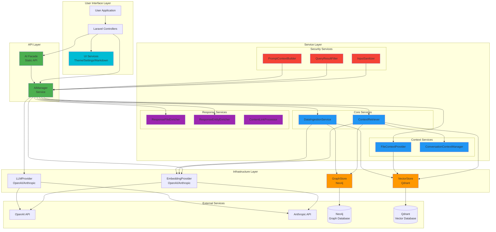
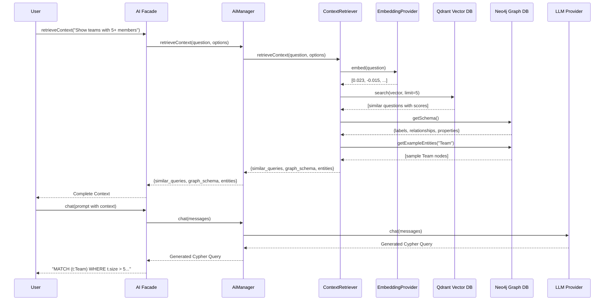
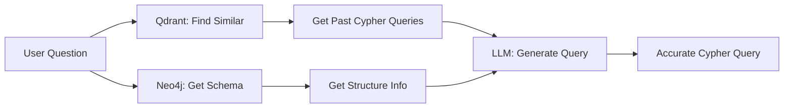

# Architecture Overview

This document explains the design principles, components, and data flow of the AI Text-to-Query System.

---

## System Architecture



---

## Complete 6-Phase Flow

The AI system operates in 6 distinct phases:

```
┌─────────────────────────────────────────────────────────────────────┐
│                    COMPLETE SYSTEM FLOW                             │
├─────────────────────────────────────────────────────────────────────┤
│                                                                     │
│  PHASE 1: CONFIGURATION                                             │
│  ┌─────────────────────────────────────────────────────────────┐   │
│  │  Model Properties  ──┐                                       │   │
│  │  entities.php        ├──> HasNodeableConfig ──> GraphConfig  │   │
│  │  nodeableConfig()  ──┘                      └──> VectorConfig│   │
│  └─────────────────────────────────────────────────────────────┘   │
│                              │                                      │
│                              ▼                                      │
│  PHASE 2: INGESTION                                                 │
│  ┌─────────────────────────────────────────────────────────────┐   │
│  │  AI::ingest($entity) ──> DataIngestionService                │   │
│  │      ├──> Neo4jStore::createNode()     (Graph)               │   │
│  │      ├──> EmbeddingProvider::embed()   (Vectors)             │   │
│  │      └──> QdrantStore::upsert()        (Search)              │   │
│  └─────────────────────────────────────────────────────────────┘   │
│                              │                                      │
│                              ▼                                      │
│  PHASE 3: CONTEXT RETRIEVAL (at query time)                        │
│  ┌─────────────────────────────────────────────────────────────┐   │
│  │  User Question ──> ContextRetriever                          │   │
│  │      ├──> Qdrant: Similar past queries (few-shot)            │   │
│  │      ├──> Neo4j: Graph schema                                │   │
│  │      └──> AccessLevelResolver: User permissions              │   │
│  └─────────────────────────────────────────────────────────────┘   │
│                              │                                      │
│                              ▼                                      │
│  PHASE 4: PROMPT BUILDING                                          │
│  ┌─────────────────────────────────────────────────────────────┐   │
│  │  PromptBuilder assembles:                                    │   │
│  │      ├──> System prompt with entity schemas                  │   │
│  │      ├──> Available scopes (from entities.php)               │   │
│  │      ├──> Access level constraints                           │   │
│  │      ├──> Similar queries (few-shot examples)                │   │
│  │      └──> User question                                      │   │
│  └─────────────────────────────────────────────────────────────┘   │
│                              │                                      │
│                              ▼                                      │
│  PHASE 5: QUERY GENERATION                                         │
│  ┌─────────────────────────────────────────────────────────────┐   │
│  │  LLM Provider generates:                                     │   │
│  │      ├──> Cypher query (if graph query needed)               │   │
│  │      ├──> Entity selection                                   │   │
│  │      └──> Scope applications                                 │   │
│  └─────────────────────────────────────────────────────────────┘   │
│                              │                                      │
│                              ▼                                      │
│  PHASE 6: EXECUTION & RESPONSE                                     │
│  ┌─────────────────────────────────────────────────────────────┐   │
│  │  Execute & Format:                                           │   │
│  │      ├──> Neo4j executes Cypher query                        │   │
│  │      ├──> Results filtered by access level                   │   │
│  │      └──> LLM formats response for user                      │   │
│  └─────────────────────────────────────────────────────────────┘   │
│                                                                     │
└─────────────────────────────────────────────────────────────────────┘
```

---

## Data Flow: User Question to Answer



---

## Core Components

### 1. Domain Layer

**Purpose:** Business logic and contracts independent of infrastructure.

#### Contracts (Interfaces)

**`Nodeable`** - Contract for entities storable in graph/vector databases
```php
interface Nodeable
{
    public function getGraphConfig(): GraphConfig;
    public function getVectorConfig(): VectorConfig;
    public function getId(): string|int;
    public function toArray(): array;
}
```

**`Searchable`** - Marker interface for vector-searchable entities

#### Value Objects

**`GraphConfig`** - Immutable Neo4j configuration
- Node label
- Properties to store
- Relationships to create

**`VectorConfig`** - Immutable Qdrant configuration
- Collection name
- Fields to embed
- Metadata to store

**`RelationshipConfig`** - Graph relationship definition
- Relationship type (e.g., "MEMBER_OF")
- Target label
- Foreign key mapping

#### Traits

**`HasNodeableConfig`** - Configuration resolution with layered approach:

```
┌────────────────────────────────────────────────────────┐
│  HasNodeableConfig::resolveConfig()                    │
├────────────────────────────────────────────────────────┤
│  1. nodeableConfig() override?  ──Yes──> Use directly  │
│         │ No                                           │
│         ▼                                              │
│  2. config/entities.php (WARM CACHE)                   │
│         │ Empty?                                       │
│         ▼                                              │
│  3. Runtime auto-discovery (if enabled)                │
│         │                                              │
│         ▼                                              │
│  4. Merge model properties on top                      │
│     ($embedFields, $graphLabel, $sensibleColumns)      │
│         │                                              │
│         ▼                                              │
│  5. Ensure minimum defaults                            │
└────────────────────────────────────────────────────────┘
```

**Model properties supported:**
- `$embedFields` - Fields to embed for semantic search
- `$graphLabel` - Neo4j node label
- `$sensibleColumns` - Sensitive fields requiring permission
- `$nodeableAliases` - Alternative names for LLM
- `$graphRelationships` - Explicit relationship definitions

---

### 2. Infrastructure Contracts Layer

**Purpose:** Abstraction over external services for testability and flexibility.

#### VectorStoreInterface

```php
interface VectorStoreInterface
{
    public function upsert(string $collection, array $points): bool;
    public function search(string $collection, array $vector, int $limit): array;
    public function deletePoints(string $collection, array $ids): bool;
    public function createCollection(string $name, int $vectorSize): bool;
}
```

**Implementations:**
- `QdrantStore` - Qdrant REST API client

---

#### GraphStoreInterface

```php
interface GraphStoreInterface
{
    public function createNode(string $label, array $properties): string;
    public function updateNode(string $label, string|int $id, array $properties): bool;
    public function createRelationship(...): bool;
    public function query(string $cypher, array $params = []): array;
    public function getSchema(): array;
}
```

**Implementations:**
- `Neo4jStore` - Neo4j HTTP API client

---

#### EmbeddingProviderInterface

```php
interface EmbeddingProviderInterface
{
    public function embed(string $text): array;
    public function embedBatch(array $texts): array;
}
```

**Implementations:**
- `OpenAiEmbeddingProvider` - text-embedding-3-small (1536 dimensions)
- `AnthropicEmbeddingProvider` - Placeholder for future support

---

#### LlmProviderInterface

```php
interface LlmProviderInterface
{
    public function chat(array $messages, array $options = []): string;
    public function chatJson(array $messages, array $options = []): object|array;
    public function complete(string $prompt, ?string $systemPrompt = null): string;
    public function streamChat(array $messages, callable $callback): void;
}
```

**Implementations:**
- `OpenAiLlmProvider` - GPT-4o (128K context)
- `AnthropicLlmProvider` - Claude 3.5 Sonnet (200K context)

---

### 3. Service Layer

**Purpose:** Business logic orchestration and coordination.

#### DataIngestionService

**Responsibility:** Ingest entities into both graph and vector stores.

**Key Methods:**
```php
ingest(Nodeable $entity): array
ingestBatch(array $entities): array
sync(Nodeable $entity): array
remove(Nodeable $entity): bool
```

**Features:**
- Dual-store ingestion (Neo4j + Qdrant)
- Automatic embedding generation
- Relationship creation from config
- Batch optimization
- Graceful error handling

---

#### ContextRetriever

**Responsibility:** Implement RAG (Retrieval-Augmented Generation).

**Key Methods:**
```php
retrieveContext(string $question, array $options = []): array
searchSimilar(string $question, string $collection, int $limit): array
getGraphSchema(): array
getExampleEntities(string $label, int $limit): array
```

**Features:**
- Vector similarity search for past questions
- Graph schema discovery
- Example entity retrieval
- Combined context assembly
- Graceful degradation on partial failures

---

### 4. API Layer (AiManager + Facade)

#### AiManager Service

**Purpose:** Convenient wrapper around AI services with proper dependency injection.

**Architecture:**
```php
class AiManager
{
    public function __construct(
        private readonly DataIngestionServiceInterface $ingestion,
        private readonly ContextRetrieverInterface $context,
        private readonly EmbeddingProviderInterface $embedding,
        private readonly LlmProviderInterface $llm
    ) {}
}
```

**Features:**
- Constructor dependency injection
- Fully testable with Laravel's container
- Follows SOLID principles
- All dependencies explicit and visible

#### AI Facade

**Purpose:** Developer-friendly static API.

**Architecture:**
```php
class AI extends Facade
{
    protected static function getFacadeAccessor(): string
    {
        return 'ai'; // Resolves AiManager from container
    }
}
```

**Features:**
- Static method access: `AI::ingest($entity)`
- Leverages Laravel's service container
- Testable with facade mocking
- No singleton anti-pattern

**Usage Examples:**
```php
// Via Facade (simple)
use Condoedge\Ai\Facades\AI;
AI::ingest($customer);
AI::retrieveContext("Show all teams");
AI::chat("What is 2+2?");

// Via Dependency Injection (testable)
use Condoedge\Ai\Services\AiManager;
class CustomerController extends Controller
{
    public function __construct(private AiManager $ai) {}

    public function store(Request $request)
    {
        $this->ai->ingest($customer);
    }
}
```

**Benefits of Refactored Architecture:**
- Proper dependency injection throughout
- Testable with Laravel's facade mocking
- Follows Laravel best practices
- No service locator anti-pattern
- Single source of truth (service provider)

---

## Code Structure Map

The following shows the complete source code organization:

```
src/
├── Domain/
│   ├── Contracts/
│   │   └── Nodeable.php                 # Interface for AI-enabled models
│   │
│   ├── Traits/
│   │   └── HasNodeableConfig.php        # Main trait
│   │       ├── resolveConfig()          # 4-step resolution
│   │       ├── readFromEntitiesConfig() # Read from warm cache
│   │       ├── readModelProperties()    # Read model properties
│   │       ├── getGraphConfig()         # Returns GraphConfig VO
│   │       └── getVectorConfig()        # Returns VectorConfig VO
│   │
│   └── ValueObjects/
│       ├── GraphConfig.php              # Neo4j config VO
│       ├── VectorConfig.php             # Qdrant config VO
│       └── NodeableConfig.php           # Fluent builder
│
├── Services/
│   ├── Discovery/
│   │   ├── EntityAutoDiscovery.php      # Main discovery orchestrator
│   │   ├── PropertyDiscoverer.php       # Discovers model properties
│   │   ├── RelationshipDiscoverer.php   # Discovers relationships
│   │   ├── CypherScopeAdapter.php       # Converts scopes to Cypher
│   │   ├── CypherQueryBuilderSpy.php    # Records QB calls
│   │   │   └── __call()                 # Handles nested scope resolution
│   │   └── CypherPatternGenerator.php   # Generates Cypher
│   │
│   ├── Security/
│   │   ├── AccessLevelResolver.php      # Determines access tags
│   │   └── PromptContextBuilder.php     # Builds access-aware prompts
│   │
│   ├── Ingestion/
│   │   └── DataIngestionService.php     # Orchestrates ingestion
│   │
│   ├── Context/
│   │   ├── ContextRetriever.php         # Retrieves relevant context
│   │   ├── FileContextProvider.php      # File search for RAG
│   │   ├── FileAccessResolver.php       # File access permissions
│   │   ├── ConversationContextManager.php # Conversation state tracking
│   │   ├── EntityExtractor.php          # Extract entities from text
│   │   └── ReferenceResolver.php        # Resolve pronouns/references
│   │
│   ├── Query/
│   │   ├── QueryGenerator.php           # LLM generates queries
│   │   └── QueryExecutor.php            # Executes & filters
│   │
│   ├── Response/
│   │   ├── ResponseGenerator.php        # Formats final response
│   │   ├── ResponseFileEnricher.php     # Enriches with file refs
│   │   ├── ResponseEntityEnricher.php   # Enriches with entity actions
│   │   ├── ContentLinkProcessor.php     # Processes special links
│   │   ├── ActionLinkHandler.php        # entity:// and action:// links
│   │   └── FileCitationHandler.php      # File citation [1] links
│   │
│   ├── UI/
│   │   ├── ChatThemeFactoryInterface.php # Theme factory contract
│   │   ├── ConfigChatThemeFactory.php   # Config-based themes
│   │   ├── UserChatThemeFactory.php     # User preference themes
│   │   └── SafeMarkdownRenderer.php     # Secure markdown rendering
│   │
│   └── Settings/
│       └── ChatSettingsInterface.php    # Chat UI settings contract
│
├── Stores/
│   ├── Neo4j/
│   │   └── Neo4jStore.php               # Neo4j operations
│   └── Qdrant/
│       └── QdrantStore.php              # Qdrant operations
│
└── Console/Commands/
    ├── DiscoverEntitiesCommand.php      # ai:discover → entities.php
    ├── IngestEntitiesCommand.php        # ai:ingest
    ├── SyncRelationshipsCommand.php     # ai:sync-rels
    ├── IndexScopesCommand.php           # ai:index-scopes
    └── IndexSemanticCommand.php         # ai:index-semantic
```

**Layer Responsibilities:**

| Layer | Purpose | Key Classes |
|-------|---------|-------------|
| **Domain** | Business contracts and value objects | `Nodeable`, `GraphConfig`, `VectorConfig` |
| **Services/Discovery** | Auto-discover models and relationships | `EntityAutoDiscovery`, `PropertyDiscoverer` |
| **Services/Security** | Access control and input validation | `AccessLevelResolver`, `InputSanitizer`, `QueryResultFilter`, `PromptContextBuilder` |
| **Services/Ingestion** | Data sync to graph/vector stores | `DataIngestionService` |
| **Services/Context** | RAG context and conversation state | `ContextRetriever`, `FileContextProvider`, `ConversationContextManager`, `EntityExtractor`, `ReferenceResolver` |
| **Services/Query** | LLM query generation and execution | `QueryGenerator`, `QueryExecutor` |
| **Services/Response** | Response formatting and enrichment | `ResponseGenerator`, `ResponseFileEnricher`, `ResponseEntityEnricher`, `ContentLinkProcessor` |
| **Services/UI** | Chat theming and rendering | `ChatThemeFactoryInterface`, `ConfigChatThemeFactory`, `SafeMarkdownRenderer` |
| **Services/Settings** | Chat UI configuration | `ChatSettingsInterface`, `UserChatSettings` |
| **Stores** | Database adapters | `Neo4jStore`, `QdrantStore` |
| **Console** | Artisan commands | Discovery, ingestion, sync commands |

---

## Response Processing Services

Response processing services enrich AI responses with actionable metadata, process special link formats, and handle entity actions.

### ResponseFileEnricher

**Responsibility:** Enriches AI responses with file reference metadata by extracting citation markers and building actionable file references.

**Key Features:**
- Extracts citation markers `[1]`, `[2]`, etc. from response text
- Maps citations to files in the provided file context
- Builds actionable metadata for database files (download/preview URLs)
- Physical files have null URLs and cannot be downloaded directly

```php
$enricher = app(ResponseFileEnricher::class);

// Extract citation markers
$markers = $enricher->extractCitationMarkers($response);
// Returns: [1, 2, 3] for response containing [1], [2], [3]

// Build referenced files with metadata
$files = $enricher->buildReferencedFiles($response, $fileContext, [
    'download_url_resolver' => fn($id) => route('files.download', $id),
    'preview_url_resolver' => fn($id) => route('files.preview', $id),
]);

// Enrich full response
$enriched = $enricher->enrichResponse($response, $fileContext);
// Adds 'referenced_files' and 'has_file_references' keys
```

---

### ResponseEntityEnricher

**Responsibility:** Enriches query results with entity action metadata by checking if each entity type has configured profile actions.

**Key Features:**
- Adds available actions info to each result with an entity label
- Uses EntityAutoDiscovery to resolve configured entity actions
- Enables actionable entity links in responses

```php
$enricher = app(ResponseEntityEnricher::class);

$enrichedResults = $enricher->enrichEntityResults($queryResults);
// Each result gets: has_actions, available_actions, entity_type
```

---

### ContentLinkProcessor

**Responsibility:** Orchestrates processing of all inline content links by combining multiple handlers (actions, file citations) into a single entry point.

**Key Features:**
- Combines ActionLinkHandler and FileCitationHandler
- Extensible: Add custom handlers via `registerHandler()`
- Single entry point for message rendering

```php
$processor = app(ContentLinkProcessor::class);

// Process for direct rendering (strips links, creates elements)
$result = $processor->processForDirectRendering($content, ['files' => $files]);
// Returns: ['content' => '...', 'elements' => [...], 'has_links' => true]

// Check if content has any processable links
if ($processor->hasLinks($content)) {
    // Process content
}

// Register custom handler
$processor->registerHandler('custom', new MyLinkHandler());
```

---

### ActionLinkHandler

**Responsibility:** Handles `entity://` and `action://` protocol links in AI responses.

**Link Formats:**
- `[text](entity://EntityType/id/action_key)` - Entity-specific action
- `[text](action://action_key)` - Generic action

**Key Features:**
- Processes AI-generated action links
- Creates Kompo elements using configured resolvers from config/ai.php
- Deduplicates multiple occurrences of the same link

```php
$handler = app(ActionLinkHandler::class);

// AI response containing: [View Customer](entity://Customer/123/profile)
$elements = $handler->createElements($content, $context);
// Returns Kompo link elements with configured action handlers
```

---

### FileCitationHandler

**Responsibility:** Handles file citation links `[1]`, `[2]`, etc. in AI responses.

**Key Features:**
- Processes numbered citations referencing files
- Creates clickable elements that open file preview modals
- Tracks citation metadata for proxy element creation

```php
$handler = app(FileCitationHandler::class);

// AI response containing: Based on the report [1] and analysis [2]...
$elements = $handler->createElements($content, ['files' => $referencedFiles]);

// Get metadata for processed citations
$metadata = $handler->getCitationMetadata();
// Returns: [['slot' => 'file-citation-1', 'id' => 1, 'type' => 'file', ...]]
```

---

## Context Management Services

Context services manage conversation state, file context for RAG, and resolve references across messages.

### FileContextProvider

**Responsibility:** Provides unified file search across both physical documentation files and database-backed files with access control filtering.

**Key Features:**
- Searches both physical (documentation) and database file collections
- Detects explicit filename references in queries for targeted search
- Combines filename-based and semantic content search results
- Applies access filtering (physical files always pass through)
- Truncates snippets to configured length

```php
$provider = app(FileContextProvider::class);

// Search for relevant files
$files = $provider->searchRelevantFiles($question, $user, [
    'limit' => 5,
    'min_score' => 0.4,
]);

// Get full file context for prompt building
$context = $provider->getFileContext($question, $user);
// Returns: [
//     'relevant_files' => [...],
//     'file_count' => 3,
//     'has_physical' => true,
//     'has_database' => true,
// ]
```

---

### FileAccessResolver

**Responsibility:** Resolves file access permissions for the AI context system, supporting both physical files and database-backed files.

**Key Features:**
- Physical files (with `physical:` prefix) always bypass security
- Supports configurable access resolver closures
- Falls back to user_id/team_id filtering
- Logs all access attempts for auditing

```php
$resolver = app(FileAccessResolverInterface::class);

// Check if security is enabled
if ($resolver->shouldEnforceSecurity()) {
    // Check individual file access
    if ($resolver->canAccessFile($fileId, $user)) {
        // Allow access
    }
}

// Filter list of file IDs to accessible ones
$accessibleIds = $resolver->filterAccessibleFileIds($fileIds, $user);

// Check if file is physical (documentation)
if ($resolver->isPhysicalFile($fileId)) {
    // Physical files always accessible
}

// Create physical file ID
$physicalId = $resolver->makePhysicalFileId('/path/to/doc.md');
// Returns: 'physical:/path/to/doc.md'
```

---

### ConversationContextManager

**Responsibility:** Orchestrates conversation context tracking by combining entity extraction, reference resolution, and context snapshot management.

**Key Features:**
- Main entry point for conversation context handling
- Processes incoming questions and updates context
- Records AI responses with enhanced entity data
- Builds prompt context for follow-up questions

```php
$manager = app(ConversationContextManager::class);

// Process incoming question
$result = $manager->processQuestion($conversation, $question, $schema);
// Returns: [
//     'is_follow_up' => true,
//     'focused_entity' => 'Customer',
//     'query_type' => 'list',
//     'mentioned_entities' => ['Customer', 'Order'],
//     'enriched_question' => 'Show customers with...',
//     'resolved_entity' => 'Customer',
// ]

// Record AI response
$manager->recordResponse($conversation, $response, $cypherQuery, $queryResult);

// Build prompt context for follow-up
$context = $manager->buildPromptContext($conversation, maxHistory: 5);
```

---

### EntityExtractor

**Responsibility:** Extracts entity types and query patterns from questions and Cypher queries.

**Key Features:**
- Extracts mentioned entities from natural language questions
- Detects query types (count, list, detail, aggregate, compare)
- Extracts entities and relationships from Cypher queries

```php
$extractor = app(EntityExtractor::class);

// Extract from question
$result = $extractor->extractFromQuestion('Show all customers with orders', $schema);
// Returns: [
//     'focused_entity' => 'Customer',
//     'query_type' => 'list',
//     'mentioned_entities' => ['Customer', 'Order'],
// ]

// Extract from Cypher
$result = $extractor->extractFromCypher('MATCH (c:Customer)-[:PLACED]->(o:Order)...');
// Returns: [
//     'entities' => ['Customer', 'Order'],
//     'relationships' => ['PLACED'],
// ]
```

---

### ReferenceResolver

**Responsibility:** Resolves conversational references like "those", "them", "the same" using conversation context.

**Key Features:**
- Detects follow-up questions
- Identifies reference types (pronoun, demonstrative, definite, implicit)
- Enriches questions with resolved entity references

```php
$resolver = app(ReferenceResolver::class);

// Check if question is a follow-up
if ($resolver->isFollowUp('Show those with pending status')) {
    // Resolve references
    $result = $resolver->resolve($question, $conversationContext);
    // Returns: [
    //     'resolved' => true,
    //     'resolved_entity' => 'Order',
    //     'operation' => 'filter',
    //     'enriched_question' => 'Show orders with pending status',
    //     'reference_type' => 'demonstrative',
    // ]
}

// Detect reference type
$type = $resolver->detectReferenceType('Filter those by date');
// Returns: 'demonstrative'
```

---

## UI Services

UI services provide theming and rendering capabilities for the chat interface.

### ChatThemeFactoryInterface

**Responsibility:** Factory contract for theme selection and creation.

**Implementations:**
- `ConfigChatThemeFactory` - Resolves themes from config/ai.php (default)
- `UserChatThemeFactory` - Resolves themes from user database settings

**Key Methods:**
```php
$factory = app(ChatThemeFactoryInterface::class);

// Create theme with overrides
$theme = $factory->create('indigo', ['primaryBg' => 'bg-blue-600']);

// Register custom theme
$factory->register('corporate', CorporateTheme::class);

// Get available themes
$themes = $factory->available(); // ['indigo', 'green', 'config']

// Check if theme exists
if ($factory->has('dark')) {
    // Theme available
}
```

---

### ConfigChatThemeFactory

**Responsibility:** Factory that resolves themes from config/ai.php (default implementation).

**Built-in Themes:**
- `indigo` - Purple-blue professional theme (default)
- `green` - Fresh green theme
- `config` - Fully configurable via config values

```php
// Configuration (config/ai.php)
'ui' => [
    'theme' => 'indigo',
    'colors' => [
        'primaryBg' => 'bg-indigo-600',
        'primaryText' => 'text-indigo-600',
    ],
],
```

---

### UserChatThemeFactory

**Responsibility:** Factory that resolves themes from user database settings, with fallback to config.

**Key Features:**
- Priority: runtime param > user setting > config
- Merges color overrides from all sources
- Falls back gracefully when user is not authenticated

```php
// Uses AiUserSetting model to store user preferences
// Theme selection: $userSetting->getThemeName()
// Color overrides: $userSetting->getColorOverrides()
```

---

### ChatSettingsInterface

**Responsibility:** Contract for chat settings providing configuration values for UI behavior and features.

**Key Settings:**
```php
$settings = app(ChatSettingsInterface::class);

// Welcome/onboarding
$settings->welcomeTitle();        // "Welcome to AI Assistant"
$settings->welcomeMessage();      // "Ask me anything..."
$settings->exampleQuestions();    // ["Show all teams", "List customers"]

// Display options
$settings->showTimestamps();      // true/false
$settings->showAvatars();         // true/false
$settings->showTyping();          // true/false
$settings->showSuggestions();     // true/false
$settings->showMetrics();         // true/false

// Feature toggles
$settings->enableCopy();          // true/false
$settings->enableFeedback();      // true/false
$settings->enableEdit();          // true/false
$settings->enableRegenerate();    // true/false

// Behavior
$settings->responseStyle();       // 'concise', 'detailed', 'balanced'
$settings->typingAnimationStyle(); // 'dots', 'wave', 'pulse', 'brain'
$settings->animationSpeed();      // 'slow', 'normal', 'fast', 'none'
```

---

### SafeMarkdownRenderer

**Responsibility:** Minimal, secure markdown renderer for chat messages with XSS prevention.

**Supported Syntax:**
- Code blocks (```language)
- Inline code (`code`)
- Bold (**text**)
- Italic (*text*)
- Lists (- item, 1. item)
- Headers (## H2, ### H3)
- Links ([text](url))
- Citations ([1], [2])

**Key Features:**
- All outputs properly HTML escaped
- Only safe URL schemes allowed (http, https, mailto, tel, #)
- No javascript:, data:, or other dangerous schemes
- Theme-aware styling

```php
$renderer = new SafeMarkdownRenderer(['primaryText' => 'text-blue-600']);

$html = $renderer->render('**Bold** and `code` with [link](https://example.com)');
// Returns safe HTML with proper escaping
```

---

## Security Services

Security services provide defense-in-depth for the AI system, including input validation, access control, and result filtering.

### InputSanitizer

**Responsibility:** Detects and mitigates prompt injection attempts in user input.

**Detection Patterns:**
- Direct instruction overrides ("ignore previous instructions")
- System-level impersonation ("SYSTEM:", "[[]]")
- Role manipulation ("you are now", "pretend to be")
- Code block injection
- Access control bypass attempts

**Key Methods:**
```php
$sanitizer = app(InputSanitizer::class);

// Analyze input for injection risk
$analysis = $sanitizer->analyze($userInput);
// Returns: [
//     'has_injection_risk' => true,
//     'patterns_matched' => [...],
//     'risk_level' => 'medium', // none, low, medium, high
// ]

// Sanitize by removing dangerous patterns
$clean = $sanitizer->sanitize($userInput);

// Combined analysis and sanitization
$result = $sanitizer->process($userInput, sanitize: true);

// Add custom pattern
$sanitizer->addPattern('/custom_bad_pattern/i');
```

---

### QueryResultFilter

**Responsibility:** Server-side filter for query results based on user access levels. Provides defense-in-depth beyond LLM prompt-level access control.

**Key Features:**
- Filters sensitive columns from results
- Applies count threshold protection to prevent identifying individuals
- Works as second layer after prompt-based restrictions

```php
$filter = app(QueryResultFilter::class);

// Filter results based on user access
$filtered = $filter->filterResults($results, 'Employee', $user);
// Removes sensitive columns like salary if user lacks access

// Apply count threshold protection
$protectedCount = $filter->applyCountThreshold(3, 'Employee');
// Returns "fewer than 5" if below threshold, actual count if above
```

---

### PromptContextBuilder

**Responsibility:** Builds access-aware prompt context for RAG queries. Injects access control instructions into prompts to guide the AI on data access.

**Key Features:**
- Builds entity-specific access sections
- Describes allowed and restricted access levels
- Applies count thresholds for privacy
- Filters sensitive content from semantic results

```php
$builder = new PromptContextBuilder($user);

// Set sensible columns for entities
$builder->setEntitySensibleColumns('Employee', ['salary', 'ssn', 'bank_account']);

// Build access section for prompt
$accessSection = $builder->buildAccessSection(['Employee', 'Department']);

// Build full context including semantic results
$fullContext = $builder->buildFullContext(
    entities: ['Employee'],
    semanticResults: $vectorSearchResults,
    aggregates: ['total_employees' => 150]
);

// Build complete system prompt with access rules
$systemPrompt = $builder->buildSystemPrompt(['Employee', 'Department']);
```

---

## Design Principles

### 1. Interface-Based Design

**All dependencies are interfaces**, not concrete classes:

```php
class DataIngestionService
{
    public function __construct(
        private readonly VectorStoreInterface $vectorStore,
        private readonly GraphStoreInterface $graphStore,
        private readonly EmbeddingProviderInterface $embeddingProvider
    ) {}
}
```

**Benefits:**
- Easy testing with mocks
- Swap implementations without changing code
- Add new providers (Pinecone, ArangoDB, etc.)

---

### 2. Dependency Injection

Services receive dependencies via constructor:

```php
// Laravel container auto-wires this
class CustomerController
{
    public function __construct(
        private DataIngestionServiceInterface $ingestion
    ) {}
}
```

**Benefits:**
- Testability
- Flexibility
- No hidden dependencies

---

### 3. Separation of Concerns

Each component has a single responsibility:

- **Domain Layer:** Business rules
- **Infrastructure:** External service communication
- **Services:** Orchestration
- **Wrappers:** Developer convenience

---

### 4. Graceful Degradation

Services handle partial failures elegantly:

```php
$status = AI::ingest($entity);
// [
//     'graph_stored' => true,
//     'vector_stored' => false,  // Vector failed but graph succeeded
//     'errors' => ['Vector: Connection timeout']
// ]
```

One store failing doesn't crash the entire operation.

---

### 5. Configuration Over Code

Entity mappings defined in config, not code:

```php
// config/entities.php
'Customer' => [
    'graph' => ['label' => 'Customer', ...],
    'vector' => ['collection' => 'customers', ...]
]
```

**Benefits:**
- No code changes for new entities
- Easy to maintain
- Clear separation

---

## Why Two Storage Systems?

### Neo4j (Graph Database)

**Strengths:**
- Complex relationship queries
- Pattern matching
- Graph algorithms
- Structured data

**Use Cases:**
- "Find teams with most active members"
- "Show customer purchase history"
- "Recommend products based on friend purchases"

**Query Language:** Cypher
```cypher
MATCH (t:Team)<-[:MEMBER_OF]-(p:Person)
WHERE p.status = 'active'
RETURN t.name, count(p) as members
ORDER BY members DESC
```

---

### Qdrant (Vector Database)

**Strengths:**
- Semantic similarity search
- Fast nearest neighbor search
- Fuzzy matching
- RAG support

**Use Cases:**
- Find similar past questions
- Search by meaning, not keywords
- Few-shot learning context
- Semantic product search

**Query:** Vector similarity
```php
$embedding = embed("software development teams");
$similar = search($embedding, limit: 5);
// Returns: ["Engineering Team", "Dev Squad", "Tech Builders"]
```

---

### Together: Intelligent Query Generation



**The Synergy:**
1. **Qdrant** provides examples (few-shot learning)
2. **Neo4j** provides structure (schema understanding)
3. **LLM** combines both for accurate query generation

---

## Data Flow Examples

### Example 1: Ingesting an Entity

```
Customer Entity (Laravel Model)
  ↓
AI::ingest($customer)
  ↓
DataIngestionService
  ├─→ Generate embedding from name+description
  ├─→ Create node in Neo4j {id, name, email}
  ├─→ Store vector in Qdrant with metadata
  └─→ Create relationships (PURCHASED → Order)
  ↓
Status Report: {graph_stored: true, vector_stored: true}
```

---

### Example 2: RAG Context Retrieval

```
Question: "Show teams with 5+ members"
  ↓
AI::retrieveContext($question)
  ↓
ContextRetriever
  ├─→ EmbeddingProvider: Generate question embedding
  ├─→ Qdrant: Search for similar questions
  │     Returns: ["List all teams", "Show team members"]
  ├─→ Neo4j: Get schema
  │     Returns: {labels: [Team, Person], relationships: [MEMBER_OF]}
  ├─→ Neo4j: Get example entities
  │     Returns: [{id: 1, name: "Alpha", size: 10}]
  └─→ Combine into context
  ↓
Context: {similar_queries, graph_schema, relevant_entities}
```

---

### Example 3: Complete Q&A Pipeline

```
1. User Question
   "Which teams have more than 5 members?"

2. RAG Context Retrieval
   AI::retrieveContext($question)
   → Similar queries, schema, examples

3. LLM Prompt Construction
   System: "You are a Cypher expert"
   User: "Question + Context"

4. Query Generation
   AI::chat($prompt)
   → "MATCH (t:Team) WHERE t.size > 5 RETURN t"

5. Query Execution
   Neo4jStore::query($cypherQuery)
   → [{id: 1, name: "Alpha", size: 10}, ...]

6. Response Generation
   AI::chat("Explain these results to the user")
   → "I found 3 teams with more than 5 members: Alpha, Beta, Gamma"

7. Return to User
```

---

## Testing Architecture

### Unit Tests
- Mock all interfaces
- Test business logic in isolation
- Fast, no external dependencies

```php
$mockVector = Mockery::mock(VectorStoreInterface::class);
$service = new DataIngestionService($mockVector, $mockGraph, $mockEmbed);
```

---

### Integration Tests
- Test with real Neo4j/Qdrant
- Verify API integrations
- Slower, requires infrastructure

```php
$neo4j = new Neo4jStore(config('ai.graph.neo4j'));
$result = $neo4j->createNode('Test', ['name' => 'test']);
```

---

## Scalability Considerations

### Batch Operations
- Use `ingestBatch()` for bulk ingestion
- Reduces API calls and network overhead
- Batch embedding generation

### Caching
- Configure `AI_CACHE_TTL` for query result caching
- Cache schema information
- Cache frequently accessed embeddings

### Async Processing
- Queue ingestion operations
- Process updates asynchronously
- Use Laravel queues for background processing

---

## Security Considerations

### Cypher Injection Prevention
- All labels validated with regex: `/^[a-zA-Z_][a-zA-Z0-9_-]*$/`
- Parameterized queries for user input
- Never concatenate user input into Cypher

### API Key Protection
- Store in environment variables
- Never commit to version control
- Use Laravel's encrypted environment

### Access Control
- Protect documentation routes with middleware
- Restrict database access by IP
- Use Neo4j RBAC for multi-tenant scenarios

---

## Extension Points

### Add New Vector Store
1. Implement `VectorStoreInterface`
2. Register in service provider
3. Configure in `config/ai.php`

### Add New Graph Store
1. Implement `GraphStoreInterface`
2. Register in service provider
3. Configure in `config/ai.php`

### Add New LLM Provider
1. Implement `LlmProviderInterface`
2. Register in service provider
3. Add configuration section

---

## Next Steps

- **[Simple Usage](/docs/{{version}}/usage/simple-usage)** - Learn the AI wrapper API
- **[Advanced Usage](/docs/{{version}}/usage/advanced-usage)** - Direct service usage
- **[Configuration](/docs/{{version}}/foundations/configuration)** - All settings explained
- **[Real-World Examples](/docs/{{version}}/usage/examples)** - Complete implementations
