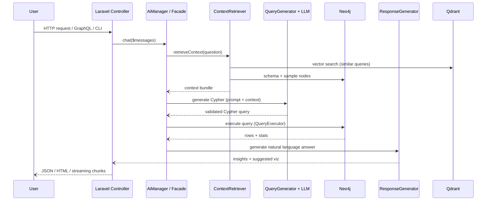
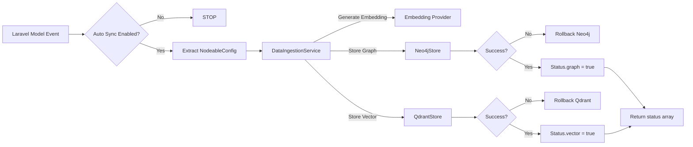
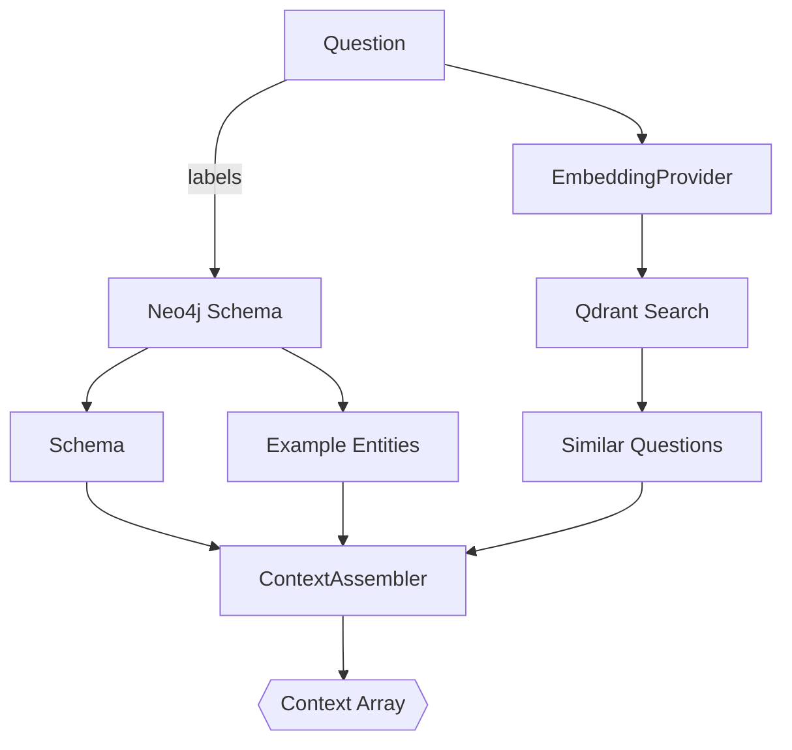

# Data & Control Flows

Understanding the order of operations makes it easier to debug issues or add instrumentation. This chapter summarizes the most important flows with Mermaid diagrams you can tweak or paste into monitoring docs.

## Question → Answer Pipeline



Key safeguards:
- Context retrieval tolerates partial failures (e.g., Qdrant offline) and still proceeds with available data.
- Query validation enforces read-only patterns unless explicitly overridden.
- Query execution enforces `AI_MAX_RESULTS` and `AI_QUERY_TIMEOUT`.

## Entity Ingestion Flow



Notes:
- `ingestBatch` groups embedding/API calls to reduce latency and ensures a single rollback covers the batch.
- Compensating transactions run synchronously to keep both stores consistent.

## Auto-Discovery Flow

```mermaid
stateDiagram-v2
    [*] --> Start
    Start --> CacheCheck: ConfigCache::remember
    CacheCheck --> Discovered: hit
    CacheCheck --> Reflect: miss
    Reflect --> Properties: fillable/casts/dates
    Properties --> Relationships: belongsTo()
    Relationships --> Scopes: scopeX() + CypherSpy
    Scopes --> EmbedFields: heuristics
    EmbedFields --> Merge: merge explicit config overrides
    Merge --> CacheWrite
    CacheWrite --> Discovered
```

- Cache keys follow `ai:discovery:{EntityClass}`.
- You can pre-warm everything with `php artisan ai:discover:cache`.

## Context Retrieval Flow



Each context payload contains:
- `similar_queries` – question text + top matching Cypher
- `graph_schema` – labels, relationships, indexed properties
- `example_entities` – sanitized snapshots per label
- `scopes` – discovered semantic filters

## Error Reporting Flow

1. Any exception during ingestion or querying is wrapped with a contextual array:
   ```php
   [
       'operation' => 'ingest',
       'entity' => Customer::class,
       'graph_stored' => false,
       'vector_stored' => true,
       'errors' => [...],
   ]
   ```
2. If `fail_silently=false`, the exception bubbles up. Otherwise it is logged via Laravel’s logger (with secrets automatically redacted).
3. LaRecipe docs can embed these patterns so on-call engineers know what to expect.

Review the [Resilience & Security chapter](/docs/{{version}}/internals/resilience) for deeper coverage of retries, circuit breakers, and sanitization.
