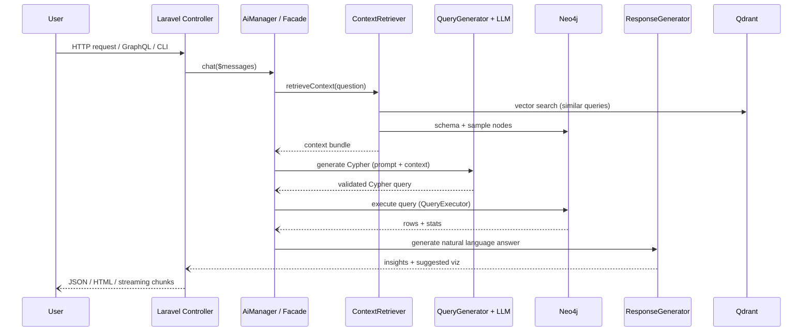
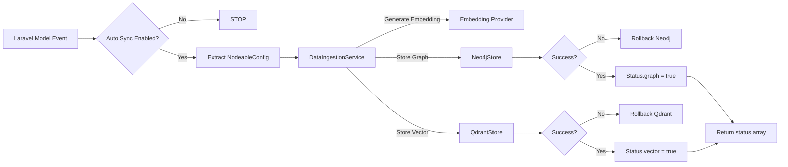
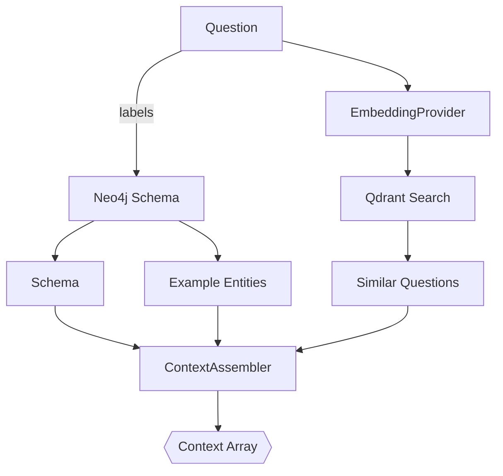

# Data & Control Flows

Understanding the order of operations makes it easier to debug issues or add instrumentation. This chapter summarizes the most important flows with Mermaid diagrams you can tweak or paste into monitoring docs.

---

## Complete AI Package Architecture

Here's the complete flow from configuration to response:

```
┌─────────────────────────────────────────────────────────────────────────────────┐
│                           AI PACKAGE COMPLETE FLOW                               │
└─────────────────────────────────────────────────────────────────────────────────┘

┌──────────────────┐    ┌──────────────────┐    ┌──────────────────┐
│   PHASE 1        │    │   PHASE 2        │    │   PHASE 3        │
│  CONFIGURATION   │───▶│   INGESTION      │───▶│ CONTEXT RETRIEVAL│
│  (One-time)      │    │  (Sync/Batch)    │    │  (Per Question)  │
└──────────────────┘    └──────────────────┘    └──────────────────┘
         │                       │                       │
         ▼                       ▼                       ▼
┌──────────────────┐    ┌──────────────────┐    ┌──────────────────┐
│ • Model props    │    │ • Neo4j nodes    │    │ • Semantic search│
│ • nodeableConfig │    │ • Neo4j rels     │    │ • Graph traversal│
│ • entities.php   │    │ • Qdrant vectors │    │ • Access filter  │
│ • Auto-discovery │    │ • Scope patterns │    │ • Entity detect  │
└──────────────────┘    └──────────────────┘    └──────────────────┘
                                                         │
         ┌───────────────────────────────────────────────┘
         ▼
┌──────────────────┐    ┌──────────────────┐    ┌──────────────────┐
│   PHASE 4        │    │   PHASE 5        │    │   PHASE 6        │
│ PROMPT BUILDING  │───▶│ QUERY GENERATION │───▶│    RESPONSE      │
│                  │    │                  │    │                  │
└──────────────────┘    └──────────────────┘    └──────────────────┘
         │                       │                       │
         ▼                       ▼                       ▼
┌──────────────────┐    ┌──────────────────┐    ┌──────────────────┐
│ • System prompt  │    │ • LLM generates  │    │ • Execute query  │
│ • Context inject │    │   Cypher/SQL     │    │ • Filter results │
│ • Access tags    │    │ • Pattern match  │    │ • LLM formats    │
│ • Thresholds     │    │ • Scope resolve  │    │ • Return answer  │
└──────────────────┘    └──────────────────┘    └──────────────────┘
```

---

## Question → Answer Pipeline


```mermaid
sequenceDiagram
    participant User
    participant Controller as Laravel Controller
    participant AI as AiManager / Facade
    participant Context as ContextRetriever
    participant LLM as QueryGenerator + LLM
    participant Neo4j
    participant Response as ResponseGenerator

    User->>Controller: HTTP request / GraphQL / CLI
    Controller->>AI: chat($messages)
    AI->>Context: retrieveContext(question)
    Context->>Qdrant: vector search (similar queries)
    Context->>Neo4j: schema + sample nodes
    Context--)AI: context bundle
    AI->>LLM: generate Cypher (prompt + context)
    LLM--)AI: validated Cypher query
    AI->>Neo4j: execute query (QueryExecutor)
    Neo4j--)AI: rows + stats
    AI->>Response: generate natural language answer
    Response--)Controller: insights + suggested viz
    Controller--)User: JSON / HTML / streaming chunks
```

Key safeguards:
- Context retrieval tolerates partial failures (e.g., Qdrant offline) and still proceeds with available data.
- Query validation enforces read-only patterns unless explicitly overridden.
- Query execution enforces `AI_MAX_RESULTS` and `AI_QUERY_TIMEOUT`.

---

## Phase 1: Configuration

How entities are defined through the 4-layer configuration resolution:

```
┌─────────────────────────────────────────────────────────────────────────────────┐
│                         PHASE 1: CONFIGURATION                                   │
│                         "How entities are defined"                               │
└─────────────────────────────────────────────────────────────────────────────────┘

                     ┌─────────────────────────────────────┐
                     │         CONFIG RESOLUTION           │
                     │      (HasNodeableConfig trait)      │
                     └─────────────────────────────────────┘
                                      │
             ┌────────────────────────┼────────────────────────┐
             ▼                        ▼                        ▼
    ┌─────────────────┐     ┌─────────────────┐     ┌─────────────────┐
    │  LAYER 1 (Base) │     │ LAYER 2 (Override)│   │ LAYER 3 (Legacy)│
    │ Model Properties│     │ nodeableConfig() │   │ entities.php    │
    └─────────────────┘     └─────────────────┘     └─────────────────┘
             │                        │                        │
             ▼                        ▼                        ▼
    ┌─────────────────┐     ┌─────────────────┐     ┌─────────────────┐
    │ $embedFields    │     │ return [        │     │ 'Person' => [   │
    │ $graphLabel     │     │   'graph' => [  │     │   'graph' => [  │
    │ $sensibleColumns│     │     'label' =>  │     │     'label' =>  │
    │ $graphRelations │     │   ],            │     │   ],            │
    │ $nodeableAliases│     │   'vector' => [ │     │   ...           │
    └─────────────────┘     │   ]             │     │ ]               │
                            │ ];              │     └─────────────────┘
                            └─────────────────┘
                                      │
                                      ▼
                     ┌─────────────────────────────────────┐
                     │       LAYER 4: AUTO-DISCOVERY       │
                     │  (Fills missing parts automatically)│
                     └─────────────────────────────────────┘
                                      │
             ┌────────────────────────┼────────────────────────┐
             ▼                        ▼                        ▼
    ┌─────────────────┐     ┌─────────────────┐     ┌─────────────────┐
    │  PropertyDisc.  │     │ RelationshipDisc│     │ CypherScopeAdpt │
    │  - fillable     │     │ - belongsTo     │     │ - scopeActive() │
    │  - casts        │     │ - hasMany       │     │ - scopeVolunteer│
    │  - dates        │     │ - morphTo       │     │ - whereHas()    │
    └─────────────────┘     └─────────────────┘     └─────────────────┘
                                      │
                                      ▼
                     ┌─────────────────────────────────────┐
                     │         FINAL MERGED CONFIG         │
                     │  (GraphConfig + VectorConfig +      │
                     │   SecurityConfig + ScopeConfig)     │
                     └─────────────────────────────────────┘
```

**Priority Order** (later overrides earlier):
1. Model Properties - Base layer (convention)
2. nodeableConfig() - Developer override (explicit)
3. config/entities.php - Legacy/global override
4. Auto-Discovery - Fills missing parts only

---

## Phase 2: Entity Ingestion Flow


```mermaid
flowchart LR
    A[Laravel Model Event] --> B{Auto Sync Enabled?}
    B -- No --> STOP
    B -- Yes --> C[Extract NodeableConfig]
    C --> D[DataIngestionService]
    D -->|Generate Embedding| E[Embedding Provider]
    D -->|Store Graph| F[Neo4jStore]
    D -->|Store Vector| G[QdrantStore]
    F --> H{Success?}
    G --> I{Success?}
    H -- No --> R[Rollback Neo4j]
    I -- No --> S[Rollback Qdrant]
    H -- Yes --> J[Status.graph = true]
    I -- Yes --> K[Status.vector = true]
    J & K --> L[Return status array]
```

### ASCII Detail: Populating Neo4j and Qdrant

```
┌─────────────────────────────────────────────────────────────────────────────────┐
│                           PHASE 2: INGESTION                                     │
│                    "Populating Neo4j and Qdrant"                                 │
└─────────────────────────────────────────────────────────────────────────────────┘

                          ┌──────────────────┐
                          │  Nodeable Model  │
                          │  (Person, Event) │
                          └────────┬─────────┘
                                   │
                     ┌─────────────┴─────────────┐
                     ▼                           ▼
          ┌─────────────────────┐     ┌─────────────────────┐
          │   GRAPH INGESTION   │     │  VECTOR INGESTION   │
          │      (Neo4j)        │     │     (Qdrant)        │
          └─────────────────────┘     └─────────────────────┘
                     │                           │
     ┌───────────────┼───────────────┐           │
     ▼               ▼               ▼           ▼
 ┌────────┐   ┌───────────┐   ┌──────────┐  ┌──────────────┐
 │ Step 1 │   │  Step 2   │   │  Step 3  │  │   Step 1     │
 │ Create │   │  Create   │   │  Index   │  │  Generate    │
 │ Nodes  │   │   Rels    │   │  Scopes  │  │  Embeddings  │
 └────────┘   └───────────┘   └──────────┘  └──────────────┘
     │               │               │              │
     ▼               ▼               ▼              ▼
 ┌────────┐   ┌───────────┐   ┌──────────┐  ┌──────────────┐
 │(:Person│   │(:Person)  │   │ Scope:   │  │ embedFields: │
 │ {id:1, │   │    │      │   │ volunteer│  │ "John Doe    │
 │ name:  │   │[HAS_TEAM] │   │ ────────▶│  │  is a dev"   │
 │ "John"}│   │    │      │   │ Cypher:  │  │              │
 │)       │   │    ▼      │   │ MATCH... │  │ vector[1536] │
 └────────┘   │(:Team)    │   └──────────┘  └──────────────┘
              └───────────┘          │              │
                                     ▼              ▼
                            ┌──────────────────────────────┐
                            │      Step 2: Store in DB     │
                            ├──────────────────────────────┤
                            │ Neo4j: ai_entity_scopes      │
                            │ Qdrant: persons collection   │
                            └──────────────────────────────┘
```

**Commands:**
```bash
php artisan ai:discover      # Analyze models, generate config cache
php artisan ai:ingest        # Create Neo4j nodes from entities
php artisan ai:sync-rels     # Create Neo4j relationships
php artisan ai:index-scopes  # Parse scopes → Cypher patterns
php artisan ai:index-semantic # Generate embeddings → Qdrant
```

Notes:
- `ingestBatch` groups embedding/API calls to reduce latency and ensures a single rollback covers the batch.
- Compensating transactions run synchronously to keep both stores consistent.

### Scope Discovery Deep Dive

```
                          ┌────────────────────┐
                          │  SCOPE DISCOVERY   │
                          │   (Deep Dive)      │
                          └────────────────────┘
                                   │
                     ┌─────────────┴─────────────┐
                     ▼                           ▼
          ┌─────────────────────┐     ┌─────────────────────┐
          │   Simple Scope      │     │   Complex Scope     │
          │                     │     │   (Nested)          │
          └─────────────────────┘     └─────────────────────┘
                     │                           │
                     ▼                           ▼
          ┌─────────────────────┐     ┌─────────────────────┐
          │ scopeActive($q)     │     │ scopeVolunteers($q) │
          │ {                   │     │ {                   │
          │   $q->where(        │     │   $q->whereHas(     │
          │     'status',       │     │     'personTeams',  │
          │     'active'        │     │     fn($q) =>       │
          │   );                │     │       $q->volunteer │
          │ }                   │     │   );                │
          └─────────────────────┘     │ }                   │
                     │                └─────────────────────┘
                     ▼                           │
          ┌─────────────────────┐                ▼
          │ CypherQueryBuilder  │     ┌─────────────────────┐
          │ Spy records:        │     │ __call() resolves:  │
          │ [where, status,     │     │ 1. Get related model│
          │  active]            │     │ 2. Find scope method│
          │                     │     │ 3. Execute with spy │
          └─────────────────────┘     │ 4. Capture calls    │
                     │                └─────────────────────┘
                     ▼                           │
          ┌─────────────────────┐                ▼
          │ Cypher Generated:   │     ┌─────────────────────┐
          │ MATCH (n:Person)    │     │ Cypher Generated:   │
          │ WHERE n.status =    │     │ MATCH (n:Person)    │
          │   'active'          │     │ -[:HAS_TEAM]->(t)   │
          │ RETURN n            │     │ WHERE t.role_type=3 │
          └─────────────────────┘     │ RETURN n            │
                                      └─────────────────────┘
```

---

## Auto-Discovery Flow

```mermaid
stateDiagram-v2
    [*] --> Start
    Start --> CacheCheck: ConfigCache::remember
    CacheCheck --> Discovered: hit
    CacheCheck --> Reflect: miss
    Reflect --> Properties: fillable/casts/dates
    Properties --> Relationships: belongsTo()
    Relationships --> Scopes: scopeX() + CypherSpy
    Scopes --> EmbedFields: heuristics
    EmbedFields --> Merge: merge explicit config overrides
    Merge --> CacheWrite
    CacheWrite --> Discovered
```

- Cache keys follow `ai:discovery:{EntityClass}`.
- You can pre-warm everything with `php artisan ai:discover:cache`.

---

## Phase 3: Context Retrieval Flow


```mermaid
graph TD
    Q[Question] --> E[EmbeddingProvider]
    E --> V[Qdrant Search]
    V --> SQ[Similar Questions]
    Q -->|labels| N[Neo4j Schema]
    N --> Schema
    N --> Examples[Example Entities]
    Schema & Examples & SQ --> Combine[ContextAssembler]
    Combine --> Output{{Context Array}}
```

Each context payload contains:
- `similar_queries` - question text + top matching Cypher
- `graph_schema` - labels, relationships, indexed properties
- `example_entities` - sanitized snapshots per label
- `scopes` - discovered semantic filters

### ASCII Detail: Finding Relevant Data for Questions

```
┌─────────────────────────────────────────────────────────────────────────────────┐
│                       PHASE 3: CONTEXT RETRIEVAL                                 │
│                    "Finding relevant data for question"                          │
└─────────────────────────────────────────────────────────────────────────────────┘

                     ┌─────────────────────────────────────┐
                     │         USER QUESTION               │
                     │  "Show me all active volunteers"    │
                     └─────────────────────────────────────┘
                                      │
                                      ▼
                     ┌─────────────────────────────────────┐
                     │      STEP 1: ENTITY DETECTION       │
                     │      (What entities involved?)      │
                     └─────────────────────────────────────┘
                                      │
             ┌────────────────────────┼────────────────────────┐
             ▼                        ▼                        ▼
    ┌─────────────────┐     ┌─────────────────┐     ┌─────────────────┐
    │  Keyword Match  │     │  Alias Match    │     │  LLM Detection  │
    │  "volunteers"   │     │  "people" →     │     │  (fallback)     │
    │   → Person      │     │   Person        │     │                 │
    └─────────────────┘     └─────────────────┘     └─────────────────┘
                                      │
                                      ▼
                     ┌─────────────────────────────────────┐
                     │  DETECTED: [Person, PersonTeam]     │
                     └─────────────────────────────────────┘
                                      │
               ┌──────────────────────┴──────────────────────┐
               ▼                                             ▼
 ┌───────────────────────────┐              ┌───────────────────────────┐
 │  STEP 2A: SEMANTIC SEARCH │              │  STEP 2B: SCOPE MATCHING  │
 │         (Qdrant)          │              │     (Pattern Library)     │
 └───────────────────────────┘              └───────────────────────────┘
               │                                             │
               ▼                                             ▼
 ┌───────────────────────────┐              ┌───────────────────────────┐
 │ 1. Embed question         │              │ 1. Match "volunteers"     │
 │    → vector[1536]         │              │    to scope patterns      │
 │                           │              │                           │
 │ 2. Search Qdrant          │              │ 2. Find matching scope:   │
 │    collection: persons    │              │    scopeVolunteers        │
 │    limit: 10              │              │                           │
 │                           │              │ 3. Get Cypher pattern:    │
 │ 3. Return similar:        │              │    MATCH (n:Person)       │
 │    - Person(id:5) 0.89    │              │    -[:HAS_TEAM]->(t)      │
 │    - Person(id:12) 0.85   │              │    WHERE t.role_type = 3  │
 └───────────────────────────┘              └───────────────────────────┘
               │                                             │
               └──────────────────────┬──────────────────────┘
                                      ▼
                     ┌─────────────────────────────────────┐
                     │    STEP 3: ACCESS CONTROL FILTER    │
                     │    (What can THIS user see?)        │
                     └─────────────────────────────────────┘
                                      │
                                      ▼
                     ┌─────────────────────────────────────┐
                     │      AccessLevelResolver            │
                     └─────────────────────────────────────┘
                                      │
     ┌────────────────────────────────┼────────────────────────────────┐
     ▼                                ▼                                ▼
 ┌────────────┐              ┌────────────────┐              ┌────────────────┐
 │ User: null │              │ User: TeamMem  │              │ User: Admin    │
 │ (Guest)    │              │ (Basic access) │              │ (Full access)  │
 └────────────┘              └────────────────┘              └────────────────┘
       │                              │                              │
       ▼                              ▼                              ▼
 ┌────────────┐              ┌────────────────┐              ┌────────────────┐
 │ Tags:      │              │ Tags:          │              │ Tags:          │
 │ • global_  │              │ • global_count │              │ • global_count │
 │   count    │              │ • team_count   │              │ • team_count   │
 │            │              │ • team_details │              │ • team_details │
 │            │              │                │              │ • team_sensitive│
 └────────────┘              └────────────────┘              └────────────────┘
                                      │
                                      ▼
                     ┌─────────────────────────────────────┐
                     │       STEP 4: AGGREGATE DATA        │
                     │   (Pre-calculate safe aggregates)   │
                     └─────────────────────────────────────┘
                                      │
                     ┌────────────────┼────────────────┐
                     ▼                ▼                ▼
            ┌──────────────┐ ┌──────────────┐ ┌──────────────┐
            │ Total Count  │ │ Team Count   │ │ Filtered     │
            │   (Global)   │ │  (Scoped)    │ │  (Threshold) │
            └──────────────┘ └──────────────┘ └──────────────┘
                     │                │                │
                     ▼                ▼                ▼
            ┌──────────────┐ ┌──────────────┐ ┌──────────────┐
            │ "150 total   │ │ "45 in your  │ │ "12 active   │
            │  persons"    │ │  teams"      │ │  volunteers" │
            └──────────────┘ └──────────────┘ └──────────────┘
```

---

## Phases 4-6: Prompt → Query → Response

```
┌─────────────────────────────────────────────────────────────────────────────────┐
│                    PHASES 4-6: PROMPT → QUERY → RESPONSE                         │
│                         "Generating the answer"                                  │
└─────────────────────────────────────────────────────────────────────────────────┘

                     ┌─────────────────────────────────────┐
                     │    FROM PHASE 3: CONTEXT READY      │
                     │ • Semantic results                  │
                     │ • Matched scopes                    │
                     │ • Access tags                       │
                     │ • Aggregates                        │
                     └─────────────────────────────────────┘
                                      │
                                      ▼
┌─────────────────────────────────────────────────────────────────────────────────┐
│                          PHASE 4: PROMPT BUILDING                                │
└─────────────────────────────────────────────────────────────────────────────────┘
                                      │
     ┌────────────────────────────────┼────────────────────────────────┐
     ▼                                ▼                                ▼
 ┌────────────────┐          ┌────────────────┐          ┌────────────────┐
 │ SYSTEM PROMPT  │          │ CONTEXT SECTION│          │ ACCESS RULES   │
 └────────────────┘          └────────────────┘          └────────────────┘
          │                           │                           │
          ▼                           ▼                           ▼
 ┌─────────────────────────────────────────────────────────────────────────┐
 │  You are an AI assistant with access to:                                │
 │                                                                         │
 │  <schema>                                                               │
 │    ...graph schema, example entities...                                 │
 │  </schema>                                                              │
 │                                                                         │
 │  <access_rules>                                                         │
 │    ...tags, thresholds...                                               │
 │  </access_rules>                                                        │
 │                                                                         │
 │  [USER]: Show me volunteers                                             │
 └─────────────────────────────────────────────────────────────────────────┘
                                      │
                                      ▼
┌─────────────────────────────────────────────────────────────────────────────────┐
│                       PHASE 5: QUERY GENERATION                                  │
└─────────────────────────────────────────────────────────────────────────────────┘
                                      │
                                      ▼
                     ┌─────────────────────────────────────┐
                     │         LLM (Claude/GPT)            │
                     │    Analyzes context + question      │
                     └─────────────────────────────────────┘
                                      │
               ┌──────────────────────┴──────────────────────┐
               ▼                                             ▼
 ┌───────────────────────────┐              ┌───────────────────────────┐
 │   Option A: Use Scope     │              │   Option B: Generate New  │
 │   (Pattern matched)       │              │   (Custom query needed)   │
 └───────────────────────────┘              └───────────────────────────┘
               │                                             │
               ▼                                             ▼
 ┌───────────────────────────┐              ┌───────────────────────────┐
 │ Found: scopeVolunteers    │              │ LLM generates Cypher:     │
 │                           │              │                           │
 │ Use pre-indexed Cypher:   │              │ MATCH (p:Person)          │
 │ MATCH (n:Person)          │              │ -[:HAS_TEAM]->(t:Team)    │
 │ -[:HAS_TEAM]->(t)         │              │ WHERE t.role_type = 3     │
 │ WHERE t.role_type = 3     │              │ AND t.status = 'active'   │
 │ RETURN n                  │              │ RETURN p.name, p.email    │
 └───────────────────────────┘              └───────────────────────────┘
               │                                             │
               └──────────────────────┬──────────────────────┘
                                      ▼
┌─────────────────────────────────────────────────────────────────────────────────┐
│                         PHASE 6: RESPONSE                                        │
└─────────────────────────────────────────────────────────────────────────────────┘
                                      │
          ┌───────────────────────────┼───────────────────────────┐
          ▼                           ▼                           ▼
 ┌─────────────────┐         ┌─────────────────┐         ┌─────────────────┐
 │ STEP 1: Execute │         │ STEP 2: Filter  │         │ STEP 3: Format  │
 │ Query           │         │ Results         │         │ Response        │
 └─────────────────┘         └─────────────────┘         └─────────────────┘
          │                           │                           │
          ▼                           ▼                           ▼
 ┌─────────────────┐         ┌─────────────────┐         ┌─────────────────┐
 │ Neo4j/MySQL     │         │ Apply access:   │         │ LLM formats:    │
 │ returns:        │         │ • Team filter   │         │                 │
 │                 │         │ • Remove ssn,   │         │ "Found 12 active│
 │ [               │         │   salary cols   │         │  volunteers in  │
 │  {id:5, name:   │         │ • Check thresh  │         │  your teams:    │
 │   "John",...},  │         │                 │         │                 │
 │  {id:12,...},   │         │ Result: 12 rows │         │  1. John Doe    │
 │  ...            │         │ (below thresh?) │         │  2. Jane Smith  │
 │ ]               │         │ → Show actual   │         │  ..."           │
 └─────────────────┘         └─────────────────┘         └─────────────────┘
                                      │
                                      ▼
                     ┌─────────────────────────────────────┐
                     │         FINAL RESPONSE              │
                     │  "Found 12 active volunteers in     │
                     │   your teams:                       │
                     │   1. John Doe - Software Developer  │
                     │   2. Jane Smith - Marketing         │
                     │   ..."                              │
                     └─────────────────────────────────────┘
```

---

## Error Reporting Flow

1. Any exception during ingestion or querying is wrapped with a contextual array:
   ```php
   [
       'operation' => 'ingest',
       'entity' => Customer::class,
       'graph_stored' => false,
       'vector_stored' => true,
       'errors' => [...],
   ]
   ```
2. If `fail_silently=false`, the exception bubbles up. Otherwise it is logged via Laravel's logger (with secrets automatically redacted).
3. LaRecipe docs can embed these patterns so on-call engineers know what to expect.

Review the [Resilience & Security chapter](/docs/{{version}}/internals/resilience) for deeper coverage of retries, circuit breakers, and sanitization.

---

## Code Structure Map

```
src/
├── Domain/
│   ├── Contracts/
│   │   └── Nodeable.php                 ← Interface for AI-enabled models
│   ├── Traits/
│   │   └── HasNodeableConfig.php        ← Main trait (config resolution)
│   │       ├── readModelProperties()    ← Reads $embedFields, etc.
│   │       ├── resolveConfig()          ← 4-layer config merge
│   │       ├── getGraphConfig()         ← Returns GraphConfig VO
│   │       └── getVectorConfig()        ← Returns VectorConfig VO
│   └── ValueObjects/
│       ├── GraphConfig.php              ← Neo4j config (label, props, rels)
│       ├── VectorConfig.php             ← Qdrant config (fields, collection)
│       └── NodeableConfig.php           ← Fluent builder for config
│
├── Services/
│   ├── Discovery/
│   │   ├── EntityAutoDiscovery.php      ← Main discovery orchestrator
│   │   ├── PropertyDiscoverer.php       ← Discovers model properties
│   │   ├── RelationshipDiscoverer.php   ← Discovers Eloquent relationships
│   │   ├── CypherScopeAdapter.php       ← Converts scopes to Cypher
│   │   ├── CypherQueryBuilderSpy.php    ← Records query builder calls
│   │   │   └── __call()                 ← Handles nested scope resolution
│   │   └── CypherPatternGenerator.php   ← Generates Cypher from calls
│   │
│   ├── Security/
│   │   ├── AccessLevelResolver.php      ← Determines user access tags
│   │   └── PromptContextBuilder.php     ← Builds access-aware prompts
│   │
│   ├── Ingestion/
│   │   └── DataIngestionService.php     ← Orchestrates data ingestion
│   │
│   ├── Context/
│   │   └── ContextRetriever.php         ← Retrieves relevant context
│   │
│   ├── Query/
│   │   ├── QueryGenerator.php           ← LLM generates queries
│   │   └── QueryExecutor.php            ← Executes & filters results
│   │
│   └── Response/
│       └── ResponseGenerator.php        ← Formats final response
│
├── Stores/
│   ├── Neo4j/
│   │   └── Neo4jStore.php               ← Neo4j operations
│   └── Qdrant/
│       └── QdrantStore.php              ← Qdrant operations
│
└── Console/Commands/
    ├── DiscoverEntitiesCommand.php      ← php artisan ai:discover
    ├── IngestEntitiesCommand.php        ← php artisan ai:ingest
    ├── SyncRelationshipsCommand.php     ← php artisan ai:sync-rels
    ├── IndexScopesCommand.php           ← php artisan ai:index-scopes
    └── IndexSemanticCommand.php         ← php artisan ai:index-semantic
```
